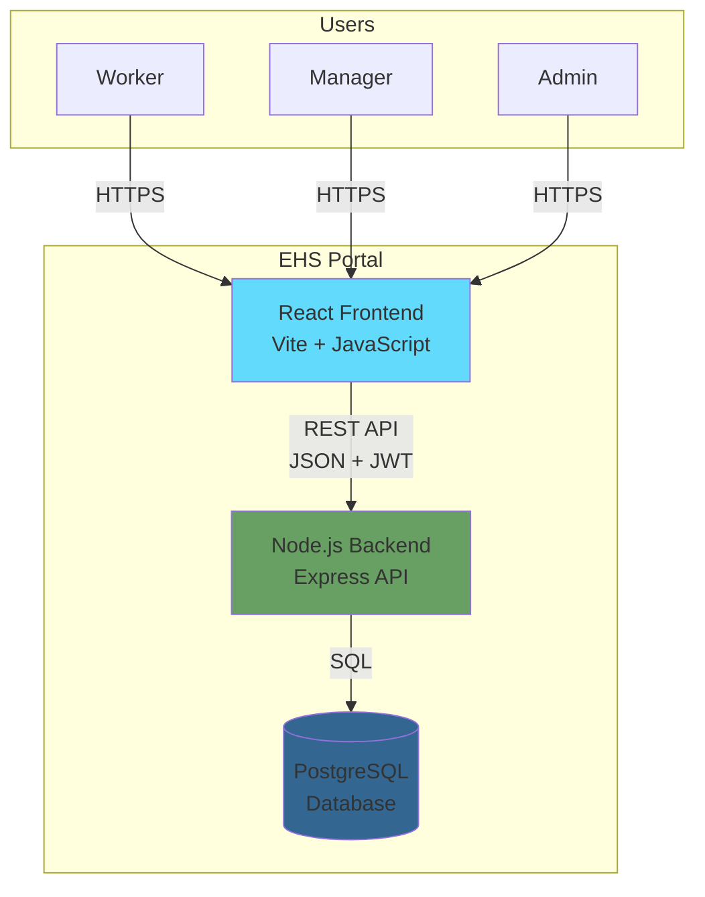
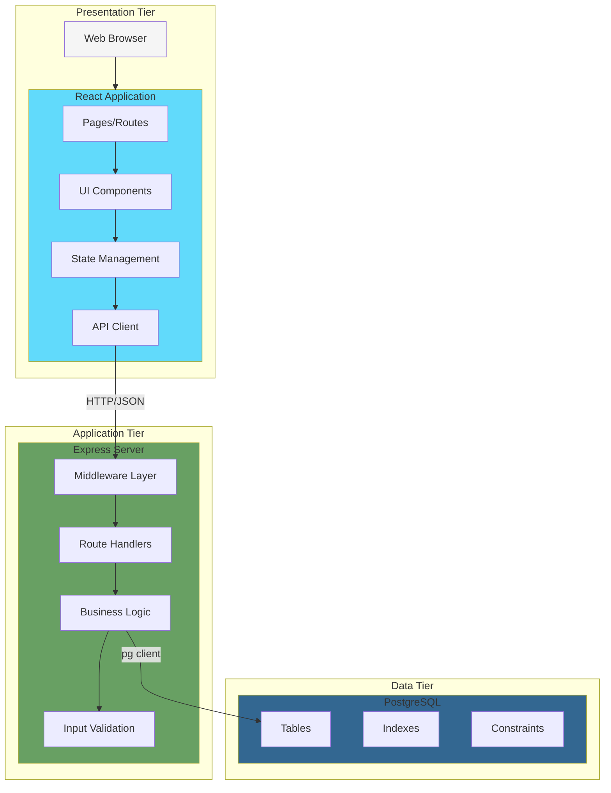
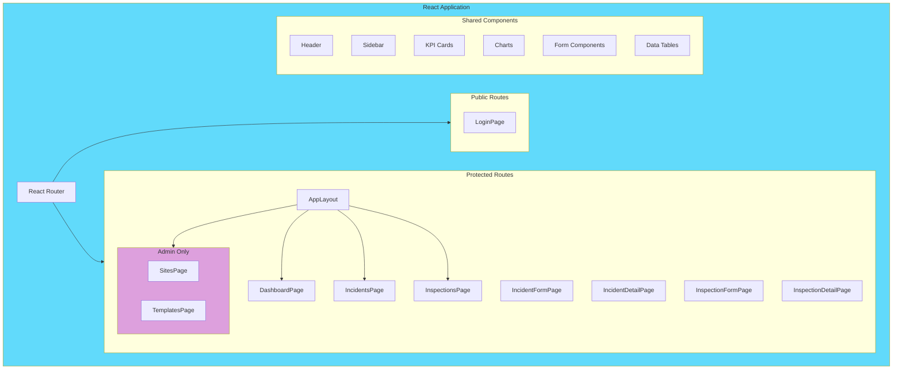
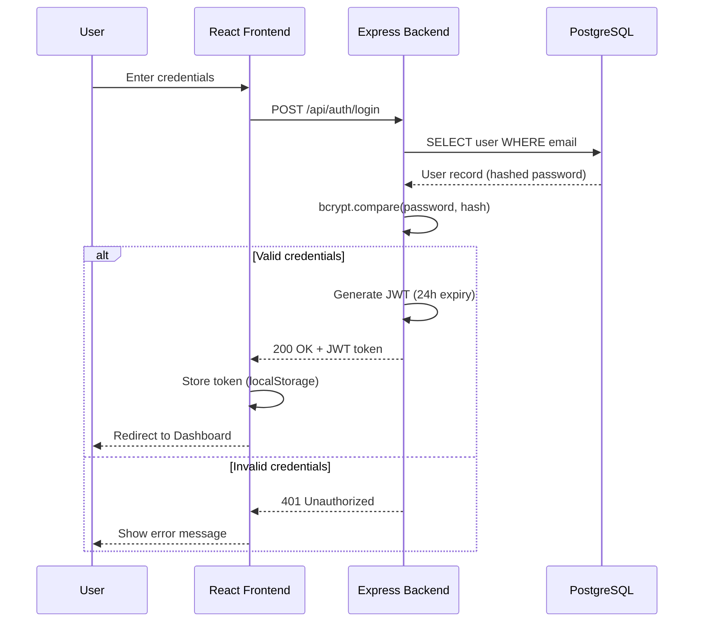
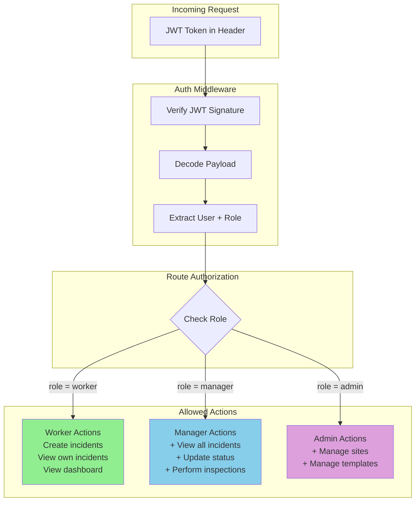
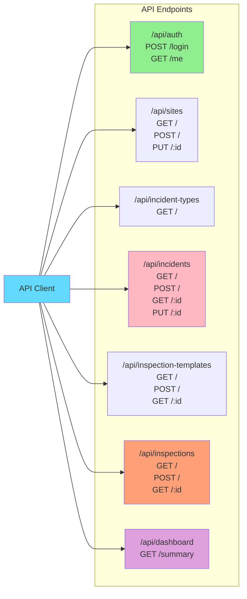
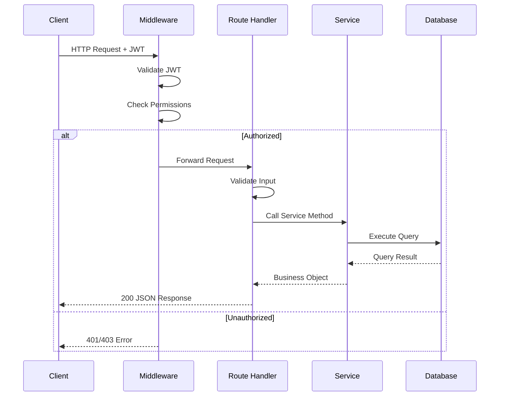
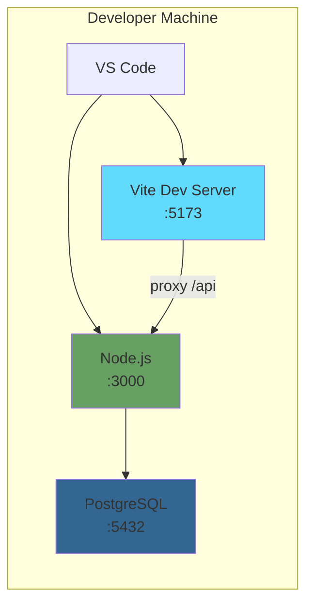
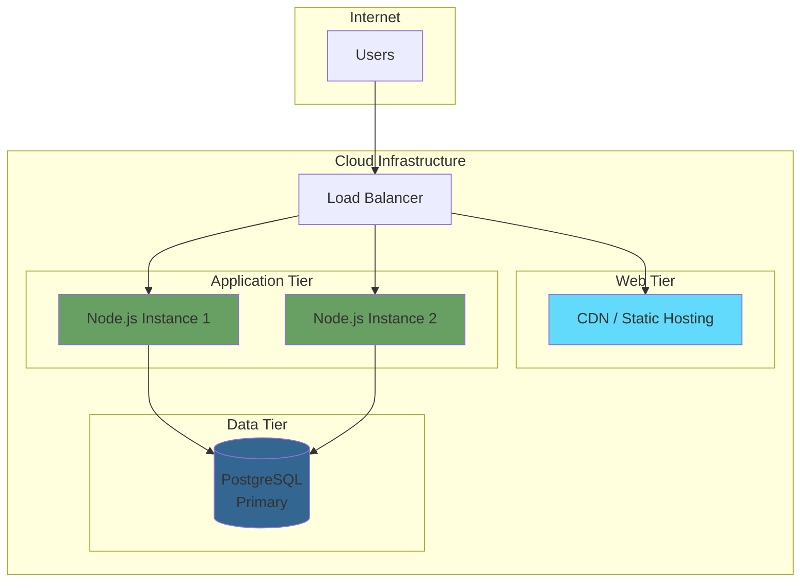

# System Architecture Document
# EHS Portal - Phase 1: Core Operational MVP

---

> **How to Use Diagrams in This Document**
>
> This document contains Mermaid diagram definitions enclosed in triple backticks with `mermaid` syntax.
> To convert these to images for Microsoft Word:
> 1. Copy the Mermaid code block (without the backticks)
> 2. Paste into [Mermaid Live Editor](https://mermaid.live/) or [draw.io](https://app.diagrams.net/)
> 3. Export as PNG or SVG
> 4. Insert the image into your Word document
>
> Alternatively, use VS Code with a Mermaid preview extension, or Markdown editors that support Mermaid rendering.

---

## Document Control

| Item | Details |
|------|---------|
| **Document Title** | System Architecture Document - EHS Portal Phase 1 |
| **Version** | 1.0 |
| **Status** | Draft |
| **Author** | Claude (Senior Architect) |
| **Date** | January 2025 |
| **Related Documents** | BRD_EHS_PORTAL_PHASE1.md, DATA_MODEL_PHASE1.md, API_SPEC_PHASE1.md |

---

## 1. Overview

### 1.1 Purpose

This document describes the technical architecture for Phase 1 of the EHS Portal. It covers:
- High-level system architecture
- Component interactions
- Technology stack
- Security architecture
- Deployment considerations

### 1.2 Architecture Principles

| Principle | Description |
|-----------|-------------|
| **Simplicity** | Minimal viable architecture for Phase 1 |
| **Separation of Concerns** | Clear boundaries between frontend, backend, and database |
| **Security by Design** | Authentication and authorization built into every layer |
| **Scalability Ready** | Design allows for future horizontal scaling |
| **Maintainability** | Clean code structure with clear responsibilities |

---

## 2. High-Level System Architecture

### 2.1 System Context Diagram



### 2.2 Technology Stack

| Layer | Technology | Version | Purpose |
|-------|------------|---------|---------|
| **Frontend** | React | 18.x | UI library |
| | Vite | 5.x | Build tool |
| | JavaScript | ES2022 | Programming language |
| | React Router | 6.x | Client-side routing |
| | Axios | 1.x | HTTP client |
| **Backend** | Node.js | 20.x LTS | Runtime environment |
| | Express | 4.x | Web framework |
| | pg | 8.x | PostgreSQL client |
| | bcrypt | 5.x | Password hashing |
| | jsonwebtoken | 9.x | JWT handling |
| **Database** | PostgreSQL | 15.x | Relational database |
| **Testing** | Playwright | Latest | E2E testing |
| | Jest | 29.x | Unit testing |

---

## 3. Component Architecture

### 3.1 Three-Tier Architecture



### 3.2 Frontend Component Structure



### 3.3 Backend Component Structure

```mermaid
flowchart TB
    subgraph Server["Express Server"]
        Entry[server.js<br/>Entry Point]

        subgraph MiddlewareStack["Middleware"]
            CORS[CORS]
            JSON[JSON Parser]
            Auth[Auth Middleware]
            ErrorHandler[Error Handler]
        end

        subgraph RouteHandlers["Routes"]
            AuthRoutes[/api/auth]
            SiteRoutes[/api/sites]
            TypeRoutes[/api/incident-types]
            IncidentRoutes[/api/incidents]
            TemplateRoutes[/api/inspection-templates]
            InspectionRoutes[/api/inspections]
            DashboardRoutes[/api/dashboard]
        end

        subgraph BusinessLayer["Services"]
            AuthService[AuthService]
            SiteService[SiteService]
            IncidentService[IncidentService]
            InspectionService[InspectionService]
            DashboardService[DashboardService]
        end

        subgraph DataLayer["Data Access"]
            DBPool[Connection Pool]
            Queries[SQL Queries]
        end
    end

    Entry --> MiddlewareStack
    MiddlewareStack --> RouteHandlers
    RouteHandlers --> BusinessLayer
    BusinessLayer --> DataLayer

    style Server fill:#68A063
    style MiddlewareStack fill:#FFE4B5
    style RouteHandlers fill:#98FB98
    style BusinessLayer fill:#87CEEB
    style DataLayer fill:#DDA0DD
```

---

## 4. Security Architecture

### 4.1 Authentication Flow



### 4.2 Authorization Model



### 4.3 Security Controls

| Layer | Control | Implementation |
|-------|---------|----------------|
| **Transport** | HTTPS | TLS 1.3 encryption |
| **Authentication** | JWT | 24-hour expiry, HS256 signing |
| **Password Storage** | bcrypt | Cost factor  10 |
| **Input Validation** | Server-side | Express validators |
| **SQL Injection** | Parameterised queries | pg client placeholders |
| **XSS Prevention** | React escaping | Default JSX behaviour |
| **CORS** | Whitelist | Configured origins only |
| **Rate Limiting** | API throttling | (Phase 2) |

---

## 5. API Architecture

### 5.1 RESTful API Structure



### 5.2 Request/Response Flow



---

## 6. Folder Structure

### 6.1 Project Structure

```
ehs-portal/
""" frontend/
"   """ public/
"   -   """" index.html
"   """ src/
"   -   """ api/
"   -   -   """" client.js           # Axios instance + interceptors
"   -   """ components/
"   -   -   """ common/             # Shared UI components
"   -   -   """ dashboard/          # Dashboard widgets
"   -   -   """ incidents/          # Incident components
"   -   -   """ inspections/        # Inspection components
"   -   -   """" layout/             # Header, Sidebar, Footer
"   -   """ contexts/
"   -   -   """" AuthContext.jsx     # Auth state management
"   -   """ hooks/
"   -   -   """" useAuth.js          # Auth custom hook
"   -   """ pages/
"   -   -   """ Dashboard.jsx
"   -   -   """ Incidents.jsx
"   -   -   """ Inspections.jsx
"   -   -   """ Login.jsx
"   -   -   """ Sites.jsx
"   -   -   """" Templates.jsx
"   -   """ utils/
"   -   -   """" helpers.js
"   -   """ App.jsx
"   -   """" main.jsx
"   """ package.json
"   """" vite.config.js
"
""" backend/
"   """ src/
"   -   """ config/
"   -   -   """" database.js         # DB connection config
"   -   """ middleware/
"   -   -   """ auth.js             # JWT verification
"   -   -   """" errorHandler.js     # Global error handling
"   -   """ routes/
"   -   -   """ auth.js
"   -   -   """ dashboard.js
"   -   -   """ incidentTypes.js
"   -   -   """ incidents.js
"   -   -   """ inspections.js
"   -   -   """ inspectionTemplates.js
"   -   -   """" sites.js
"   -   """ services/
"   -   -   """ authService.js
"   -   -   """ dashboardService.js
"   -   -   """ incidentService.js
"   -   -   """" inspectionService.js
"   -   """" server.js               # Entry point
"   """ migrations/
"   -   """ 001_create_users.sql
"   -   """ 002_create_sites.sql
"   -   """ 003_create_incidents.sql
"   -   """" 004_create_inspections.sql
"   """ seeds/
"   -   """" seed.sql
"   """" package.json
"
""" tests/
"   """ e2e/                        # Playwright tests
"   """" unit/                       # Jest tests
"
"""" docs/                           # Documentation
```

---

## 7. Deployment Architecture

### 7.1 Development Environment



### 7.2 Production Deployment (Conceptual)



---

## 8. Integration Points

### 8.1 Phase 1 Integrations

| Integration | Type | Description |
|-------------|------|-------------|
| Frontend - Backend | REST API | JSON over HTTPS |
| Backend - Database | pg client | Connection pooling |

### 8.2 Future Integration Points (Phase 2+)

| Phase | Integration | Purpose |
|-------|-------------|---------|
| Phase 2 | File Storage | Attachment uploads |
| Phase 3 | Export Service | CSV/PDF generation |
| Phase 5 | Email Service | Notifications |
| Phase 5 | SSO Provider | Enterprise authentication |

---

## 9. Non-Functional Considerations

### 9.1 Performance

| Metric | Target | Approach |
|--------|--------|----------|
| Page Load | < 3s | Code splitting, lazy loading |
| API Response | < 500ms | Connection pooling, indexes |
| Dashboard | < 2s | Optimised aggregation queries |

### 9.2 Scalability

| Component | Scaling Strategy |
|-----------|------------------|
| Frontend | CDN distribution |
| Backend | Horizontal pod scaling |
| Database | Read replicas (future) |

### 9.3 Reliability

| Concern | Mitigation |
|---------|------------|
| Server Crash | Process manager (PM2) |
| DB Connection | Connection pooling |
| Data Loss | Regular backups |

---

## 10. Appendices

### Appendix A: Environment Variables

| Variable | Layer | Description |
|----------|-------|-------------|
| PORT | Backend | Server port (default: 3000) |
| DATABASE_URL | Backend | PostgreSQL connection string |
| JWT_SECRET | Backend | JWT signing secret |
| JWT_EXPIRY | Backend | Token expiry (default: 24h) |
| VITE_API_URL | Frontend | Backend API base URL |

### Appendix B: Related Documents

- BRD_EHS_PORTAL_PHASE1.md - Business requirements
- DATA_MODEL_PHASE1.md - Database schema
- API_SPEC_PHASE1.md - API specification
- WORKFLOWS_PHASE1.md - User workflows


