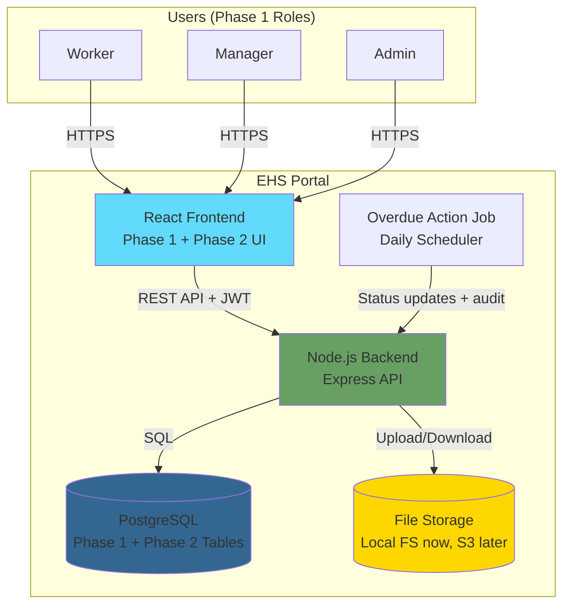
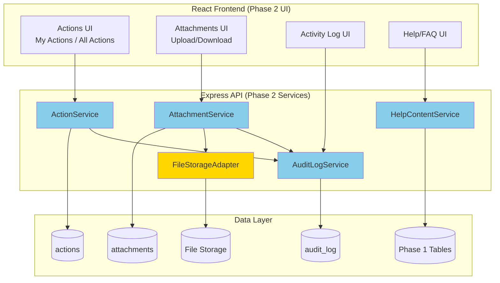
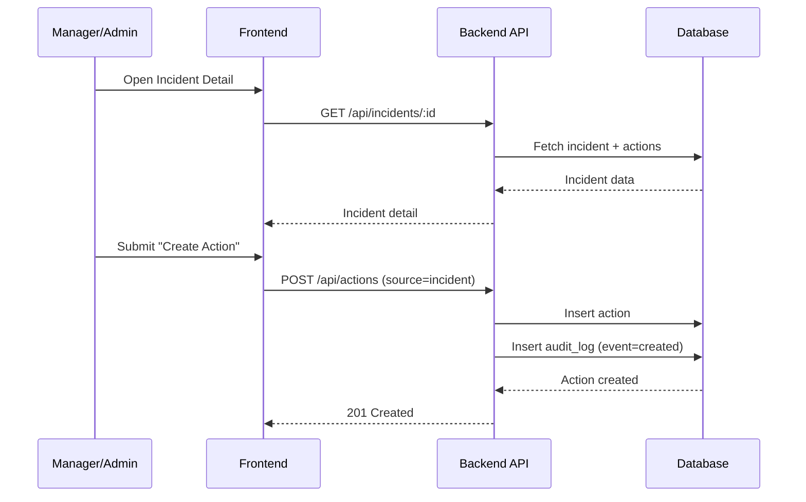
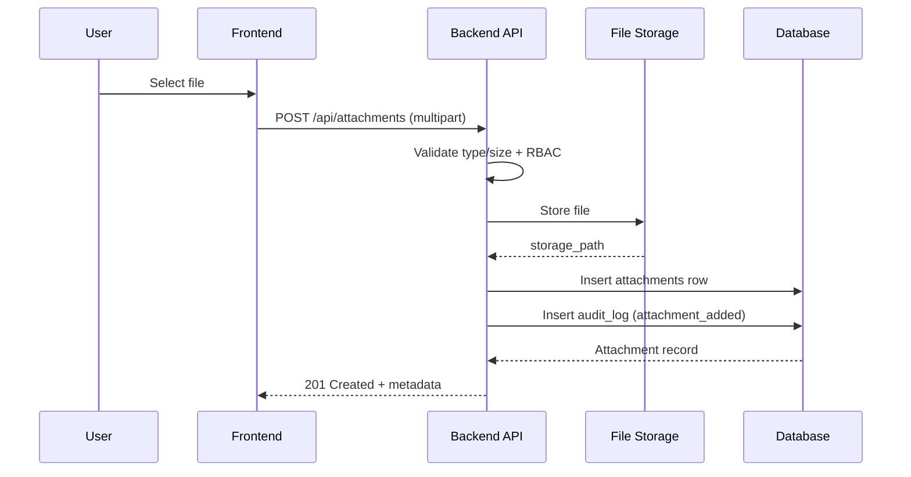
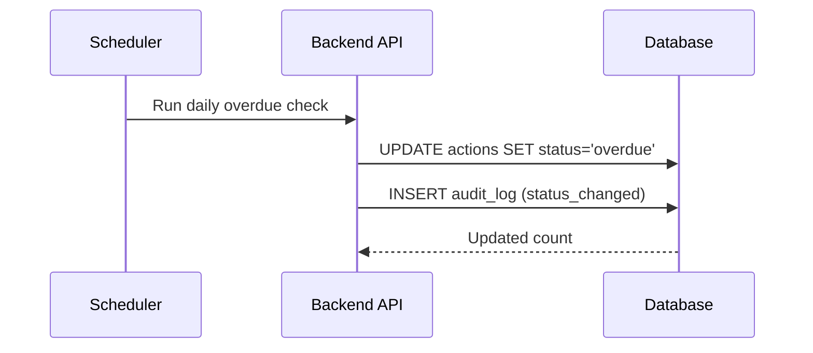

# System Architecture Document
# EHS Portal - Phase 2: Operational Excellence

---

> **How to Use Diagrams in This Document**
>
> This document contains Mermaid diagram definitions enclosed in triple backticks with `mermaid` syntax.
> To convert these to images for Microsoft Word:
> 1. Copy the Mermaid code block (without the backticks)
> 2. Paste into [Mermaid Live Editor](https://mermaid.live/) or [draw.io](https://app.diagrams.net/)
> 3. Export as PNG or SVG
> 4. Insert the image into your Word document
>
> Alternatively, use VS Code with a Mermaid preview extension, or Markdown editors that support Mermaid rendering.

---

## Document Control

| Item | Details |
|------|---------|
| **Document Title** | System Architecture Document - EHS Portal Phase 2 |
| **Version** | 1.0 |
| **Status** | Draft |
| **Author** | Codex (Solution Architect) |
| **Date** | January 2025 |
| **Related Documents** | BRD_EHS_PORTAL_PHASE2.md, DATA_MODEL_PHASE2.md, DATA_MODEL.md |

---

## 1. Overview

### 1.1 Purpose

This document describes the Phase 2 architecture for the EHS Portal. Phase 2 is additive to Phase 1 and introduces:

- Actions/CAPA management
- Attachments/Evidence handling
- Audit logging (immutable)
- Basic in-app help content

### 1.2 Architecture Principles (Phase 2)

| Principle | Description |
|-----------|-------------|
| **Additive Change** | Phase 2 adds new services without breaking Phase 1 flows |
| **Security First** | RBAC enforced for all Phase 2 endpoints |
| **Auditability** | All critical changes are logged immutably |
| **Storage Abstraction** | File storage supports local now, S3 later |
| **Operational Simplicity** | Daily job for overdue actions, no complex scheduler |

---

## 2. High-Level System Architecture (Phase 2)

### 2.1 System Context Diagram



### 2.2 Phase 2 Technology Additions

| Layer | Technology | Purpose |
|-------|------------|---------|
| **Backend** | File upload middleware (e.g., multer) | Handle multipart attachments |
| **Backend** | Storage adapter | Local FS now, S3-compatible later |
| **Backend** | Scheduler/cron | Overdue action updates |
| **Database** | New tables + enums | actions, attachments, audit_log |

---

## 3. Component Architecture (Phase 2 Additions)

### 3.1 Phase 2 Component Diagram



### 3.2 Backend Component Diagram (Routes -> Services -> Data)

```mermaid
flowchart TB
    subgraph Server["Express Server"]
        Middleware[JWT + RBAC Middleware]

        subgraph Routes["Phase 2 Routes"]
            ActionsRoutes[/api/actions]
            AttachRoutes[/api/attachments]
            AuditRoutes[/api/audit-logs]
            HelpRoutes[/api/help]
        end

        subgraph Services["Phase 2 Services"]
            ActionService[ActionService]
            AttachmentService[AttachmentService]
            AuditLogService[AuditLogService]
            HelpContentService[HelpContentService]
            FileStorageAdapter[FileStorageAdapter]
        end

        subgraph DataLayer["Data Access"]
            DB[PostgreSQL]
            FS[File Storage]
        end
    end

    Middleware --> Routes
    Routes --> Services
    ActionService --> DB
    AttachmentService --> DB
    AttachmentService --> FileStorageAdapter
    FileStorageAdapter --> FS
    AuditLogService --> DB
    HelpContentService --> DB

    style Routes fill:#98FB98
    style Services fill:#87CEEB
    style DataLayer fill:#DDA0DD
```

---

## 4. Key Phase 2 Workflows (Sequence Diagrams)

### 4.1 Create Action from Incident



### 4.2 Upload Attachment to Incident/Inspection/Action



### 4.3 Overdue Action Scheduler



---

## 5. RBAC Hardening (Phase 2)

Phase 2 enforces additional RBAC rules at the API layer:

- **Create actions**: Manager/Admin only (C20-C22)
- **Update action status**: Assignee, Manager, Admin
- **My Actions**: Filters by assigned_to = user_id
- **All Actions**: Manager/Admin only
- **Upload attachments**: Scope-checked by entity ownership and role
- **Audit logs**: System-wide access restricted to Admin

RBAC is enforced in middleware and in service-layer checks for entity ownership.

---

## 6. Audit Logging Architecture

- **AuditLogService** is called by action, attachment, incident, and inspection services.
- **Append-only** behavior enforced by database triggers (no UPDATE/DELETE).
- **Activity Log** shown on detail views queries `audit_log` by entity_type + entity_id.
- **System audit log** (admin-only) queries across all entities with filters.

---

## 7. Help Content Architecture

Phase 2 includes a lightweight Help module:

- **HelpContentService** serves static help content (markdown/HTML) for key workflows.
- No new Phase 2 database tables required (aligns with DATA_MODEL_PHASE2.md).
- Frontend renders Help content via a simple API endpoint or static asset route.

---

## 8. File Storage Architecture

- **FileStorageAdapter** abstracts storage operations:
  - `LocalFileStorage` (Phase 2 default)
  - `S3FileStorage` (future Phase 3/5)
- Attachment metadata stored in `attachments.storage_path`.
- Download endpoints enforce auth and RBAC checks before streaming files.

---

## 9. Phase 2 Checklist Mapping (Architecture)

| Checklist Cluster | Architectural Components |
|-------------------|--------------------------|
| **C20-C27 Actions/CAPA** | ActionService, Actions routes, Actions UI, overdue scheduler |
| **C28-C33 Attachments** | AttachmentService, FileStorageAdapter, Attachments UI |
| **C40-C46 Audit Log** | AuditLogService, audit_log table, Activity Log UI |
| **C68-C70 Help** | HelpContentService, Help UI |

---

## 10. Open Architecture Questions / Risks

| Question/Risk | Impact | Mitigation |
|--------------|--------|------------|
| Storage choice (local vs S3) | Affects deployment and scaling | Implement FileStorageAdapter now |
| Malware scanning | Security requirement | Validate file types now; add scanning later |
| Scheduler ownership | Reliability of overdue updates | Use simple cron job initially |
| Audit log volume | Growth over time | Index by entity_id and occurred_at |
| Help content ownership | Who updates content | Static in Phase 2, CMS later |

---

## 11. Related Documents

- BRD_EHS_PORTAL_PHASE2.md
- DATA_MODEL_PHASE2.md
- DATA_MODEL.md
