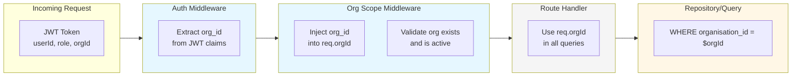
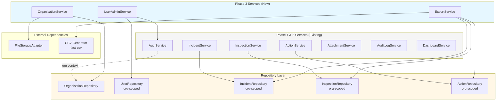
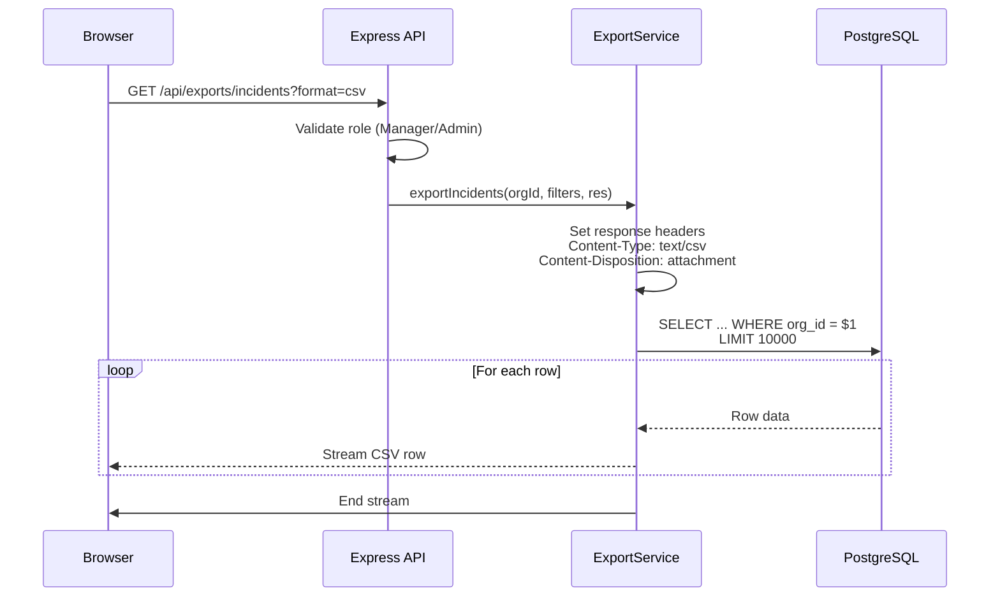
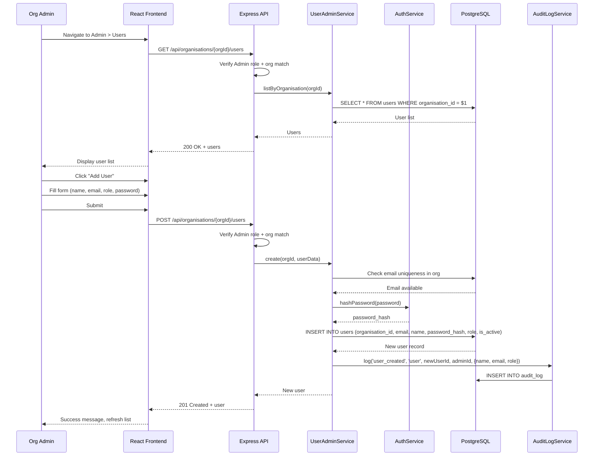
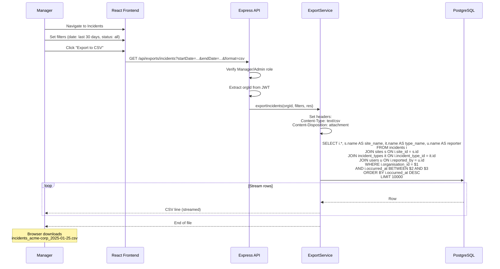
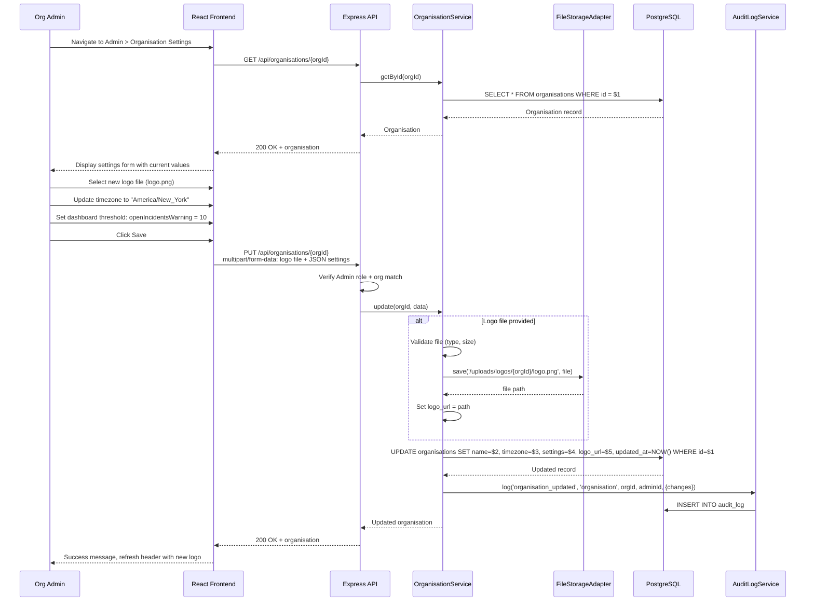

# System Architecture - EHS Portal Phase 3: Multi-Organisation & Enterprise Reporting

## 1. Overview

Phase 3 extends the EHS Portal architecture to support **multi-organisation (multi-tenant)** deployments and **enterprise reporting** capabilities. This document describes the architectural additions and modifications required to implement Phase 3 features while preserving Phase 1 and Phase 2 functionality.

**Key Architectural Goals:**
- Support multiple organisations in a single deployment
- Ensure complete data isolation between organisations
- Enable organisation-level user administration
- Provide CSV export capabilities for reporting
- Maintain backward compatibility with Phase 1/2

**Design Decisions (Confirmed):**
- Tenant isolation via query filtering on `organisation_id` (not database-level RLS)
- Email uniqueness is per-organisation (`email + organisation_id` unique)
- First organisation and admin created via seed/CLI tool
- Exports are synchronous CSV streams (max 10K rows)
- Logos use attachment storage mechanism with separate prefix
- Incident types are per-organisation with `is_system` flag for defaults

---

## 2. High-Level Architecture (Phase 3)

```mermaid
flowchart TB
    subgraph Clients["Client Layer"]
        Browser[Browser]
    end

    subgraph Frontend["Frontend (React/Vite)"]
        Pages[Pages]
        Components[Components]
        AuthCtx[AuthContext<br/>+ organisationId]
        OrgCtx[OrgContext<br/>org settings/branding]
    end

    subgraph Backend["Backend (Express/Node.js)"]
        subgraph Middleware["Middleware Layer"]
            CORS[CORS]
            Auth[authMiddleware<br/>JWT + org extraction]
            OrgScope[orgScopeMiddleware<br/>inject org_id]
            Role[roleMiddleware]
        end

        subgraph Routes["Route Layer"]
            AuthR[/api/auth/*]
            OrgR[/api/organisations/*]
            UsersR[/api/organisations/:orgId/users/*]
            ExportR[/api/exports/*]
            ExistingR[Existing Routes<br/>incidents, inspections, etc.]
        end

        subgraph Services["Service Layer"]
            OrgSvc[OrganisationService]
            UserAdminSvc[UserAdminService]
            ExportSvc[ExportService]
            ExistingSvc[Existing Services<br/>auth, actions, audit, etc.]
        end

        subgraph Data["Data Layer"]
            Repo[Repository Layer<br/>org-scoped queries]
        end
    end

    subgraph Storage["Storage Layer"]
        DB[(PostgreSQL<br/>+ organisations table)]
        Files[(File Storage<br/>attachments + logos)]
    end

    Browser --> Frontend
    Frontend --> Backend
    Pages --> AuthCtx
    Pages --> OrgCtx
    AuthCtx --> |API calls| Auth

    Auth --> OrgScope
    OrgScope --> Role
    Role --> Routes

    OrgR --> OrgSvc
    UsersR --> UserAdminSvc
    ExportR --> ExportSvc
    ExistingR --> ExistingSvc

    Services --> Repo
    Repo --> DB
    OrgSvc --> Files

    style Clients fill:#FFF
    style Frontend fill:#E6F7FF
    style Backend fill:#F5F5F5
    style Storage fill:#FFF7E6
```

---

## 3. Organisation Scoping Architecture

### 3.1 Core Principle

Every business data entity is scoped by `organisation_id`. The scoping is enforced at multiple layers:



### 3.2 JWT Token Structure (Phase 3)

```json
{
  "userId": "uuid",
  "email": "user@example.com",
  "role": "admin|manager|worker",
  "organisationId": "uuid",
  "organisationSlug": "acme-corp",
  "iat": 1234567890,
  "exp": 1234567890
}
```

### 3.3 Organisation Scope Middleware

```javascript
// middleware/orgScope.js
const orgScopeMiddleware = async (req, res, next) => {
  // Organisation ID is extracted from JWT by authMiddleware
  const orgId = req.user?.organisationId;

  if (!orgId) {
    return res.status(401).json({ error: 'Organisation context required' });
  }

  // Validate organisation exists and is active
  const org = await organisationRepository.findById(orgId);
  if (!org || !org.is_active) {
    return res.status(403).json({ error: 'Organisation inactive or not found' });
  }

  // Inject into request for downstream use
  req.orgId = orgId;
  req.organisation = org;

  next();
};
```

### 3.4 Repository Pattern for Org-Scoped Queries

All repositories follow a consistent pattern:

```javascript
// repositories/incidentRepository.js
class IncidentRepository {
  async findAll(orgId, filters = {}) {
    const query = `
      SELECT * FROM incidents
      WHERE organisation_id = $1
        AND ($2::uuid IS NULL OR site_id = $2)
        AND ($3::text IS NULL OR status = $3)
      ORDER BY occurred_at DESC
    `;
    return db.query(query, [orgId, filters.siteId, filters.status]);
  }

  async create(orgId, data) {
    // Always inject organisation_id
    const query = `
      INSERT INTO incidents (organisation_id, title, ...)
      VALUES ($1, $2, ...)
      RETURNING *
    `;
    return db.query(query, [orgId, data.title, ...]);
  }
}
```

---

## 4. Phase 3 Backend Components

### 4.1 Component Diagram



### 4.2 OrganisationService

**Responsibilities:**
- Read organisation profile and settings
- Update organisation name, timezone, settings
- Upload/update organisation logo
- Validate organisation-level operations

**Key Methods:**
| Method | Description | Access |
|--------|-------------|--------|
| `getById(orgId)` | Get organisation profile | All authenticated users |
| `update(orgId, data)` | Update name, timezone | Org Admin only |
| `updateSettings(orgId, settings)` | Update dashboard thresholds | Org Admin only |
| `uploadLogo(orgId, file)` | Upload organisation logo | Org Admin only |
| `deleteLogo(orgId)` | Remove organisation logo | Org Admin only |

**Logo Storage:**
- Path: `/uploads/logos/{organisation_id}/{filename}`
- Allowed types: PNG, JPEG, SVG
- Max size: 2 MB
- Storage adapter: Same as AttachmentService

### 4.3 UserAdminService

**Responsibilities:**
- List users within organisation
- Create new users (with password hashing)
- Update user details (name, email, role)
- Enable/disable user accounts
- Reset user passwords

**Key Methods:**
| Method | Description | Access |
|--------|-------------|--------|
| `listByOrganisation(orgId)` | Get all users in org | Org Admin only |
| `create(orgId, userData)` | Create new user | Org Admin only |
| `update(orgId, userId, data)` | Update user details | Org Admin only |
| `setActive(orgId, userId, isActive)` | Enable/disable user | Org Admin only |
| `resetPassword(orgId, userId, newPassword)` | Reset user password | Org Admin only |

**Validation Rules:**
- Email must be unique within organisation
- Cannot disable the last admin in an organisation
- Cannot change own role (prevents admin lockout)

### 4.4 ExportService

**Responsibilities:**
- Generate CSV exports for incidents, inspections, actions
- Apply filters (date range, site, status, severity)
- Enforce row limits (max 10,000)
- Stream CSV directly to response

**Key Methods:**
| Method | Description | Access |
|--------|-------------|--------|
| `exportIncidents(orgId, filters, res)` | Stream incidents CSV | Manager, Admin |
| `exportInspections(orgId, filters, res)` | Stream inspections CSV | Manager, Admin |
| `exportActions(orgId, filters, res)` | Stream actions CSV | Manager, Admin |

**CSV Streaming Architecture:**



**Response Headers:**
```
Content-Type: text/csv
Content-Disposition: attachment; filename="incidents_acme-corp_2025-01-25.csv"
```

---

## 5. Sequence Diagrams

### 5.1 Org Admin Creates a New User



### 5.2 Manager Exports Incidents to CSV



### 5.3 Admin Updates Organisation Logo and Settings



---

## 6. Frontend Architecture (Phase 3 Additions)

### 6.1 New Context: OrgContext

```javascript
// context/OrgContext.jsx
const OrgContext = createContext();

export const OrgProvider = ({ children }) => {
  const { user } = useAuth();
  const [organisation, setOrganisation] = useState(null);

  useEffect(() => {
    if (user?.organisationId) {
      fetchOrganisation(user.organisationId).then(setOrganisation);
    }
  }, [user]);

  return (
    <OrgContext.Provider value={{ organisation, refetchOrg }}>
      {children}
    </OrgContext.Provider>
  );
};
```

### 6.2 New Pages

| Page | Route | Description |
|------|-------|-------------|
| OrgSettingsPage | `/admin/organisation` | View/edit organisation settings |
| UserManagementPage | `/admin/users` | List, create, edit, disable users |

### 6.3 New Components

| Component | Purpose |
|-----------|---------|
| OrgLogo | Display organisation logo in header |
| UserTable | List users with actions |
| UserForm | Create/edit user modal |
| ExportButton | Trigger CSV export with filters |
| ExportModal | Configure export options |

### 6.4 Header with Org Branding

```jsx
// components/Layout/Header.jsx
const Header = () => {
  const { organisation } = useOrg();

  return (
    <header>
      {organisation?.logo_url ? (
        
      ) : (
        <span>{organisation?.name || 'EHS Portal'}</span>
      )}
      {/* ... rest of header */}
    </header>
  );
};
```

---

## 7. API Routes (Phase 3)

### 7.1 Organisation Routes

| Method | Path | Description | Access |
|--------|------|-------------|--------|
| GET | `/api/organisations/:orgId` | Get organisation profile | All authenticated |
| PUT | `/api/organisations/:orgId` | Update organisation | Admin |
| POST | `/api/organisations/:orgId/logo` | Upload logo | Admin |
| DELETE | `/api/organisations/:orgId/logo` | Delete logo | Admin |

### 7.2 User Management Routes

| Method | Path | Description | Access |
|--------|------|-------------|--------|
| GET | `/api/organisations/:orgId/users` | List users | Admin |
| POST | `/api/organisations/:orgId/users` | Create user | Admin |
| GET | `/api/organisations/:orgId/users/:userId` | Get user | Admin |
| PUT | `/api/organisations/:orgId/users/:userId` | Update user | Admin |
| POST | `/api/organisations/:orgId/users/:userId/reset-password` | Reset password | Admin |

### 7.3 Export Routes

| Method | Path | Description | Access |
|--------|------|-------------|--------|
| GET | `/api/exports/incidents` | Export incidents CSV | Manager, Admin |
| GET | `/api/exports/inspections` | Export inspections CSV | Manager, Admin |
| GET | `/api/exports/actions` | Export actions CSV | Manager, Admin |

**Export Query Parameters:**
- `startDate` - Filter start date (ISO 8601)
- `endDate` - Filter end date (ISO 8601)
- `siteId` - Filter by site UUID
- `status` - Filter by status
- `severity` - Filter by severity (incidents only)

---

## 8. Data Flow for Multi-Tenancy

### 8.1 Request Flow

```
1. Request arrives with JWT token
2. authMiddleware extracts userId, role, organisationId from JWT
3. orgScopeMiddleware validates organisation exists and is active
4. Route handler receives req.orgId
5. Service layer passes orgId to repository
6. Repository includes WHERE organisation_id = $orgId in all queries
7. Response contains only org-scoped data
```

### 8.2 Data Isolation Guarantees

| Layer | Isolation Mechanism |
|-------|---------------------|
| Authentication | JWT contains organisationId claim |
| Middleware | orgScopeMiddleware validates org context |
| Routes | req.orgId injected into all handlers |
| Services | All methods require orgId parameter |
| Repositories | All queries filter by organisation_id |
| Database | Foreign key to organisations table |

---

## 9. File Storage (Phase 3)

### 9.1 Storage Layout

```
/uploads/
├── attachments/
│   ├── incidents/{entity_id}/{filename}
│   ├── inspections/{entity_id}/{filename}
│   └── actions/{entity_id}/{filename}
└── logos/
    └── {organisation_id}/{filename}
```

### 9.2 Logo Storage Rules

| Aspect | Rule |
|--------|------|
| Path | `/uploads/logos/{organisation_id}/logo.{ext}` |
| Max Size | 2 MB |
| Allowed Types | PNG, JPEG, SVG |
| Naming | Single file per org, overwrites existing |
| Access | Public read (via static serving) |

---

## 10. Security Considerations (Phase 3)

| Requirement | Implementation |
|-------------|----------------|
| NFR-SEC-P3-01 | All queries filter by organisation_id |
| NFR-SEC-P3-02 | JWT includes organisationId claim |
| NFR-SEC-P3-03 | orgScopeMiddleware validates org on every request |
| NFR-SEC-P3-04 | Admin routes check user's org matches target org |
| NFR-SEC-P3-05 | Disabled users blocked at login |
| NFR-SEC-P3-06 | Export row limit prevents DoS |
| NFR-SEC-P3-07 | Logo uploads validated for type and size |

### 10.1 Cross-Tenant Attack Prevention

```javascript
// Example: Prevent user from accessing another org's data
router.get('/organisations/:orgId/users', async (req, res) => {
  // Verify the requested org matches user's org
  if (req.params.orgId !== req.user.organisationId) {
    return res.status(403).json({ error: 'Access denied' });
  }
  // ... proceed with org-scoped query
});
```

---

## 11. Checklist ID to Architecture Mapping

| C-ID | Feature | Architecture Component |
|------|---------|----------------------|
| C71 | Multi-org support | organisations table, org-scoped queries |
| C72 | User belongs to one org | users.organisation_id NOT NULL |
| C73 | All entities org-scoped | Repository layer filtering |
| C74 | Data isolation | orgScopeMiddleware, JWT claims |
| C75 | Org admin scoped rights | Role + org validation in routes |
| C76 | System incident types | incident_types.is_system flag |
| C77-C83 | User management | UserAdminService, /api/organisations/:orgId/users |
| C84-C90 | Exports | ExportService, /api/exports/* |
| C91-C95 | Org settings | OrganisationService, /api/organisations/:orgId |

---

## 12. Migration from Phase 2

### 12.1 Backward Compatibility

Phase 3 is **additive** to Phase 1 and 2:
- All existing routes continue to work
- Existing data migrated to a default organisation
- JWT token format extended (not replaced)
- No breaking changes to existing API contracts

### 12.2 Migration Steps

1. Run `003_phase3_multitenant.sql` migration
2. Run seed script to create default organisation
3. Update seed script to assign existing users/data to default org
4. Deploy updated backend with org-scoping middleware
5. Deploy updated frontend with OrgContext

---

## 13. Performance Considerations

| Aspect | Approach |
|--------|----------|
| Query Performance | Composite indexes on (organisation_id, ...) |
| Export Performance | Streaming CSV, 10K row limit |
| Logo Caching | Static file serving with cache headers |
| User List | Paginated (Phase 3: simple list, future: pagination) |

---

## 14. Related Documents

- [ARCHITECTURE.md](./ARCHITECTURE.md) - Master architecture (all phases)
- [DATA_MODEL_PHASE3.md](./DATA_MODEL_PHASE3.md) - Phase 3 data model
- [BRD_EHS_PORTAL_PHASE3.md](./BRD_EHS_PORTAL_PHASE3.md) - Phase 3 requirements
- [API_SPEC_PHASE3.md](./API_SPEC_PHASE3.md) - Phase 3 API specification (to be created)
- [WORKFLOWS_PHASE3.md](./WORKFLOWS_PHASE3.md) - Phase 3 workflows

---

*End of Document*
