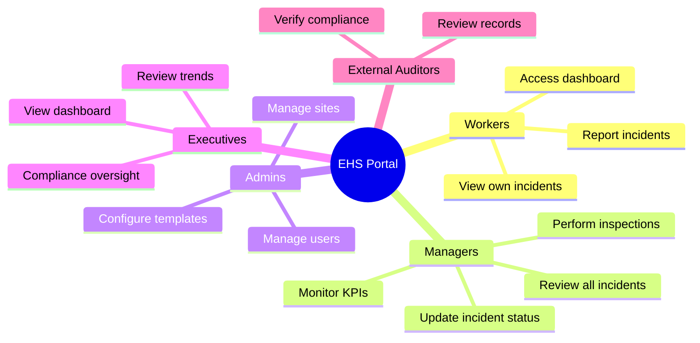
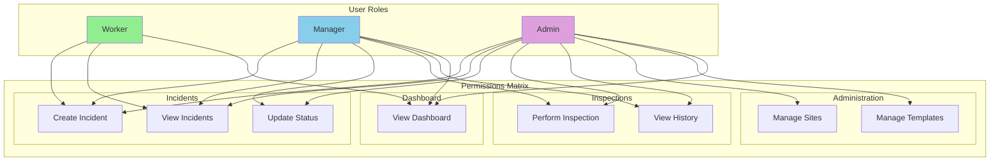
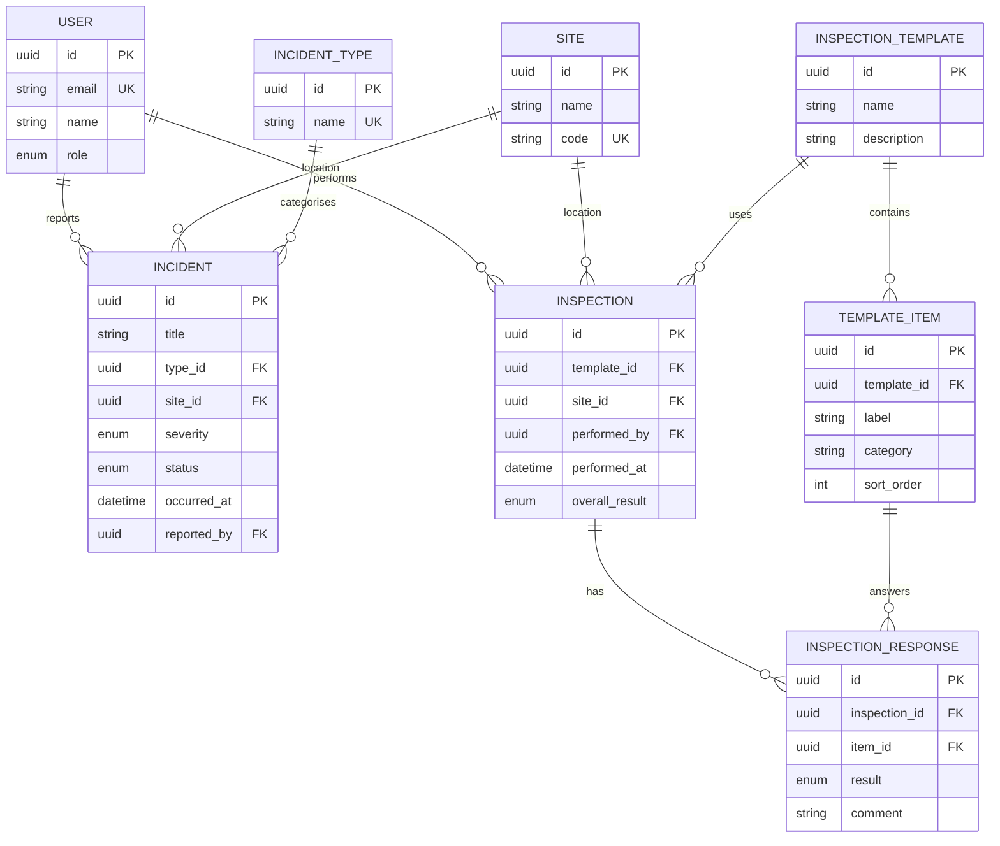

# Business Requirements Document (BRD)
# EHS Portal - Phase 1: Core Operational MVP

---

> **How to Use Diagrams in This Document**
>
> This document contains Mermaid diagram definitions enclosed in triple backticks with `mermaid` syntax.
> To convert these to images for Microsoft Word:
> 1. Copy the Mermaid code block (without the backticks)
> 2. Paste into [Mermaid Live Editor](https://mermaid.live/) or [draw.io](https://app.diagrams.net/)
> 3. Export as PNG or SVG
> 4. Insert the image into your Word document
>
> Alternatively, use VS Code with a Mermaid preview extension, or Markdown editors that support Mermaid rendering.

---

## Document Control

| Item | Details |
|------|---------|
| **Document Title** | Business Requirements Document - EHS Portal Phase 1 |
| **Version** | 1.0 |
| **Status** | Draft |
| **Author** | Claude (Senior Architect) |
| **Date** | January 2025 |
| **Reviewers** | Codex (PM/BA), Project Stakeholders |

---

## 1. Executive Summary

### 1.1 Purpose

This Business Requirements Document (BRD) defines the functional and non-functional requirements for **Phase 1** of the EHS (Environmental, Health & Safety) Portal. Phase 1 delivers the **Core Operational MVP** - a web-based platform enabling organisations to:

- Log and track safety incidents
- Perform standardised inspections using configurable templates
- Monitor safety performance through a real-time dashboard

### 1.2 Business Objectives

| Objective | Success Metric |
|-----------|----------------|
| Centralise incident reporting | 100% of safety incidents captured in single system |
| Standardise inspection processes | All inspections use approved templates |
| Improve safety visibility | Real-time dashboard accessible to all stakeholders |
| Reduce compliance risk | Complete audit trail of all safety events |

### 1.3 Scope Summary

**In Scope (Phase 1):**
- User authentication and role-based access
- Site management
- Incident type reference data
- Incident management (create, view, update status)
- Inspection template configuration
- Inspection execution and recording
- Dashboard with KPIs, charts, and recent activity

**Out of Scope (Future Phases):**
- Actions/CAPA management (Phase 2)
- File attachments (Phase 2)
- Audit logging (Phase 2)
- Multi-organisation tenancy (Phase 3)
- Data exports (Phase 3)
- Advanced analytics (Phase 4)
- Notifications and integrations (Phase 5)

---

## 2. Business Context

### 2.1 Problem Statement

Organisations currently struggle with:
- **Fragmented incident reporting** - Safety events recorded in spreadsheets, emails, or paper forms
- **Inconsistent inspections** - No standardised checklists; results stored in various formats
- **Poor visibility** - Management lacks real-time view of safety performance
- **Compliance gaps** - Difficulty demonstrating due diligence to regulators

### 2.2 Proposed Solution

The EHS Portal provides a unified platform where:
- **Workers** can quickly report incidents from any device
- **Managers** can review incidents, perform inspections, and monitor trends
- **Admins** can configure sites, templates, and reference data
- **All users** can access a dashboard showing current safety status

### 2.3 Stakeholder Overview



---

## 3. Business Requirements

### 3.1 Incident Management

| BR-ID | Requirement | Priority | Rationale |
|-------|-------------|----------|-----------|
| BR-INC-01 | Users shall be able to create incident records with title, type, site, severity, date/time, and description | Must Have | Core functionality for capturing safety events |
| BR-INC-02 | All incidents shall be assigned to a specific site location | Must Have | Enables location-based reporting and analysis |
| BR-INC-03 | Incidents shall have a status workflow: Open ' Under Investigation ' Closed | Must Have | Tracks investigation progress |
| BR-INC-04 | Only managers and admins shall be able to change incident status | Must Have | Ensures proper oversight and accountability |
| BR-INC-05 | Workers shall see only incidents they have reported | Must Have | Privacy and data minimisation |
| BR-INC-06 | Managers shall see all incidents across their organisation | Must Have | Enables oversight responsibility |

### 3.2 Inspection Management

| BR-ID | Requirement | Priority | Rationale |
|-------|-------------|----------|-----------|
| BR-INSP-01 | Admins shall be able to create inspection templates with configurable checklist items | Must Have | Standardises inspection process |
| BR-INSP-02 | Each checklist item shall support categorisation (e.g., Fire Safety, PPE) | Should Have | Improves organisation and reporting |
| BR-INSP-03 | Users shall be able to perform inspections by selecting a site and template | Must Have | Core inspection workflow |
| BR-INSP-04 | For each checklist item, users shall record: OK, Not OK, or N/A with optional comments | Must Have | Captures detailed findings |
| BR-INSP-05 | System shall automatically calculate overall result: FAIL if any item is Not OK, else PASS | Must Have | Clear pass/fail determination |
| BR-INSP-06 | Inspection history shall be viewable with full details and item responses | Must Have | Supports audit and trend analysis |

### 3.3 Dashboard & Reporting

| BR-ID | Requirement | Priority | Rationale |
|-------|-------------|----------|-----------|
| BR-DASH-01 | Dashboard shall display: Total Incidents, Open Incidents, Incidents (30d), Inspections (30d), Failed Inspections (30d) | Must Have | Key performance indicators |
| BR-DASH-02 | Dashboard shall show incidents by type (bar chart) | Must Have | Identifies incident patterns |
| BR-DASH-03 | Dashboard shall show severity trend over time (line chart) | Must Have | Tracks safety trajectory |
| BR-DASH-04 | Dashboard shall display recent incidents and inspections with click-through to details | Must Have | Quick access to latest activity |

### 3.4 User & Access Management

| BR-ID | Requirement | Priority | Rationale |
|-------|-------------|----------|-----------|
| BR-AUTH-01 | Users shall authenticate with email and password | Must Have | Secure access control |
| BR-AUTH-02 | System shall support three roles: Worker, Manager, Admin | Must Have | Role-based permissions |
| BR-AUTH-03 | Administrative functions (sites, templates, incident types) shall be restricted to admins | Must Have | Separation of duties |
| BR-AUTH-04 | Passwords shall be securely stored using industry-standard hashing | Must Have | Security compliance |
| BR-AUTH-05 | Phase 1 user accounts shall be created by admins only (no self-registration) | Must Have | Controlled access and role assignment |

---

## 4. User Roles and Permissions

### 4.1 Role Definitions



### 4.2 Permission Details

| Permission | Worker | Manager | Admin |
|------------|--------|---------|---------------|
| Create incident | Yes | Yes | Yes |
| View own incidents | Yes | Yes | Yes |
| View all incidents | No | Yes | Yes |
| Update incident status | No | Yes | Yes |
| Perform inspection | No | Yes | Yes |
| View inspection history | Read-only | Yes | Yes |
| Manage sites | No | No | Yes |
| Manage templates | No | No | Yes |
| View dashboard | Yes | Yes | Yes |

---

## 5. Business Process Flows

### 5.1 High-Level Process Overview

```mermaid
flowchart LR
    subgraph Capture[-1. Capture"]
        A[Safety Event Occurs] --> B[Worker Reports Incident]
    end

    subgraph Review[-2. Review"]
        B --> C[Manager Reviews]
        C --> D{Investigation Needed?}
        D -->|Yes| E[Under Investigation]
        D -->|No| F[Close Incident]
        E --> F
    end

    subgraph Inspect[-3. Inspect"]
        G[Scheduled Inspection] --> H[Manager Performs Inspection]
        H --> I{All Items OK?}
        I -->|Yes| J[Pass]
        I -->|No| K[Fail]
    end

    subgraph Monitor[-4. Monitor"]
        F --> L[Dashboard Updated]
        J --> L
        K --> L
        L --> M[Management Review]
    end

    style A fill:#ffcccc
    style F fill:#90EE90
    style J fill:#90EE90
    style K fill:#ffcccc
```

### 5.2 Incident Lifecycle

| Stage | Status | Actions Available | Next Stage |
|-------|--------|-------------------|------------|
| New | Open | Review, Update severity | Under Investigation or Closed |
| Investigation | Under Investigation | Document findings, Assign actions (P2) | Closed |
| Resolved | Closed | View history | - |

---

## 6. Data Requirements

### 6.1 Key Data Entities

| Entity | Description | Key Attributes |
|--------|-------------|----------------|
| **User** | System user with authentication | Email, Name, Role, Password (hashed) |
| **Site** | Physical location | Name, Code (unique) |
| **Incident Type** | Category of incident | Name, Description |
| **Incident** | Safety event record | Title, Type, Site, Severity, Status, Date, Description |
| **Inspection Template** | Reusable checklist definition | Name, Description, Items |
| **Inspection** | Completed inspection record | Template, Site, Inspector, Date, Overall Result |
| **Inspection Response** | Individual item result | Item, Result (OK/Not OK/N/A), Comment |

### 6.2 Data Relationships



---

## 7. Non-Functional Requirements

### 7.1 Security

| NFR-ID | Requirement | Target |
|--------|-------------|--------|
| NFR-SEC-01 | All passwords must be hashed using bcrypt | Cost factor  10 |
| NFR-SEC-02 | Authentication tokens must expire | 24 hours maximum |
| NFR-SEC-03 | All API endpoints must require authentication | Except login |
| NFR-SEC-04 | Role-based access must be enforced at API level | 100% coverage |
| NFR-SEC-05 | No sensitive data in application logs | Zero tolerance |

### 7.2 Performance

| NFR-ID | Requirement | Target |
|--------|-------------|--------|
| NFR-PERF-01 | Page load time | < 3 seconds |
| NFR-PERF-02 | API response time | < 500ms for list operations |
| NFR-PERF-03 | Dashboard refresh | < 2 seconds |

### 7.3 Usability

| NFR-ID | Requirement | Target |
|--------|-------------|--------|
| NFR-UX-01 | Clean, consistent layout | All pages follow design system |
| NFR-UX-02 | Clear navigation | User finds any feature in < 3 clicks |
| NFR-UX-03 | Form validation messages | Clear, specific error messages |
| NFR-UX-04 | Responsive design | Functional on desktop and tablet |

### 7.4 Reliability

| NFR-ID | Requirement | Target |
|--------|-------------|--------|
| NFR-REL-01 | System availability | 99% uptime during business hours |
| NFR-REL-02 | Data persistence | Zero data loss on form submission |
| NFR-REL-03 | Error handling | User-friendly messages, no 500 errors |

---

## 8. Acceptance Criteria Summary

### 8.1 Phase 1 Completion Criteria

- [ ] User can log in with email/password and access role-appropriate features
- [ ] Admin can create and edit sites
- [ ] Worker can create incident with all required fields
- [ ] Incident list displays with filters for status and site
- [ ] Manager can update incident status
- [ ] Admin can create inspection templates with checklist items
- [ ] Manager can perform inspection and record results
- [ ] System correctly calculates overall inspection result (pass/fail)
- [ ] Dashboard displays all 5 KPI cards with accurate data
- [ ] Dashboard shows incidents by type chart
- [ ] Dashboard shows severity trend chart
- [ ] Dashboard shows clickable recent incidents and inspections

### 8.2 Quality Gates

| Gate | Criteria |
|------|----------|
| Development Complete | All features implemented per requirements |
| Testing Complete | All test cases executed and passing |
| UAT Complete | Business stakeholders approve functionality |
| Go-Live Ready | No critical or high-severity defects |

---

## 9. Glossary

| Term | Definition |
|------|------------|
| **EHS** | Environmental, Health & Safety |
| **Incident** | Any safety-related event including injuries, near misses, and property damage |
| **Inspection** | Formal check of a site against a predefined checklist |
| **Template** | Reusable inspection checklist definition |
| **CAPA** | Corrective and Preventive Action (Phase 2) |
| **KPI** | Key Performance Indicator |
| **MVP** | Minimum Viable Product |

---

## 10. Appendices

### Appendix A: Phase Roadmap

| Phase | Focus | Key Features |
|-------|-------|--------------|
| Phase 1 | Core MVP | Auth, Sites, Incidents, Inspections, Dashboard |
| Phase 2 | Operational Excellence | Actions/CAPA, Attachments, Audit Log |
| Phase 3 | Enterprise | Multi-org, Exports, Branding |
| Phase 4 | Analytics | Advanced dashboards, Risk Register |
| Phase 5 | Integration | Notifications, External API, SSO |

### Appendix B: Reference Documents

- USER_STORIES.md - Detailed user stories with acceptance criteria
- USER_JOURNEYS.md - Step-by-step user flows
- API_SPEC_PHASE1.md - Technical API specification
- TEST_STRATEGY_PHASE1.md - Testing approach and test cases


