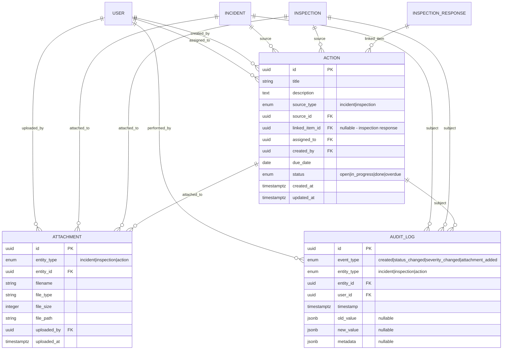

# Business Requirements Document (BRD)
# EHS Portal - Phase 2: Operational Excellence

---

> **How to Use Diagrams in This Document**
>
> This document contains Mermaid diagram definitions enclosed in triple backticks with `mermaid` syntax.
> To convert these to images for Microsoft Word:
> 1. Copy the Mermaid code block (without the backticks)
> 2. Paste into [Mermaid Live Editor](https://mermaid.live/) or [draw.io](https://app.diagrams.net/)
> 3. Export as PNG or SVG
> 4. Insert the image into your Word document
>
> Alternatively, use VS Code with a Mermaid preview extension, or Markdown editors that support Mermaid rendering.

---

## Document Control

| Item | Details |
|------|---------|
| **Document Title** | Business Requirements Document - EHS Portal Phase 2 |
| **Version** | 1.0 |
| **Status** | Draft |
| **Author** | Claude (Senior Architect) |
| **Date** | January 2025 |
| **Reviewers** | Codex (PM/BA), Project Stakeholders |
| **Dependencies** | Phase 1 must be complete before Phase 2 implementation |

---

## 1. Executive Summary

### 1.1 Purpose

This Business Requirements Document (BRD) defines the functional and non-functional requirements for **Phase 2** of the EHS (Environmental, Health & Safety) Portal. Phase 2 delivers **Operational Excellence** capabilities - extending the Phase 1 core with:

- Corrective and Preventive Actions (CAPA) management
- Evidence and attachment handling
- Comprehensive audit logging
- Basic in-app help and documentation

### 1.2 Phase 2 Business Objectives

| Objective | Success Metric |
|-----------|----------------|
| Enable corrective action tracking | 100% of failed inspections and high-severity incidents have linked actions |
| Capture evidence for compliance | All critical incidents have supporting attachments |
| Establish audit trail | Every safety event change is logged and traceable |
| Improve user onboarding | New users can self-serve basic help within the application |

### 1.3 Scope Summary

**In Scope (Phase 2):**
- Actions/CAPA management linked to incidents and inspections
- File attachments for incidents, inspections, and actions
- Audit logging for key safety events
- RBAC hardening for Phase 2 features
- Basic in-app help and support contact

**Out of Scope (Phase 2 - Deferred to Later Phases):**
- Multi-organisation tenancy (Phase 3)
- CSV/Excel data exports (Phase 3)
- Advanced analytics and risk register (Phase 4)
- Email notifications (Phase 5)
- Chat/webhook integrations (Phase 5)
- AI-powered help assistant (Future)

### 1.4 Phase 1 Dependencies

Phase 2 builds on Phase 1 capabilities. The following must be complete and stable:
- User authentication and RBAC (Worker, Manager, Admin)
- Site management
- Incident management (create, view, update status)
- Inspection templates and execution
- Dashboard with KPIs and charts

---

## 2. Business Context

### 2.1 Problem Statement

After Phase 1, organisations can report incidents and perform inspections, but still face challenges:

- **No corrective action tracking** - When issues are found, there's no formal way to assign, track, and close remediation tasks
- **No evidence capture** - Photos, documents, and supporting files cannot be attached to records
- **Limited accountability** - No audit trail showing who changed what and when
- **User support gaps** - New users have no in-app guidance for common workflows

### 2.2 Proposed Solution

Phase 2 extends the EHS Portal to provide:

- **Action Management** - Create, assign, and track corrective actions from incidents and inspections
- **Evidence Attachments** - Upload photos, documents, and files to support safety records
- **Audit Logging** - Immutable record of all key events for compliance and accountability
- **Help System** - Basic in-app help links and documentation for self-service support

### 2.3 Stakeholder Value (Phase 2)

---

## 3. Business Requirements

### 3.1 Actions/CAPA Management

| BR-ID | Requirement | Priority | C-ID | Rationale |
|-------|-------------|----------|------|-----------|
| BR-ACT-01 | From an incident detail view, users shall be able to create one or more action items linked to that incident | Must Have | C20 | Enables remediation tracking from incidents |
| BR-ACT-02 | From an inspection detail view, users shall be able to create action items from failed/not_ok checklist items | Must Have | C21 | Ensures failed inspection items are addressed |
| BR-ACT-03 | Action items shall have: title, description, source (incident or inspection), assigned_to, due_date, status | Must Have | C22 | Core data model for action tracking |
| BR-ACT-04 | Action item statuses shall include: open, in_progress, done, overdue | Must Have | C23 | Clear status workflow |
| BR-ACT-05 | System shall automatically mark action items as overdue when due_date is past and status is not done | Must Have | C24 | Proactive overdue identification |
| BR-ACT-06 | Users shall have a "My Actions" view listing action items assigned to them | Must Have | C25 | Personal task management |
| BR-ACT-07 | Admins and managers shall have an "All Actions" view listing all action items | Must Have | C26 | Organisation-wide oversight |
| BR-ACT-08 | Action lists shall be filterable by status, site, and due date | Must Have | C27 | Efficient action management |

### 3.2 Attachments/Evidence

| BR-ID | Requirement | Priority | C-ID | Rationale |
|-------|-------------|----------|------|-----------|
| BR-ATT-01 | Users shall be able to upload files to incidents (photos, documents) | Must Have | C28 | Evidence capture for incident investigation |
| BR-ATT-02 | Users shall be able to upload files to inspections (evidence of findings) | Must Have | C29 | Documentation of inspection results |
| BR-ATT-03 | Users shall optionally be able to attach files to action items | Must Have | C30 | Evidence of action completion |
| BR-ATT-04 | Each attachment shall store: linked entity type/ID, filename, file type, file size, uploaded_by, uploaded_at | Must Have | C31 | Complete metadata for compliance |
| BR-ATT-05 | Incident and inspection detail views shall show a list of attachments with download links | Must Have | C32 | Easy access to evidence |
| BR-ATT-06 | System shall enforce maximum file size and allowed file types | Must Have | C33 | Security and storage management |

### 3.3 Audit Logging

| BR-ID | Requirement | Priority | C-ID | Rationale |
|-------|-------------|----------|------|-----------|
| BR-AUD-01 | System shall record audit logs when incidents are created | Must Have | C40 | Traceability of incident origin |
| BR-AUD-02 | System shall record audit logs when incident status or severity changes | Must Have | C41 | Track investigation progress |
| BR-AUD-03 | System shall record audit logs when inspections are created | Must Have | C42 | Traceability of inspection records |
| BR-AUD-04 | System shall record audit logs when action items are created or their status changes | Must Have | C43 | Action accountability |
| BR-AUD-05 | Incident detail view shall include an Activity Log showing who did what and when | Must Have | C44 | Visible audit trail per incident |
| BR-AUD-06 | Inspection detail view shall include an Activity Log showing who did what and when | Must Have | C45 | Visible audit trail per inspection |
| BR-AUD-07 | Audit log records shall be immutable and cannot be edited or deleted | Must Have | C46 | Compliance integrity |

### 3.4 Help and Documentation

| BR-ID | Requirement | Priority | C-ID | Rationale |
|-------|-------------|----------|------|-----------|
| BR-HELP-01 | Application shall provide a basic Help or Support link accessible from navigation | Must Have | C68 | Entry point for user assistance |
| BR-HELP-02 | There shall be simple documentation or FAQ for key workflows (incidents, inspections, actions) | Must Have | C69 | Self-service user guidance |
| BR-HELP-03 | There shall be a clear way for users to contact support (e.g., email address or form) | Must Have | C70 | Escalation path for issues |

---

## 4. User Roles and Permissions (Phase 2 Extension)

### 4.1 Phase 2 Permission Matrix

Phase 2 extends the Phase 1 role model with new permissions for Actions, Attachments, and Audit Logs.

### 4.2 Detailed Permission Table (Phase 2)

| Permission | Worker | Manager | Admin | Notes |
|------------|--------|---------|-------|-------|
| **Actions** | | | | |
| Create action from incident | No | Yes | Yes | Only managers/admins can assign work |
| Create action from inspection | No | Yes | Yes | Only managers/admins can assign work |
| View own assigned actions | Yes | Yes | Yes | "My Actions" view |
| View all actions | No | Yes | Yes | "All Actions" view |
| Assign action to user | No | Yes | Yes | Manager/admin assigns work |
| Update own action status | Yes | Yes | Yes | Worker can mark their tasks done |
| Update any action status | No | Yes | Yes | Manager/admin oversight |
| **Attachments** | | | | |
| Upload attachment to own incident | Yes | Yes | Yes | Workers can add evidence to their reports |
| Upload attachment to any incident | No | Yes | Yes | Manager/admin can add to any incident |
| Upload attachment to inspection | No | Yes | Yes | Only inspectors can add inspection evidence |
| Upload attachment to own action | Yes | Yes | Yes | Workers can attach completion evidence |
| Download attachments | Yes | Yes | Yes | All authenticated users |
| Delete own attachments | Yes | Yes | Yes | User can remove their own uploads |
| Delete any attachment | No | No | Yes | Admin only |
| **Audit Logs** | | | | |
| View activity log on incident | Yes | Yes | Yes | Visible on detail views |
| View activity log on inspection | Yes | Yes | Yes | Visible on detail views |
| View system-wide audit log | No | No | Yes | Admin compliance review |
| **Help** | | | | |
| Access help system | Yes | Yes | Yes | All users |

### 4.3 RBAC Enforcement Rules

| Rule ID | Rule | Enforcement Point |
|---------|------|-------------------|
| RBAC-P2-01 | Only Manager and Admin can create actions | POST /api/actions |
| RBAC-P2-02 | Workers can only update actions assigned to them | PUT /api/actions/:id |
| RBAC-P2-03 | Workers can only upload attachments to their own incidents | POST /api/attachments |
| RBAC-P2-04 | Only Admin can delete attachments uploaded by others | DELETE /api/attachments/:id |
| RBAC-P2-05 | Only Admin can access system-wide audit log endpoint | GET /api/audit-logs |
| RBAC-P2-06 | All users can view activity logs on entities they can access | Inline in detail views |

---

## 5. Business Process Flows

### 5.1 Action Lifecycle (CAPA Flow)

### 5.2 Action Creation from Incident

### 5.3 Action Creation from Failed Inspection

### 5.4 Attachment Upload Flow

### 5.5 Audit Log Recording

---

## 6. Data Requirements

### 6.1 New Data Entities (Phase 2)

| Entity | Description | Key Attributes |
|--------|-------------|----------------|
| **Action** | Corrective/preventive action item | Title, Description, Source Type, Source ID, Assigned To, Due Date, Status |
| **Attachment** | File attached to incident/inspection/action | Entity Type, Entity ID, Filename, File Type, File Size, File Path, Uploaded By, Uploaded At |
| **Audit Log** | Immutable record of system events | Event Type, Entity Type, Entity ID, User ID, Timestamp, Old Value, New Value, Metadata |

### 6.2 Data Model (Phase 2 Additions)

### 6.3 Action Status Transitions

| From Status | To Status | Trigger | Notes |
|-------------|-----------|---------|-------|
| (new) | open | Action created | Initial state |
| open | in_progress | User starts work | Manual update |
| open | overdue | System job | due_date < today |
| in_progress | done | User completes | Manual update |
| in_progress | overdue | System job | due_date < today |
| overdue | in_progress | User resumes | Manual update |
| overdue | done | User completes | Manual update |

### 6.4 Attachment Constraints

| Constraint | Value | Rationale |
|------------|-------|-----------|
| Maximum file size | 10 MB | Balance between evidence capture and storage |
| Allowed file types | jpg, jpeg, png, gif, pdf, doc, docx, xls, xlsx | Common document and image formats |
| Maximum attachments per entity | 20 | Prevent abuse while allowing adequate evidence |

---

## 7. Non-Functional Requirements (Phase 2)

### 7.1 Security

| NFR-ID | Requirement | Target |
|--------|-------------|--------|
| NFR-SEC-P2-01 | Uploaded files must be scanned for malware (or type-validated) | Type validation on upload |
| NFR-SEC-P2-02 | File storage must not be publicly accessible | Authenticated download only |
| NFR-SEC-P2-03 | Audit logs must be immutable | No UPDATE/DELETE on audit_log table |
| NFR-SEC-P2-04 | RBAC must be enforced at API level for all Phase 2 endpoints | 100% coverage |

### 7.2 Performance

| NFR-ID | Requirement | Target |
|--------|-------------|--------|
| NFR-PERF-P2-01 | File upload response time | < 5 seconds for 10MB file |
| NFR-PERF-P2-02 | Action list load time | < 500ms |
| NFR-PERF-P2-03 | Audit log query time | < 1 second for entity history |

### 7.3 Storage

| NFR-ID | Requirement | Target |
|--------|-------------|--------|
| NFR-STOR-01 | File storage must be configurable | Local filesystem or S3-compatible |
| NFR-STOR-02 | Files must be organised by entity type | /uploads/{entity_type}/{entity_id}/ |
| NFR-STOR-03 | Original filenames must be preserved in metadata | Stored in attachment record |

### 7.4 Audit & Compliance

| NFR-ID | Requirement | Target |
|--------|-------------|--------|
| NFR-AUD-01 | All audit log entries must include user ID and timestamp | 100% of entries |
| NFR-AUD-02 | Audit logs must be retained | Minimum 7 years |
| NFR-AUD-03 | Audit log queries must support date range filtering | For compliance reports |

---

## 8. Acceptance Criteria Summary

### 8.1 Phase 2 Completion Criteria

**Actions/CAPA:**
- [ ] Manager can create action from incident detail view
- [ ] Manager can create action from failed inspection item
- [ ] Action has all required fields (title, description, assignee, due date, status)
- [ ] Worker can view "My Actions" list with assigned actions
- [ ] Manager can view "All Actions" list
- [ ] System automatically marks overdue actions
- [ ] Action lists can be filtered by status, site, due date

**Attachments:**
- [ ] User can upload file to incident
- [ ] User can upload file to inspection
- [ ] User can upload file to action
- [ ] Attachment metadata is stored (filename, type, size, uploader, timestamp)
- [ ] Attachments display with download links on detail views
- [ ] System enforces file size and type restrictions
- [ ] Invalid uploads show clear error messages

**Audit Logging:**
- [ ] System logs incident creation events
- [ ] System logs incident status/severity changes
- [ ] System logs inspection creation events
- [ ] System logs action creation and status changes
- [ ] Incident detail shows Activity Log section
- [ ] Inspection detail shows Activity Log section
- [ ] Audit logs cannot be edited or deleted

**Help:**
- [ ] Help link visible in navigation
- [ ] Basic FAQ/documentation accessible
- [ ] Support contact information displayed

### 8.2 Quality Gates

| Gate | Criteria |
|------|----------|
| Development Complete | All Phase 2 features implemented per requirements |
| Testing Complete | All Phase 2 test cases executed and passing |
| Phase 1 Regression | No regressions in Phase 1 functionality |
| UAT Complete | Business stakeholders approve Phase 2 functionality |
| Go-Live Ready | No critical or high-severity defects |

---

## 9. Checklist ID Mapping (Phase 2)

This section provides explicit traceability between Phase 2 requirements and the master checklist.

### 9.1 Actions/CAPA (C20-C27)

| C-ID | Checklist Item | BR-ID |
|------|----------------|-------|
| C20 | Users can create action items from incident detail view | BR-ACT-01 |
| C21 | Users can create action items from failed inspection items | BR-ACT-02 |
| C22 | Action items have title, description, source, assigned_to, due_date, status | BR-ACT-03 |
| C23 | Action statuses: open, in_progress, done, overdue | BR-ACT-04 |
| C24 | System auto-marks overdue when due_date passed and status != done | BR-ACT-05 |
| C25 | "My Actions" view for assigned actions | BR-ACT-06 |
| C26 | "All Actions" view for managers/admins | BR-ACT-07 |
| C27 | Action filters: status, site, due date | BR-ACT-08 |

### 9.2 Attachments (C28-C33)

| C-ID | Checklist Item | BR-ID |
|------|----------------|-------|
| C28 | Upload files to incidents | BR-ATT-01 |
| C29 | Upload files to inspections | BR-ATT-02 |
| C30 | Upload files to actions (optional) | BR-ATT-03 |
| C31 | Attachment metadata: entity type/ID, filename, type, size, uploader, timestamp | BR-ATT-04 |
| C32 | Detail views show attachments with download links | BR-ATT-05 |
| C33 | Enforce max file size and allowed types | BR-ATT-06 |

### 9.3 Audit Logging (C40-C46)

| C-ID | Checklist Item | BR-ID |
|------|----------------|-------|
| C40 | Audit log on incident creation | BR-AUD-01 |
| C41 | Audit log on incident status/severity change | BR-AUD-02 |
| C42 | Audit log on inspection creation | BR-AUD-03 |
| C43 | Audit log on action create/status change | BR-AUD-04 |
| C44 | Activity Log visible on incident detail | BR-AUD-05 |
| C45 | Activity Log visible on inspection detail | BR-AUD-06 |
| C46 | Audit logs immutable | BR-AUD-07 |

### 9.4 Help & Documentation (C68-C70)

| C-ID | Checklist Item | BR-ID |
|------|----------------|-------|
| C68 | Basic Help/Support link | BR-HELP-01 |
| C69 | Simple documentation/FAQ for key workflows | BR-HELP-02 |
| C70 | Clear way to contact support | BR-HELP-03 |

---

## 10. Out of Scope (Explicitly Deferred)

The following items are **NOT** part of Phase 2 and are explicitly deferred:

| Item | Deferred To | Rationale |
|------|-------------|-----------|
| Multi-organisation tenancy | Phase 3 | Requires significant architecture changes |
| CSV/Excel export | Phase 3 (C56-C58) | Lower priority than core CAPA functionality |
| Advanced analytics | Phase 4 | Requires data maturity |
| Risk register | Phase 4 | Dependent on action/trend data |
| Email notifications | Phase 5 (C64-C66) | Requires external service integration |
| Chat/webhook integrations | Phase 5 (C67) | Requires external service integration |
| SSO/SAML authentication | Phase 5 | Enterprise feature |
| AI-powered help assistant | Future | Advanced feature |
| Offline mode | Future | Mobile-specific requirement |
| Bulk operations | Future | Power user feature |

---

## 11. Glossary (Phase 2 Additions)

| Term | Definition |
|------|------------|
| **Action** | A corrective or preventive task created from an incident or inspection finding |
| **CAPA** | Corrective and Preventive Action - formal process for addressing safety issues |
| **Attachment** | A file (document, image) uploaded and linked to a safety record |
| **Audit Log** | Immutable record of system events for compliance and accountability |
| **Activity Log** | User-facing view of audit log entries for a specific entity |
| **Overdue** | An action whose due date has passed without being marked done |
| **Source** | The incident or inspection from which an action was created |

---

## 12. Appendices

### Appendix A: Phase Roadmap (Updated)

| Phase | Focus | Key Features | Status |
|-------|-------|--------------|--------|
| Phase 1 | Core MVP | Auth, Sites, Incidents, Inspections, Dashboard | Complete |
| **Phase 2** | **Operational Excellence** | **Actions/CAPA, Attachments, Audit Log, Help** | **This Document** |
| Phase 3 | Enterprise | Multi-org, Exports, Branding | Planned |
| Phase 4 | Analytics | Advanced dashboards, Risk Register | Planned |
| Phase 5 | Integration | Notifications, External API, SSO | Planned |

### Appendix B: Reference Documents

| Document | Purpose |
|----------|---------|
| BRD_EHS_PORTAL_PHASE1.md | Phase 1 business requirements (prerequisite) |
| DATA_MODEL_PHASE2.md | Phase 2 database schema |
| API_SPEC_PHASE2.md | Phase 2 API specification |
| FRONTEND_UX_PHASE2.md | Phase 2 UI/UX specification |
| TEST_STRATEGY_PHASE2.md | Phase 2 testing approach |
| USER_STORIES.md | User stories covering all phases |

### Appendix C: Assumptions

| ID | Assumption | Impact if Wrong |
|----|------------|-----------------|
| A-P2-01 | Phase 1 is complete and stable before Phase 2 starts | Delays, rework |
| A-P2-02 | File storage will be local filesystem initially, with S3 migration path | Storage architecture may need revision |
| A-P2-03 | Overdue status check runs as a daily scheduled job | Alternative: real-time calculation on query |
| A-P2-04 | Help content is static markdown/HTML, not a full CMS | May need content management later |
| A-P2-05 | Maximum 10MB file size is sufficient for initial deployment | May need increase for video evidence |

### Appendix D: Open Questions

| ID | Question | Decision Owner | Status |
|----|----------|----------------|--------|
| Q-P2-01 | Should actions have priority levels (high/medium/low)? | Product Owner | Deferred - not in current checklist |
| Q-P2-02 | Should audit logs be visible to Managers or Admin only? | Product Owner | Proposed: Activity Log visible to all, System Audit Log admin-only |
| Q-P2-03 | Is file storage local or cloud (S3)? | Technical Lead | Proposed: Design for both, implement local first |
| Q-P2-04 | Should help content be editable by admins? | Product Owner | Proposed: Static content for Phase 2, CMS in future |
