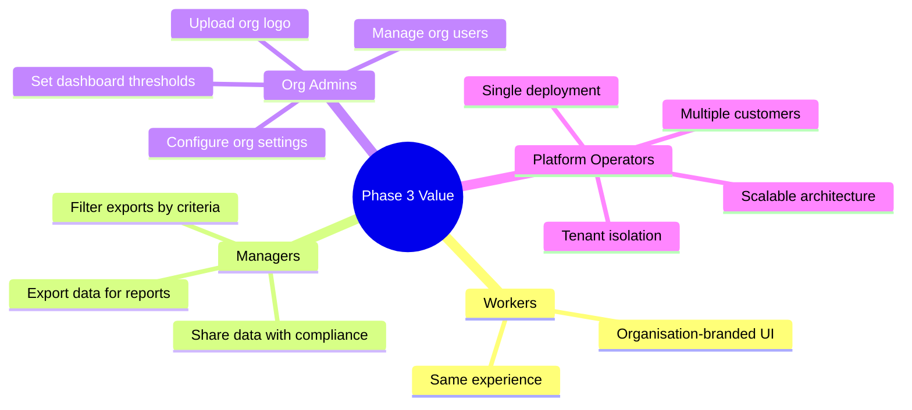
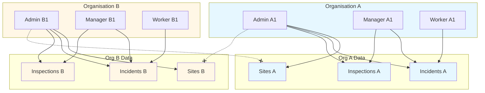
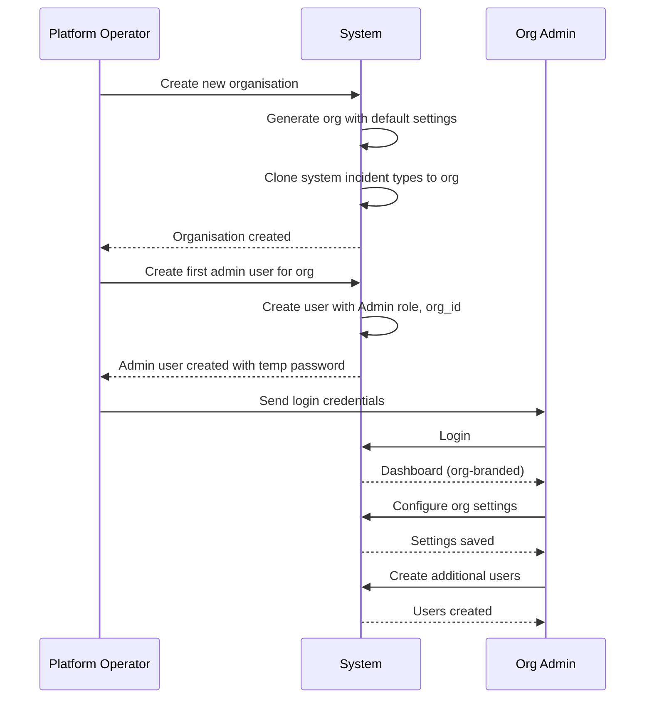
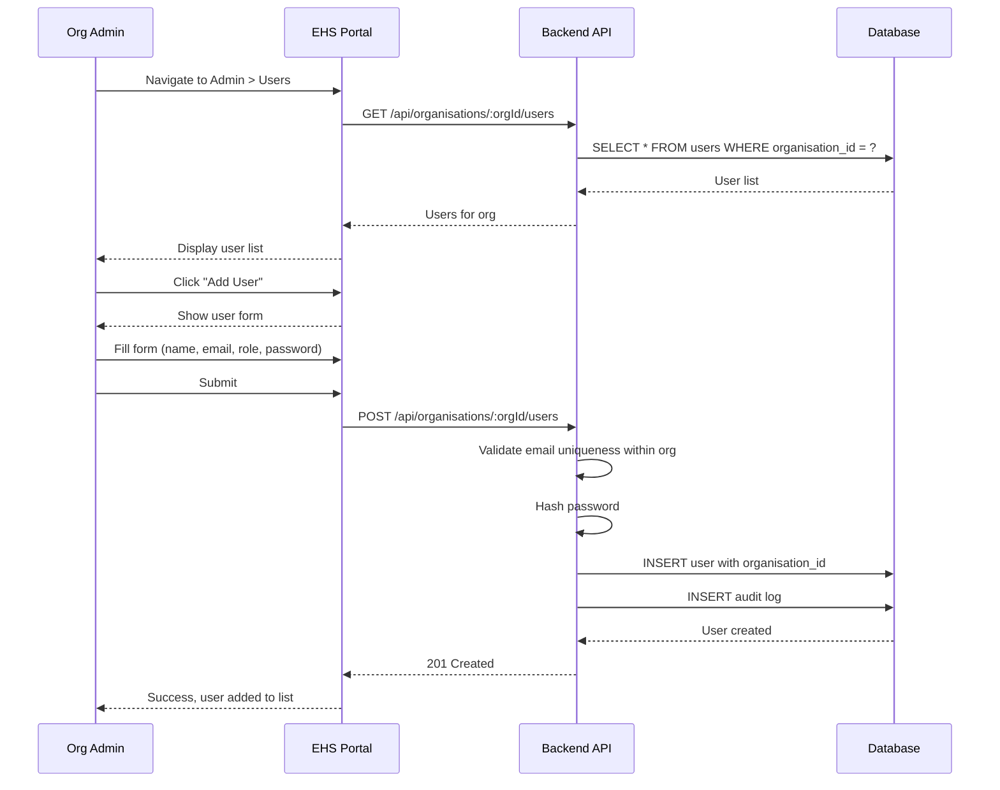
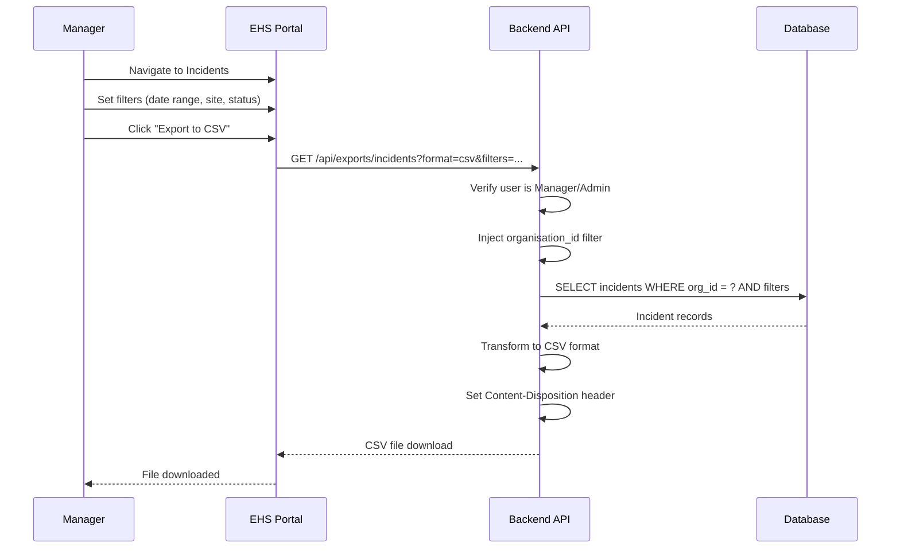
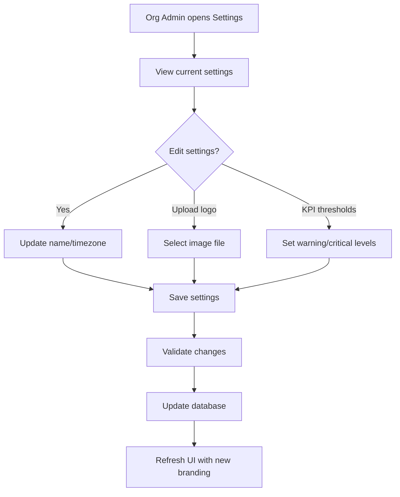
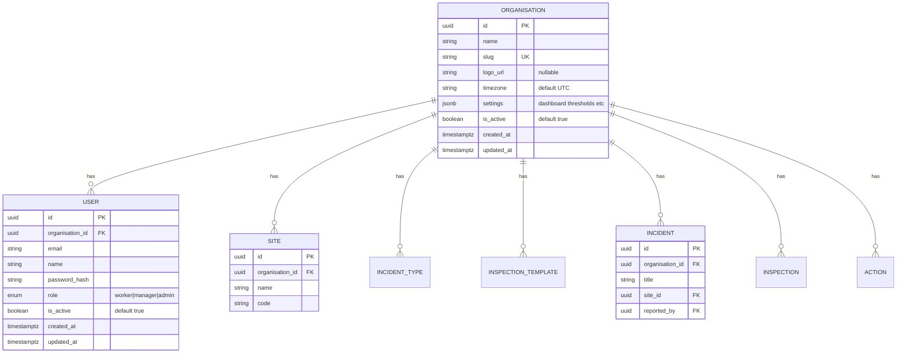

# Business Requirements Document (BRD)
# EHS Portal - Phase 3: Multi-Organisation & Enterprise Reporting

---

> **How to Use Diagrams in This Document**
>
> This document contains Mermaid diagram definitions enclosed in triple backticks with `mermaid` syntax.
> To convert these to images for Microsoft Word:
> 1. Copy the Mermaid code block (without the backticks)
> 2. Paste into [Mermaid Live Editor](https://mermaid.live/) or [draw.io](https://app.diagrams.net/)
> 3. Export as PNG or SVG
> 4. Insert the image into your Word document

---

## Document Control

| Item | Details |
|------|---------|
| **Document Title** | Business Requirements Document - EHS Portal Phase 3 |
| **Version** | 1.0 |
| **Status** | Draft |
| **Author** | Claude (Senior Architect) |
| **Date** | January 2025 |
| **Reviewers** | Codex (PM/BA), Project Stakeholders |
| **Dependencies** | Phase 1 and Phase 2 must be complete before Phase 3 implementation |

---

## 1. Executive Summary

### 1.1 Purpose

This Business Requirements Document (BRD) defines the functional and non-functional requirements for **Phase 3** of the EHS (Environmental, Health & Safety) Portal. Phase 3 delivers **Multi-Organisation & Enterprise Reporting** capabilities - extending the Phase 1 & 2 core with:

- Multi-organisation (multi-tenant) data isolation
- Organisation-level user and role management
- Data export functionality (CSV/Excel)
- Organisation settings and branding

### 1.2 Phase 3 Business Objectives

| Objective | Success Metric |
|-----------|----------------|
| Enable multi-tenancy | Multiple organisations can operate independently in one deployment |
| Ensure data isolation | Users can only access data from their own organisation |
| Empower org admins | Admins can manage users within their organisation |
| Enable data exports | Managers/Admins can export incidents, inspections, actions to CSV/Excel |
| Support org identity | Each organisation can configure basic settings and branding |

### 1.3 Scope Summary

**In Scope (Phase 3):**
- Multi-organisation / multi-tenant architecture
- Organisation-scoped data for all entities
- Organisation-level user management (create, update, disable)
- Role assignment within organisation (Worker, Manager, Admin)
- Data exports (CSV/Excel) for incidents, inspections, actions
- Export filters (date range, site, status, severity)
- Organisation settings (name, logo, timezone)
- Dashboard KPI threshold configuration (optional)

**Out of Scope (Phase 3 - Deferred to Later Phases):**
- Super-admin with cross-organisation visibility (Phase 4+)
- Email notifications (Phase 5)
- SSO/SAML authentication (Phase 5)
- Self-service user registration
- Advanced analytics and risk register (Phase 4)
- Chat/webhook integrations (Phase 5)
- Subscription/billing management
- White-label domain customisation

### 1.4 Phase 1 & 2 Dependencies

Phase 3 builds on Phase 1 and Phase 2 capabilities. The following must be complete and stable:
- User authentication and RBAC (Worker, Manager, Admin)
- Site management
- Incident management (create, view, update status)
- Inspection templates and execution
- Actions/CAPA management
- Attachments and file uploads
- Audit logging
- Dashboard with KPIs and charts
- Help system

---

## 2. Business Context

### 2.1 Problem Statement

After Phase 1 & 2, the EHS Portal serves a single organisation well, but enterprises need:

- **Multi-tenant deployment** - One installation serving multiple organisations without cross-contamination
- **Data isolation** - Each organisation's incidents, inspections, and actions visible only to their users
- **Delegated administration** - Org admins can manage their own users without system-wide access
- **Reporting and exports** - Ability to extract data for compliance reporting, analysis, and integration

### 2.2 Proposed Solution

Phase 3 extends the EHS Portal to provide:

- **Organisations Entity** - First-class organisation model with settings and branding
- **Tenant Isolation** - All core entities scoped by `organisation_id`
- **Org User Management** - Admins can create, update, and disable users within their org
- **Data Exports** - CSV/Excel exports with filtering, scoped to user's organisation
- **Org Settings** - Name, logo, timezone, and optional dashboard thresholds

### 2.3 Stakeholder Value (Phase 3)



---

## 3. Business Requirements

### 3.1 Multi-Organisation / Multi-Tenant

| BR-ID | Requirement | Priority | C-ID | Rationale |
|-------|-------------|----------|------|-----------|
| BR-ORG-01 | System shall support multiple organisations in a single deployment | Must Have | C71 | Core multi-tenancy requirement |
| BR-ORG-02 | Each user shall belong to exactly one organisation | Must Have | C72 | Clear user-org relationship |
| BR-ORG-03 | All core entities (sites, incident_types, templates, incidents, inspections, actions, attachments) shall be scoped by organisation | Must Have | C73 | Data isolation |
| BR-ORG-04 | Users shall only see and access data from their own organisation | Must Have | C74 | Security and privacy |
| BR-ORG-05 | Org admins shall have full admin rights within their organisation only | Must Have | C75 | Delegated administration |
| BR-ORG-06 | System seed data (incident types) shall be cloned per organisation or shared as read-only system defaults | Should Have | C76 | Flexibility in reference data |

### 3.2 Organisation-Level User Management

| BR-ID | Requirement | Priority | C-ID | Rationale |
|-------|-------------|----------|------|-----------|
| BR-USR-01 | Org admins shall be able to view all users in their organisation | Must Have | C77 | User visibility |
| BR-USR-02 | Org admins shall be able to create new users in their organisation | Must Have | C78 | User provisioning |
| BR-USR-03 | Org admins shall be able to update user details (name, email, role) | Must Have | C79 | User maintenance |
| BR-USR-04 | Org admins shall be able to disable/enable user accounts | Must Have | C80 | Account lifecycle |
| BR-USR-05 | Org admins shall assign roles (Worker, Manager, Admin) to users | Must Have | C81 | Role management |
| BR-USR-06 | Users shall not be able to self-register; accounts are created by admins | Must Have | C82 | Controlled access |
| BR-USR-07 | Password reset shall be performed by org admin (Phase 3) or self-service (Future) | Should Have | C83 | Password management |

### 3.3 Reporting & Exports

| BR-ID | Requirement | Priority | C-ID | Rationale |
|-------|-------------|----------|------|-----------|
| BR-EXP-01 | Managers and Admins shall be able to export incidents to CSV/Excel | Must Have | C84 | Compliance reporting |
| BR-EXP-02 | Managers and Admins shall be able to export inspections to CSV/Excel | Must Have | C85 | Quality reporting |
| BR-EXP-03 | Managers and Admins shall be able to export actions to CSV/Excel | Must Have | C86 | CAPA tracking |
| BR-EXP-04 | Exports shall support filters: date range, site, status, severity | Must Have | C87 | Targeted reporting |
| BR-EXP-05 | All exports shall be scoped to the user's organisation only | Must Have | C88 | Data isolation |
| BR-EXP-06 | Export files shall include timestamp and user info in filename | Should Have | C89 | Audit trail for exports |
| BR-EXP-07 | System shall prevent export of more than 10,000 records at once | Should Have | C90 | Performance protection |

### 3.4 Organisation Settings

| BR-ID | Requirement | Priority | C-ID | Rationale |
|-------|-------------|----------|------|-----------|
| BR-SET-01 | Each organisation shall have a name and display name | Must Have | C91 | Basic identity |
| BR-SET-02 | Each organisation shall be able to upload a logo (displayed in header) | Should Have | C92 | Branding |
| BR-SET-03 | Each organisation shall be able to set a timezone for date display | Should Have | C93 | Localisation |
| BR-SET-04 | Org admins shall be able to configure dashboard KPI thresholds (e.g., warning levels for open incidents) | Could Have | C94 | Customisation |
| BR-SET-05 | Organisation settings shall be editable only by org admins | Must Have | C95 | Access control |

---

## 4. User Roles and Permissions (Phase 3 Extension)

### 4.1 Phase 3 Role Model

Phase 3 introduces organisation-scoped permissions. All existing roles (Worker, Manager, Admin) now operate within the context of their organisation.



### 4.2 Phase 3 Permission Matrix

| Permission | Worker | Manager | Admin | Notes |
|------------|--------|---------|-------|-------|
| **Organisation** | | | | |
| View org settings | Yes | Yes | Yes | Read-only for non-admins |
| Edit org settings | No | No | Yes | Org admin only |
| Upload org logo | No | No | Yes | Org admin only |
| **User Management** | | | | |
| View org users | No | No | Yes | Org admin only |
| Create org user | No | No | Yes | Org admin only |
| Update org user | No | No | Yes | Org admin only |
| Disable/Enable user | No | No | Yes | Org admin only |
| Reset user password | No | No | Yes | Org admin only |
| **Exports** | | | | |
| Export incidents | No | Yes | Yes | Org-scoped |
| Export inspections | No | Yes | Yes | Org-scoped |
| Export actions | No | Yes | Yes | Org-scoped |
| **All Other Permissions** | | | | |
| (Same as Phase 1 & 2) | ... | ... | ... | Now org-scoped |

### 4.3 RBAC Enforcement Rules (Phase 3)

| Rule ID | Rule | Enforcement Point |
|---------|------|-------------------|
| RBAC-P3-01 | All data queries must filter by user's organisation_id | Query layer |
| RBAC-P3-02 | Only org admins can access /api/organisations/:id/users | Middleware |
| RBAC-P3-03 | Only org admins can PUT /api/organisations/:id/settings | Middleware |
| RBAC-P3-04 | Only managers and admins can access /api/exports/* | Middleware |
| RBAC-P3-05 | Export queries must include organisation_id filter | Query layer |
| RBAC-P3-06 | User creation must set organisation_id to creator's org | Route handler |

---

## 5. Business Process Flows

### 5.1 Organisation Onboarding Flow



### 5.2 User Management Flow



### 5.3 Data Export Flow



### 5.4 Organisation Settings Flow



---

## 6. Data Requirements

### 6.1 New Data Entities (Phase 3)

| Entity | Description | Key Attributes |
|--------|-------------|----------------|
| **Organisation** | Tenant/company entity | ID, Name, Slug, Logo URL, Timezone, Settings (JSON), Created At |

### 6.2 Modified Entities (Phase 3)

| Entity | Modification |
|--------|--------------|
| **users** | Add `is_active` column (BOOLEAN), enforce `organisation_id` NOT NULL |
| **sites** | Enforce `organisation_id` NOT NULL |
| **incident_types** | Enforce `organisation_id` NOT NULL (or is_system flag for shared) |
| **inspection_templates** | Enforce `organisation_id` NOT NULL |
| **incidents** | Enforce `organisation_id` NOT NULL |
| **inspections** | Enforce `organisation_id` NOT NULL |
| **actions** | Enforce `organisation_id` NOT NULL |
| **attachments** | Add `organisation_id` column (derived from parent entity) |
| **audit_log** | Add `organisation_id` column |

### 6.3 Data Model (Phase 3)



### 6.4 Organisation Settings Schema

```json
{
  "dashboard": {
    "openIncidentsWarning": 5,
    "openIncidentsCritical": 10,
    "overdueActionsWarning": 3,
    "overdueActionsCritical": 5
  },
  "defaults": {
    "incidentSeverity": "medium",
    "actionDueDays": 14
  }
}
```

---

## 7. Non-Functional Requirements (Phase 3)

### 7.1 Security

| NFR-ID | Requirement | Target |
|--------|-------------|--------|
| NFR-SEC-P3-01 | All data queries must enforce organisation isolation | 100% of queries |
| NFR-SEC-P3-02 | Cross-organisation data access must be prevented at API level | Zero cross-tenant access |
| NFR-SEC-P3-03 | Organisation ID must not be modifiable by users | Enforced on all updates |
| NFR-SEC-P3-04 | Disabled users must not be able to login | Immediate effect |

### 7.2 Performance

| NFR-ID | Requirement | Target |
|--------|-------------|--------|
| NFR-PERF-P3-01 | User list load time (org-scoped) | < 500ms |
| NFR-PERF-P3-02 | Export generation (1000 records) | < 5 seconds |
| NFR-PERF-P3-03 | Export generation (10000 records) | < 30 seconds |
| NFR-PERF-P3-04 | Organisation settings save | < 1 second |

### 7.3 Data

| NFR-ID | Requirement | Target |
|--------|-------------|--------|
| NFR-DATA-P3-01 | All existing tables must have organisation_id index | Indexed for performance |
| NFR-DATA-P3-02 | Export queries must use indexed columns | Optimised queries |
| NFR-DATA-P3-03 | Logo file size limit | 2 MB maximum |

---

## 8. Acceptance Criteria Summary

### 8.1 Phase 3 Completion Criteria

**Multi-Organisation:**
- [ ] System supports multiple organisations
- [ ] Users are assigned to exactly one organisation
- [ ] All data is scoped by organisation
- [ ] Users cannot see or access data from other organisations
- [ ] Org admins can only administer their own organisation

**User Management:**
- [ ] Org admin can view list of users in their organisation
- [ ] Org admin can create new users with role assignment
- [ ] Org admin can update user details (name, email, role)
- [ ] Org admin can disable/enable user accounts
- [ ] Org admin can reset user passwords
- [ ] Disabled users cannot login

**Exports:**
- [ ] Manager/Admin can export incidents to CSV
- [ ] Manager/Admin can export incidents to Excel
- [ ] Manager/Admin can export inspections to CSV/Excel
- [ ] Manager/Admin can export actions to CSV/Excel
- [ ] Exports respect date range, site, status, severity filters
- [ ] Exports are scoped to user's organisation
- [ ] Export files have meaningful filenames with timestamp

**Organisation Settings:**
- [ ] Org admin can view organisation settings
- [ ] Org admin can update organisation name
- [ ] Org admin can upload organisation logo
- [ ] Org admin can set organisation timezone
- [ ] Org admin can configure dashboard thresholds (optional)
- [ ] Org logo displays in header

### 8.2 Quality Gates

| Gate | Criteria |
|------|----------|
| Development Complete | All Phase 3 features implemented per requirements |
| Testing Complete | All Phase 3 test cases executed and passing |
| Phase 1 & 2 Regression | No regressions in Phase 1 & 2 functionality |
| Security Review | Multi-tenant isolation verified |
| UAT Complete | Business stakeholders approve Phase 3 functionality |
| Go-Live Ready | No critical or high-severity defects |

---

## 9. Checklist ID Mapping (Phase 3)

### 9.1 Multi-Organisation (C71-C76)

| C-ID | Checklist Item | BR-ID |
|------|----------------|-------|
| C71 | System supports multiple organisations in single deployment | BR-ORG-01 |
| C72 | Users belong to exactly one organisation | BR-ORG-02 |
| C73 | All core entities scoped by organisation_id | BR-ORG-03 |
| C74 | Users can only see/access own organisation's data | BR-ORG-04 |
| C75 | Org admins have full admin rights within their org only | BR-ORG-05 |
| C76 | System seed data cloned per org or shared read-only | BR-ORG-06 |

### 9.2 User Management (C77-C83)

| C-ID | Checklist Item | BR-ID |
|------|----------------|-------|
| C77 | Org admins can view all users in their organisation | BR-USR-01 |
| C78 | Org admins can create new users in their organisation | BR-USR-02 |
| C79 | Org admins can update user details (name, email, role) | BR-USR-03 |
| C80 | Org admins can disable/enable user accounts | BR-USR-04 |
| C81 | Org admins can assign roles (Worker, Manager, Admin) | BR-USR-05 |
| C82 | No self-registration; admins create accounts | BR-USR-06 |
| C83 | Password reset by org admin (or self-service future) | BR-USR-07 |

### 9.3 Reporting & Exports (C84-C90)

| C-ID | Checklist Item | BR-ID |
|------|----------------|-------|
| C84 | Managers/Admins can export incidents to CSV/Excel | BR-EXP-01 |
| C85 | Managers/Admins can export inspections to CSV/Excel | BR-EXP-02 |
| C86 | Managers/Admins can export actions to CSV/Excel | BR-EXP-03 |
| C87 | Exports support filters: date range, site, status, severity | BR-EXP-04 |
| C88 | All exports scoped to user's organisation | BR-EXP-05 |
| C89 | Export files include timestamp and user info in filename | BR-EXP-06 |
| C90 | Export limited to 10,000 records per request | BR-EXP-07 |

### 9.4 Organisation Settings (C91-C95)

| C-ID | Checklist Item | BR-ID |
|------|----------------|-------|
| C91 | Organisation has name and display name | BR-SET-01 |
| C92 | Organisation can upload logo for header | BR-SET-02 |
| C93 | Organisation can set timezone | BR-SET-03 |
| C94 | Org admin can configure dashboard KPI thresholds | BR-SET-04 |
| C95 | Only org admins can edit organisation settings | BR-SET-05 |

---

## 10. Out of Scope (Explicitly Deferred)

The following items are **NOT** part of Phase 3 and are explicitly deferred:

| Item | Deferred To | Rationale |
|------|-------------|-----------|
| Super-admin with cross-org visibility | Phase 4+ | Requires platform admin model |
| Self-service user registration | Future | Security concern; admin-only for now |
| SSO/SAML authentication | Phase 5 | Enterprise integration feature |
| Email notifications | Phase 5 | Requires email service integration |
| Advanced analytics | Phase 4 | Requires data maturity |
| Risk register | Phase 4 | Dependent on trend data |
| Subscription/billing | Future | SaaS business model feature |
| White-label domains | Future | Enterprise customisation |
| Data import (CSV upload) | Future | Complement to export |
| Organisation deletion | Future | Requires careful data handling |
| User transfer between orgs | Future | Edge case, complex |

---

## 11. Glossary (Phase 3 Additions)

| Term | Definition |
|------|------------|
| **Organisation** | A tenant entity representing a company or business unit |
| **Multi-tenant** | Architecture where one deployment serves multiple organisations with data isolation |
| **Org Admin** | An admin user with full admin rights scoped to their organisation |
| **Organisation Scoping** | Filtering all data queries by organisation_id |
| **Export** | Process of extracting data to CSV or Excel format |
| **Slug** | URL-safe unique identifier for an organisation (e.g., "acme-corp") |
| **Timezone** | Organisation's local timezone for date/time display |
| **KPI Threshold** | Configurable warning/critical levels for dashboard indicators |

---

## 12. Appendices

### Appendix A: Phase Roadmap (Updated)

| Phase | Focus | Key Features | Status |
|-------|-------|--------------|--------|
| Phase 1 | Core MVP | Auth, Sites, Incidents, Inspections, Dashboard | Complete |
| Phase 2 | Operational Excellence | Actions/CAPA, Attachments, Audit Log, Help | Complete |
| **Phase 3** | **Multi-Org & Reporting** | **Multi-tenancy, User Mgmt, Exports, Org Settings** | **This Document** |
| Phase 4 | Analytics | Advanced dashboards, Risk Register, Super-admin | Planned |
| Phase 5 | Integration | Notifications, External API, SSO | Planned |

### Appendix B: Reference Documents

| Document | Purpose |
|----------|---------|
| BRD_EHS_PORTAL_PHASE1.md | Phase 1 business requirements |
| BRD_EHS_PORTAL_PHASE2.md | Phase 2 business requirements |
| DATA_MODEL.md | Master database schema (all phases) |
| DATA_MODEL_PHASE3.md | Phase 3 data model details |
| ARCHITECTURE.md | System architecture |
| API_SPEC_PHASE3.md | Phase 3 API specification (to be created) |

### Appendix C: Assumptions

| ID | Assumption | Impact if Wrong |
|----|------------|-----------------|
| A-P3-01 | Phase 1 & 2 are complete and stable | Delays, rework |
| A-P3-02 | Single organisation_id per user (no multi-org access) | Architecture change needed |
| A-P3-03 | Logo storage uses same mechanism as attachments | Storage refactoring needed |
| A-P3-04 | Excel export uses xlsx library (server-side generation) | Alternative approach needed |
| A-P3-05 | Timezone affects display only, not storage (all times stored as UTC) | Data migration needed |
| A-P3-06 | Organisation creation is done by platform operator, not self-service | Onboarding flow change |

### Appendix D: Open Questions

| ID | Question | Decision Owner | Status |
|----|----------|----------------|--------|
| Q-P3-01 | Should incident types be shared system-wide or cloned per org? | Product Owner | Proposed: Clone per org with option to create custom |
| Q-P3-02 | How is the first org admin created? Platform operator? | Product Owner | Proposed: Platform operator creates via CLI/API |
| Q-P3-03 | Should we support Excel (xlsx) or just CSV initially? | Product Owner | Proposed: Both - CSV simple, Excel for formatting |
| Q-P3-04 | What happens to user's data when they are disabled? | Product Owner | Proposed: Data retained, user cannot login |
| Q-P3-05 | Maximum logo file size? | Technical Lead | Proposed: 2 MB |
| Q-P3-06 | Should exports be async for large datasets? | Technical Lead | Proposed: Sync for Phase 3, async in future |

---

## 13. Migration Strategy

### 13.1 Existing Data Migration

For existing Phase 1 & 2 deployments, migration to Phase 3 requires:

1. Create a default organisation for existing data
2. Assign all existing users to the default organisation
3. Update all tables to set organisation_id to default org
4. Add NOT NULL constraints after migration
5. Verify data integrity

### 13.2 Migration Script Outline

```sql
-- Step 1: Create default organisation
INSERT INTO organisations (id, name, slug, timezone)
VALUES (gen_random_uuid(), 'Default Organisation', 'default-org', 'UTC')
RETURNING id;

-- Step 2: Update all users
UPDATE users SET organisation_id = '<default_org_id>';

-- Step 3: Update all sites
UPDATE sites SET organisation_id = '<default_org_id>';

-- Step 4: Continue for all tables...

-- Step 5: Add NOT NULL constraints
ALTER TABLE users ALTER COLUMN organisation_id SET NOT NULL;
ALTER TABLE sites ALTER COLUMN organisation_id SET NOT NULL;
-- etc.
```

---

*End of Document*
