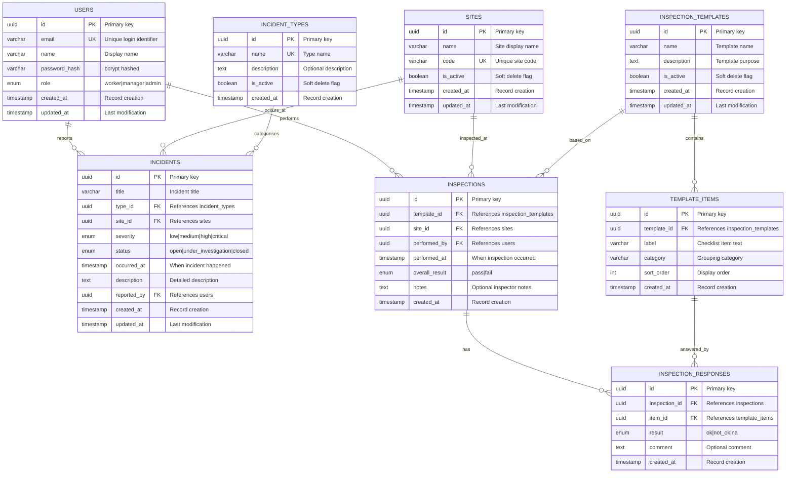
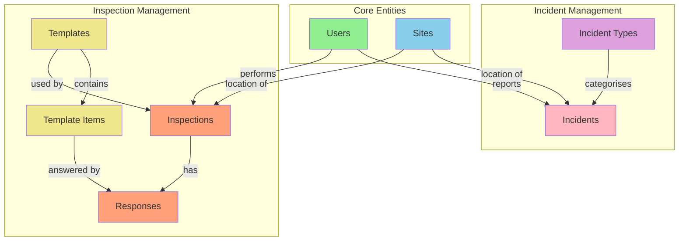

# Data Model Document
# EHS Portal - Phase 1: Core Operational MVP

---

> **How to Use Diagrams in This Document**
>
> This document contains Mermaid diagram definitions enclosed in triple backticks with `mermaid` syntax.
> To convert these to images for Microsoft Word:
> 1. Copy the Mermaid code block (without the backticks)
> 2. Paste into [Mermaid Live Editor](https://mermaid.live/) or [draw.io](https://app.diagrams.net/)
> 3. Export as PNG or SVG
> 4. Insert the image into your Word document
>
> Alternatively, use VS Code with a Mermaid preview extension, or Markdown editors that support Mermaid rendering.

---

## Document Control

| Item | Details |
|------|---------|
| **Document Title** | Data Model Document - EHS Portal Phase 1 |
| **Version** | 1.0 |
| **Status** | Draft |
| **Author** | Claude (Senior Architect) |
| **Date** | January 2025 |
| **Related Documents** | BRD_EHS_PORTAL_PHASE1.md, API_SPEC_PHASE1.md |

---

## 1. Overview

This document defines the data model for Phase 1 of the EHS Portal. It includes:
- Entity descriptions and attributes
- Entity-Relationship Diagram (ERD)
- Database schema specifications
- Data validation rules
- Seed data requirements

---

## 2. Entity-Relationship Diagram

### 2.1 Complete Phase 1 ERD



---

## 3. Entity Specifications

### 3.1 Users

**Purpose:** Stores user accounts for authentication and authorization.

| Attribute | Type | Constraints | Description |
|-----------|------|-------------|-------------|
| id | UUID | PK, NOT NULL | Primary identifier |
| email | VARCHAR(255) | UNIQUE, NOT NULL | Login identifier |
| name | VARCHAR(255) | NOT NULL | Display name |
| password_hash | VARCHAR(255) | NOT NULL | bcrypt hash (cost  10) |
| role | ENUM | NOT NULL | 'worker', 'manager', 'admin' |
| created_at | TIMESTAMP | NOT NULL, DEFAULT NOW() | Creation timestamp |
| updated_at | TIMESTAMP | NOT NULL, DEFAULT NOW() | Last update timestamp |

**Indexes:**
- PRIMARY KEY (id)
- UNIQUE INDEX (email)
- INDEX (role)

**Business Rules:**
- Email must be valid format
- Password must be minimum 8 characters before hashing
- Role determines access permissions per BR-AUTH-02

---

### 3.2 Sites

**Purpose:** Represents physical locations where incidents occur and inspections are performed.

| Attribute | Type | Constraints | Description |
|-----------|------|-------------|-------------|
| id | UUID | PK, NOT NULL | Primary identifier |
| name | VARCHAR(255) | NOT NULL | Human-readable name |
| code | VARCHAR(50) | UNIQUE, NOT NULL | Short unique code |
| is_active | BOOLEAN | NOT NULL, DEFAULT TRUE | Soft delete flag |
| created_at | TIMESTAMP | NOT NULL, DEFAULT NOW() | Creation timestamp |
| updated_at | TIMESTAMP | NOT NULL, DEFAULT NOW() | Last update timestamp |

**Indexes:**
- PRIMARY KEY (id)
- UNIQUE INDEX (code)
- INDEX (is_active)

**Business Rules:**
- Code should be uppercase alphanumeric
- Deactivated sites still visible in historical records

---

### 3.3 Incident Types

**Purpose:** Reference data categorising types of safety incidents.

| Attribute | Type | Constraints | Description |
|-----------|------|-------------|-------------|
| id | UUID | PK, NOT NULL | Primary identifier |
| name | VARCHAR(100) | UNIQUE, NOT NULL | Type name |
| description | TEXT | NULLABLE | Optional description |
| is_active | BOOLEAN | NOT NULL, DEFAULT TRUE | Soft delete flag |
| created_at | TIMESTAMP | NOT NULL, DEFAULT NOW() | Creation timestamp |

**Seed Data:**
- Injury
- Near Miss
- Property Damage
- Environmental
- Security

---

### 3.4 Incidents

**Purpose:** Records safety events reported by users.

| Attribute | Type | Constraints | Description |
|-----------|------|-------------|-------------|
| id | UUID | PK, NOT NULL | Primary identifier |
| title | VARCHAR(255) | NOT NULL | Brief incident title |
| type_id | UUID | FK, NOT NULL | References incident_types |
| site_id | UUID | FK, NOT NULL | References sites |
| severity | ENUM | NOT NULL | 'low', 'medium', 'high', 'critical' |
| status | ENUM | NOT NULL, DEFAULT 'open' | 'open', 'under_investigation', 'closed' |
| occurred_at | TIMESTAMP | NOT NULL | When the incident happened |
| description | TEXT | NULLABLE | Detailed description |
| reported_by | UUID | FK, NOT NULL | References users |
| created_at | TIMESTAMP | NOT NULL, DEFAULT NOW() | Creation timestamp |
| updated_at | TIMESTAMP | NOT NULL, DEFAULT NOW() | Last update timestamp |

**Indexes:**
- PRIMARY KEY (id)
- INDEX (type_id)
- INDEX (site_id)
- INDEX (reported_by)
- INDEX (status)
- INDEX (severity)
- INDEX (occurred_at)

**Business Rules:**
- occurred_at cannot be in the future
- Status transitions: open ' under_investigation ' closed
- Only managers/admins can change status (BR-INC-04)

---

### 3.5 Inspection Templates

**Purpose:** Defines reusable inspection checklists.

| Attribute | Type | Constraints | Description |
|-----------|------|-------------|-------------|
| id | UUID | PK, NOT NULL | Primary identifier |
| name | VARCHAR(255) | NOT NULL | Template name |
| description | TEXT | NULLABLE | Template purpose |
| is_active | BOOLEAN | NOT NULL, DEFAULT TRUE | Soft delete flag |
| created_at | TIMESTAMP | NOT NULL, DEFAULT NOW() | Creation timestamp |
| updated_at | TIMESTAMP | NOT NULL, DEFAULT NOW() | Last update timestamp |

**Business Rules:**
- Only admins can create/edit templates (BR-INSP-01)
- Deactivated templates cannot be used for new inspections

---

### 3.6 Template Items

**Purpose:** Individual checklist items within an inspection template.

| Attribute | Type | Constraints | Description |
|-----------|------|-------------|-------------|
| id | UUID | PK, NOT NULL | Primary identifier |
| template_id | UUID | FK, NOT NULL | References inspection_templates |
| label | VARCHAR(500) | NOT NULL | Checklist item text |
| category | VARCHAR(100) | NULLABLE | Grouping category |
| sort_order | INTEGER | NOT NULL, DEFAULT 0 | Display order |
| created_at | TIMESTAMP | NOT NULL, DEFAULT NOW() | Creation timestamp |

**Indexes:**
- PRIMARY KEY (id)
- INDEX (template_id)
- INDEX (template_id, sort_order)

**Business Rules:**
- Items ordered by sort_order within template
- Category enables grouping (BR-INSP-02)

---

### 3.7 Inspections

**Purpose:** Records completed inspection instances.

| Attribute | Type | Constraints | Description |
|-----------|------|-------------|-------------|
| id | UUID | PK, NOT NULL | Primary identifier |
| template_id | UUID | FK, NOT NULL | References inspection_templates |
| site_id | UUID | FK, NOT NULL | References sites |
| performed_by | UUID | FK, NOT NULL | References users |
| performed_at | TIMESTAMP | NOT NULL | When inspection was done |
| overall_result | ENUM | NOT NULL | 'pass', 'fail' |
| notes | TEXT | NULLABLE | Inspector notes |
| created_at | TIMESTAMP | NOT NULL, DEFAULT NOW() | Creation timestamp |

**Indexes:**
- PRIMARY KEY (id)
- INDEX (template_id)
- INDEX (site_id)
- INDEX (performed_by)
- INDEX (performed_at)
- INDEX (overall_result)

**Business Rules:**
- overall_result auto-calculated: FAIL if any response is 'not_ok', else PASS (BR-INSP-05)
- Only managers/admins can perform inspections (BR-INSP-03)

---

### 3.8 Inspection Responses

**Purpose:** Individual item responses within a completed inspection.

| Attribute | Type | Constraints | Description |
|-----------|------|-------------|-------------|
| id | UUID | PK, NOT NULL | Primary identifier |
| inspection_id | UUID | FK, NOT NULL | References inspections |
| item_id | UUID | FK, NOT NULL | References template_items |
| result | ENUM | NOT NULL | 'ok', 'not_ok', 'na' |
| comment | TEXT | NULLABLE | Optional finding comment |
| created_at | TIMESTAMP | NOT NULL, DEFAULT NOW() | Creation timestamp |

**Indexes:**
- PRIMARY KEY (id)
- INDEX (inspection_id)
- UNIQUE INDEX (inspection_id, item_id)

**Business Rules:**
- Each inspection must have a response for every template item
- 'not_ok' response triggers overall FAIL result

---

## 4. Entity Relationships Visual

### 4.1 Relationship Summary



---

## 5. Data Validation Rules

### 5.1 Field Validations

| Entity | Field | Validation Rule |
|--------|-------|-----------------|
| Users | email | Valid email format, max 255 chars |
| Users | password | Min 8 chars, at least 1 letter and 1 number |
| Users | name | Min 2 chars, max 255 chars |
| Sites | code | Alphanumeric, uppercase, max 50 chars |
| Sites | name | Min 2 chars, max 255 chars |
| Incidents | title | Min 5 chars, max 255 chars |
| Incidents | occurred_at | Cannot be future date |
| Incidents | description | Max 5000 chars |
| Template Items | label | Min 3 chars, max 500 chars |
| Inspection Responses | comment | Max 1000 chars |

### 5.2 Referential Integrity

| Relationship | On Delete | On Update |
|--------------|-----------|-----------|
| incidents.type_id ' incident_types.id | RESTRICT | CASCADE |
| incidents.site_id ' sites.id | RESTRICT | CASCADE |
| incidents.reported_by ' users.id | RESTRICT | CASCADE |
| template_items.template_id ' inspection_templates.id | CASCADE | CASCADE |
| inspections.template_id ' inspection_templates.id | RESTRICT | CASCADE |
| inspections.site_id ' sites.id | RESTRICT | CASCADE |
| inspections.performed_by ' users.id | RESTRICT | CASCADE |
| inspection_responses.inspection_id ' inspections.id | CASCADE | CASCADE |
| inspection_responses.item_id ' template_items.id | RESTRICT | CASCADE |

---

## 6. Seed Data Requirements

### 6.1 Default Users

| Email | Name | Role | Password |
|-------|------|------|----------|
| admin@ehs.local | System Admin | admin | Admin123! |
| manager@ehs.local | Site Manager | manager | Manager123! |
| worker@ehs.local | Field Worker | worker | Worker123! |

### 6.2 Default Sites

| Code | Name |
|------|------|
| HQ | Head Office |
| WH1 | Warehouse Alpha |
| WH2 | Warehouse Beta |
| SITE-A | Construction Site A |

### 6.3 Default Incident Types

| Name | Description |
|------|-------------|
| Injury | Physical injury to personnel |
| Near Miss | Potential incident that was avoided |
| Property Damage | Damage to equipment or facilities |
| Environmental | Environmental spill or contamination |
| Security | Security breach or concern |

### 6.4 Sample Inspection Template

**Template:** General Workplace Safety Inspection

| Category | Item Label | Sort Order |
|----------|------------|------------|
| Fire Safety | Fire extinguishers accessible and inspected | 1 |
| Fire Safety | Emergency exits clear and marked | 2 |
| Fire Safety | Fire alarm system functional | 3 |
| PPE | Required PPE available | 4 |
| PPE | PPE in good condition | 5 |
| Housekeeping | Work areas clean and organised | 6 |
| Housekeeping | Spill kits available and stocked | 7 |
| Electrical | Electrical panels accessible | 8 |
| Electrical | No exposed wiring or damaged cables | 9 |
| First Aid | First aid kit stocked | 10 |

---

## 7. Database Schema (DDL Reference)

### 7.1 Table Creation Order

Due to foreign key dependencies, tables must be created in this order:

1. users
2. sites
3. incident_types
4. incidents
5. inspection_templates
6. template_items
7. inspections
8. inspection_responses

### 7.2 Enum Types

```sql
-- Role enumeration
CREATE TYPE user_role AS ENUM ('worker', 'manager', 'admin');

-- Severity enumeration
CREATE TYPE incident_severity AS ENUM ('low', 'medium', 'high', 'critical');

-- Incident status enumeration
CREATE TYPE incident_status AS ENUM ('open', 'under_investigation', 'closed');

-- Inspection result enumeration
CREATE TYPE inspection_result AS ENUM ('pass', 'fail');

-- Response result enumeration
CREATE TYPE response_result AS ENUM ('ok', 'not_ok', 'na');
```

---

## 8. Appendices

### Appendix A: Phase 2+ Entity Extensions

| Phase | New Entities | Purpose |
|-------|--------------|---------|
| Phase 2 | actions | CAPA tracking |
| Phase 2 | attachments | File storage |
| Phase 2 | audit_logs | Change tracking |
| Phase 3 | organisations | Multi-tenancy |
| Phase 4 | risk_registers | Risk management |

### Appendix B: Traceability Matrix

| Entity | Business Requirements | User Stories |
|--------|----------------------|--------------|
| users | BR-AUTH-01 to BR-AUTH-04 | US-AUTH-01, US-AUTH-02 |
| sites | BR-INC-02 | US-SITE-01, US-SITE-02 |
| incident_types | BR-INC-01 | US-TYPE-01 |
| incidents | BR-INC-01 to BR-INC-06 | US-INC-01 to US-INC-04 |
| inspection_templates | BR-INSP-01, BR-INSP-02 | US-INSP-01, US-INSP-02 |
| template_items | BR-INSP-02 | US-INSP-02 |
| inspections | BR-INSP-03 to BR-INSP-06 | US-INSP-03, US-INSP-04 |
| inspection_responses | BR-INSP-04 | US-INSP-03 |


