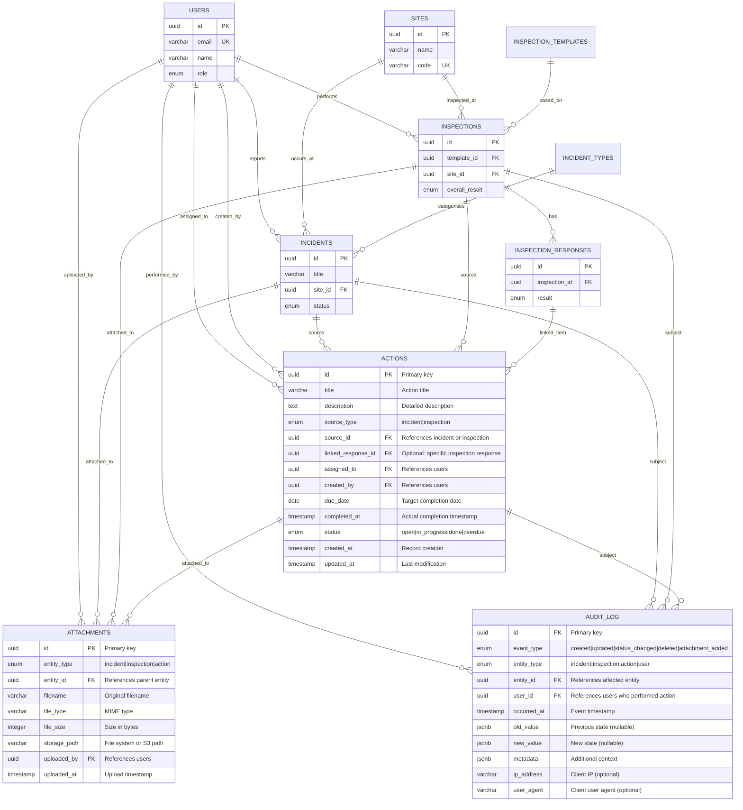
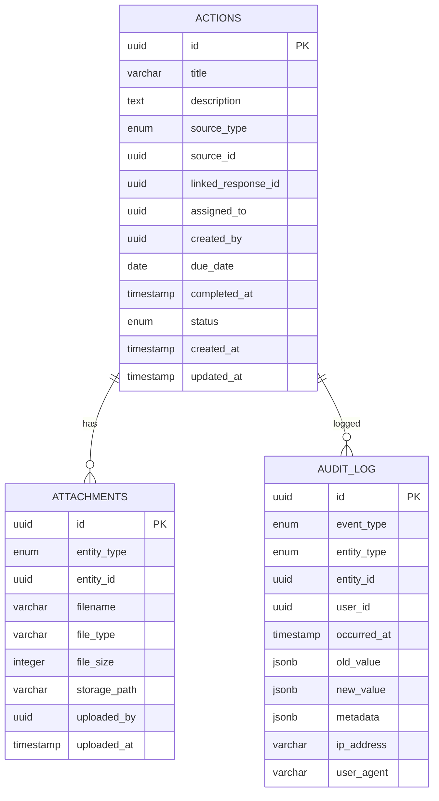

# Data Model Document
# EHS Portal - Phase 2: Operational Excellence

---

> **How to Use Diagrams in This Document**
>
> This document contains Mermaid diagram definitions enclosed in triple backticks with `mermaid` syntax.
> To convert these to images for Microsoft Word:
> 1. Copy the Mermaid code block (without the backticks)
> 2. Paste into [Mermaid Live Editor](https://mermaid.live/) or [draw.io](https://app.diagrams.net/)
> 3. Export as PNG or SVG
> 4. Insert the image into your Word document
>
> Alternatively, use VS Code with a Mermaid preview extension, or Markdown editors that support Mermaid rendering.

---

## Document Control

| Item | Details |
|------|---------|
| **Document Title** | Data Model Document - EHS Portal Phase 2 |
| **Version** | 1.0 |
| **Status** | Draft |
| **Author** | Claude (Senior Architect) |
| **Date** | January 2025 |
| **Related Documents** | BRD_EHS_PORTAL_PHASE2.md, DATA_MODEL_PHASE1.md, API_SPEC_PHASE2.md |
| **Dependencies** | Phase 1 data model must be in place |

---

## 1. Overview

This document defines the data model extensions for Phase 2 of the EHS Portal. Phase 2 adds:

- **Actions** - Corrective and preventive action items linked to incidents and inspections
- **Attachments** - File storage for evidence attached to incidents, inspections, and actions
- **Audit Log** - Immutable record of system events for compliance and accountability

This document focuses only on new Phase 2 entities and any modifications to existing Phase 1 entities. For the complete Phase 1 data model, see DATA_MODEL_PHASE1.md.

---

## 2. Phase 2 Entity-Relationship Diagram

### 2.1 Complete Phase 2 ERD (Including Phase 1 Context)



### 2.2 Phase 2 Entities Only (Simplified View)



---

## 3. New Entity Specifications

### 3.1 Actions

**Purpose:** Stores corrective and preventive action items (CAPA) linked to incidents or failed inspection items.

**Checklist Coverage:** C20, C21, C22, C23, C24, C25, C26, C27

| Attribute | Type | Constraints | Description | C-ID |
|-----------|------|-------------|-------------|------|
| id | UUID | PK, NOT NULL, DEFAULT gen_random_uuid() | Primary identifier | - |
| title | VARCHAR(255) | NOT NULL | Brief action title | C22 |
| description | TEXT | NULLABLE | Detailed description of required action | C22 |
| source_type | ENUM | NOT NULL | 'incident' or 'inspection' | C22 |
| source_id | UUID | NOT NULL | References incident.id or inspection.id | C20, C21 |
| linked_response_id | UUID | FK, NULLABLE | References inspection_responses.id for item-specific actions | C21 |
| assigned_to | UUID | FK, NULLABLE | References users.id - who must complete | C22 |
| created_by | UUID | FK, NOT NULL | References users.id - who created | - |
| due_date | DATE | NULLABLE | Target completion date | C22, C24 |
| completed_at | TIMESTAMP | NULLABLE | Actual completion timestamp | - |
| status | ENUM | NOT NULL, DEFAULT 'open' | 'open', 'in_progress', 'done', 'overdue' | C23 |
| created_at | TIMESTAMP | NOT NULL, DEFAULT NOW() | Creation timestamp | - |
| updated_at | TIMESTAMP | NOT NULL, DEFAULT NOW() | Last update timestamp | - |

**Indexes:**
- PRIMARY KEY (id)
- INDEX (source_type, source_id) - Find actions for an incident/inspection
- INDEX (assigned_to) - Find actions for a user (My Actions)
- INDEX (status) - Filter by status
- INDEX (due_date) - Find overdue actions
- INDEX (created_by) - Find actions created by user

**Foreign Keys:**
- `assigned_to` → `users.id` (ON DELETE SET NULL, ON UPDATE CASCADE)
- `created_by` → `users.id` (ON DELETE RESTRICT, ON UPDATE CASCADE)
- `linked_response_id` → `inspection_responses.id` (ON DELETE SET NULL, ON UPDATE CASCADE)

**Business Rules:**
- `source_type` + `source_id` must reference a valid incident or inspection
- When `linked_response_id` is set, `source_type` must be 'inspection'
- Only managers and admins can create actions (RBAC-P2-01)
- Workers can only update status of actions assigned to them (RBAC-P2-02)
- Status automatically set to 'overdue' by scheduled job when `due_date < today` AND `status NOT IN ('done')` (C24)
- When status changes to 'done', `completed_at` should be set to current timestamp

**Status Transitions:**
| From | To | Trigger | Allowed Roles |
|------|-----|---------|---------------|
| (new) | open | Action created | Manager, Admin |
| open | in_progress | Work started | Assignee, Manager, Admin |
| open | overdue | Scheduled job | System |
| in_progress | done | Work completed | Assignee, Manager, Admin |
| in_progress | overdue | Scheduled job | System |
| overdue | in_progress | Work resumed | Assignee, Manager, Admin |
| overdue | done | Work completed | Assignee, Manager, Admin |

---

### 3.2 Attachments

**Purpose:** Stores file metadata and references for documents attached to incidents, inspections, and actions.

**Checklist Coverage:** C28, C29, C30, C31, C32, C33

| Attribute | Type | Constraints | Description | C-ID |
|-----------|------|-------------|-------------|------|
| id | UUID | PK, NOT NULL, DEFAULT gen_random_uuid() | Primary identifier | - |
| entity_type | ENUM | NOT NULL | 'incident', 'inspection', 'action' | C28, C29, C30, C31 |
| entity_id | UUID | NOT NULL | References parent entity by type | C31 |
| filename | VARCHAR(255) | NOT NULL | Original uploaded filename | C31 |
| file_type | VARCHAR(100) | NOT NULL | MIME type (e.g., 'image/jpeg', 'application/pdf') | C31, C33 |
| file_size | INTEGER | NOT NULL | File size in bytes | C31, C33 |
| storage_path | VARCHAR(512) | NOT NULL | File system path or S3 key | - |
| uploaded_by | UUID | FK, NOT NULL | References users.id | C31 |
| uploaded_at | TIMESTAMP | NOT NULL, DEFAULT NOW() | Upload timestamp | C31 |

**Indexes:**
- PRIMARY KEY (id)
- INDEX (entity_type, entity_id) - Find attachments for an entity
- INDEX (uploaded_by) - Find attachments by uploader
- INDEX (uploaded_at) - Sort by upload date
- INDEX (file_type) - Filter by type

**Foreign Keys:**
- `uploaded_by` → `users.id` (ON DELETE RESTRICT, ON UPDATE CASCADE)

**Business Rules:**
- `entity_type` + `entity_id` must reference a valid incident, inspection, or action
- Maximum file size: 10 MB (10,485,760 bytes) (C33)
- Allowed file types (C33):
  - Images: `image/jpeg`, `image/png`, `image/gif`
  - Documents: `application/pdf`, `application/msword`, `application/vnd.openxmlformats-officedocument.wordprocessingml.document`
  - Spreadsheets: `application/vnd.ms-excel`, `application/vnd.openxmlformats-officedocument.spreadsheetml.sheet`
- Maximum 20 attachments per entity
- Workers can upload to their own incidents (RBAC)
- Managers/admins can upload to any entity (RBAC)
- Storage path format: `/{entity_type}/{entity_id}/{uuid}_{filename}`

**Allowed File Types (Detailed):**

| Category | MIME Type | Extension | Max Size |
|----------|-----------|-----------|----------|
| Image | image/jpeg | .jpg, .jpeg | 10 MB |
| Image | image/png | .png | 10 MB |
| Image | image/gif | .gif | 10 MB |
| Document | application/pdf | .pdf | 10 MB |
| Document | application/msword | .doc | 10 MB |
| Document | application/vnd.openxmlformats-officedocument.wordprocessingml.document | .docx | 10 MB |
| Spreadsheet | application/vnd.ms-excel | .xls | 10 MB |
| Spreadsheet | application/vnd.openxmlformats-officedocument.spreadsheetml.sheet | .xlsx | 10 MB |

---

### 3.3 Audit Log

**Purpose:** Stores an immutable record of significant system events for compliance, accountability, and troubleshooting.

**Checklist Coverage:** C40, C41, C42, C43, C44, C45, C46

| Attribute | Type | Constraints | Description | C-ID |
|-----------|------|-------------|-------------|------|
| id | UUID | PK, NOT NULL, DEFAULT gen_random_uuid() | Primary identifier | - |
| event_type | ENUM | NOT NULL | Type of event that occurred | C40-C43 |
| entity_type | ENUM | NOT NULL | Type of entity affected | C44, C45 |
| entity_id | UUID | NOT NULL | ID of affected entity | C44, C45 |
| user_id | UUID | FK, NULLABLE | User who performed the action (null for system events) | C44, C45 |
| occurred_at | TIMESTAMP | NOT NULL, DEFAULT NOW() | When the event occurred | C44, C45 |
| old_value | JSONB | NULLABLE | Previous state for updates | C41, C43 |
| new_value | JSONB | NULLABLE | New state for creates/updates | C40-C43 |
| metadata | JSONB | NULLABLE | Additional context (e.g., reason for change) | - |
| ip_address | VARCHAR(45) | NULLABLE | Client IP address (IPv4 or IPv6) | - |
| user_agent | VARCHAR(500) | NULLABLE | Client user agent string | - |

**Indexes:**
- PRIMARY KEY (id)
- INDEX (entity_type, entity_id) - Activity log for entity (C44, C45)
- INDEX (user_id) - Find actions by user
- INDEX (occurred_at) - Sort by time, range queries
- INDEX (event_type) - Filter by event type

**Foreign Keys:**
- `user_id` → `users.id` (ON DELETE SET NULL, ON UPDATE CASCADE)
  - Note: SET NULL preserves audit history even if user is deleted

**Business Rules:**
- Audit log records are **immutable** - no UPDATE or DELETE allowed (C46)
- Table should have database-level protection (e.g., trigger to prevent modifications)
- `old_value` is NULL for 'created' events
- `new_value` is NULL for 'deleted' events
- Activity logs shown on detail views (C44, C45) are filtered by `entity_type` + `entity_id`
- Only admins can access the system-wide audit log endpoint (RBAC-P2-05)

**Event Types:**

| Event Type | Description | entity_type | old_value | new_value |
|------------|-------------|-------------|-----------|-----------|
| created | Entity was created | incident, inspection, action | NULL | Full entity JSON |
| status_changed | Status field changed | incident, action | {status: "old"} | {status: "new"} |
| severity_changed | Severity field changed | incident | {severity: "old"} | {severity: "new"} |
| updated | Other fields changed | incident, inspection, action | Changed fields | Changed fields |
| attachment_added | File attached | incident, inspection, action | NULL | Attachment metadata |
| attachment_removed | File removed | incident, inspection, action | Attachment metadata | NULL |
| assigned | Action assigned to user | action | {assigned_to: "old"} | {assigned_to: "new"} |

**Sample Audit Log Entry:**

```json
{
  "id": "550e8400-e29b-41d4-a716-446655440000",
  "event_type": "status_changed",
  "entity_type": "incident",
  "entity_id": "7c9e6679-7425-40de-944b-e07fc1f90ae7",
  "user_id": "a0eebc99-9c0b-4ef8-bb6d-6bb9bd380a11",
  "occurred_at": "2025-01-15T10:30:00Z",
  "old_value": {"status": "open"},
  "new_value": {"status": "under_investigation"},
  "metadata": {"reason": "Investigation initiated by safety manager"},
  "ip_address": "192.168.1.100",
  "user_agent": "Mozilla/5.0 (Windows NT 10.0; Win64; x64) Chrome/120.0.0.0"
}
```

---

## 4. Enum Type Definitions

### 4.1 New Phase 2 Enums

```sql
-- Action status enumeration
CREATE TYPE action_status AS ENUM ('open', 'in_progress', 'done', 'overdue');

-- Source type for actions (what entity the action is linked to)
CREATE TYPE action_source_type AS ENUM ('incident', 'inspection');

-- Entity type for attachments and audit logs
CREATE TYPE attachable_entity_type AS ENUM ('incident', 'inspection', 'action');

-- Audit event types
CREATE TYPE audit_event_type AS ENUM (
  'created',
  'updated',
  'status_changed',
  'severity_changed',
  'attachment_added',
  'attachment_removed',
  'assigned'
);

-- Auditable entity types
CREATE TYPE auditable_entity_type AS ENUM ('incident', 'inspection', 'action', 'user');
```

### 4.2 Phase 1 Enums (Unchanged)

For reference, these Phase 1 enums remain unchanged:

```sql
-- From Phase 1 (no changes)
CREATE TYPE user_role AS ENUM ('worker', 'manager', 'admin');
CREATE TYPE incident_severity AS ENUM ('low', 'medium', 'high', 'critical');
CREATE TYPE incident_status AS ENUM ('open', 'under_investigation', 'closed');
CREATE TYPE inspection_result AS ENUM ('pass', 'fail');
CREATE TYPE response_result AS ENUM ('ok', 'not_ok', 'na');
```

---

## 5. Changes to Existing Entities

### 5.1 No Schema Changes to Phase 1 Tables

Phase 2 does **not** require any schema modifications to existing Phase 1 tables. The new entities (actions, attachments, audit_log) are additive and reference Phase 1 entities through:

- `actions.source_type` + `actions.source_id` → incidents or inspections
- `actions.linked_response_id` → inspection_responses
- `attachments.entity_type` + `attachments.entity_id` → incidents, inspections, or actions
- `audit_log.entity_type` + `audit_log.entity_id` → any entity

This polymorphic foreign key approach avoids modifying existing tables while maintaining referential integrity at the application level.

### 5.2 Application-Level Changes

While no schema changes are needed, the application code for Phase 1 entities should be updated to:

1. **Incidents**: Log audit events on create, status change, severity change
2. **Inspections**: Log audit events on create
3. **API responses**: Include attachment count and action count in list/detail responses

---

## 6. Database Schema (DDL)

### 6.1 Phase 2 Migration Script

```sql
-- migrations/002_phase2_actions_attachments_audit.sql
-- Phase 2: Actions, Attachments, and Audit Log

-- ============================================
-- ENUM TYPES
-- ============================================

-- Action status
CREATE TYPE action_status AS ENUM ('open', 'in_progress', 'done', 'overdue');

-- Source type for actions
CREATE TYPE action_source_type AS ENUM ('incident', 'inspection');

-- Entity type for attachments
CREATE TYPE attachable_entity_type AS ENUM ('incident', 'inspection', 'action');

-- Audit event types
CREATE TYPE audit_event_type AS ENUM (
  'created',
  'updated',
  'status_changed',
  'severity_changed',
  'attachment_added',
  'attachment_removed',
  'assigned'
);

-- Auditable entity types
CREATE TYPE auditable_entity_type AS ENUM ('incident', 'inspection', 'action', 'user');

-- ============================================
-- ACTIONS TABLE (C20-C27)
-- ============================================

CREATE TABLE actions (
  id UUID PRIMARY KEY DEFAULT gen_random_uuid(),
  title VARCHAR(255) NOT NULL,
  description TEXT,
  source_type action_source_type NOT NULL,
  source_id UUID NOT NULL,
  linked_response_id UUID REFERENCES inspection_responses(id) ON DELETE SET NULL,
  assigned_to UUID REFERENCES users(id) ON DELETE SET NULL,
  created_by UUID NOT NULL REFERENCES users(id) ON DELETE RESTRICT,
  due_date DATE,
  completed_at TIMESTAMPTZ,
  status action_status NOT NULL DEFAULT 'open',
  created_at TIMESTAMPTZ NOT NULL DEFAULT NOW(),
  updated_at TIMESTAMPTZ NOT NULL DEFAULT NOW()
);

-- Actions indexes
CREATE INDEX idx_actions_source ON actions(source_type, source_id);
CREATE INDEX idx_actions_assigned_to ON actions(assigned_to);
CREATE INDEX idx_actions_status ON actions(status);
CREATE INDEX idx_actions_due_date ON actions(due_date);
CREATE INDEX idx_actions_created_by ON actions(created_by);
CREATE INDEX idx_actions_created_at ON actions(created_at);

-- ============================================
-- ATTACHMENTS TABLE (C28-C33)
-- ============================================

CREATE TABLE attachments (
  id UUID PRIMARY KEY DEFAULT gen_random_uuid(),
  entity_type attachable_entity_type NOT NULL,
  entity_id UUID NOT NULL,
  filename VARCHAR(255) NOT NULL,
  file_type VARCHAR(100) NOT NULL,
  file_size INTEGER NOT NULL CHECK (file_size > 0 AND file_size <= 10485760),
  storage_path VARCHAR(512) NOT NULL,
  uploaded_by UUID NOT NULL REFERENCES users(id) ON DELETE RESTRICT,
  uploaded_at TIMESTAMPTZ NOT NULL DEFAULT NOW()
);

-- Attachments indexes
CREATE INDEX idx_attachments_entity ON attachments(entity_type, entity_id);
CREATE INDEX idx_attachments_uploaded_by ON attachments(uploaded_by);
CREATE INDEX idx_attachments_uploaded_at ON attachments(uploaded_at);

-- ============================================
-- AUDIT_LOG TABLE (C40-C46)
-- ============================================

CREATE TABLE audit_log (
  id UUID PRIMARY KEY DEFAULT gen_random_uuid(),
  event_type audit_event_type NOT NULL,
  entity_type auditable_entity_type NOT NULL,
  entity_id UUID NOT NULL,
  user_id UUID REFERENCES users(id) ON DELETE SET NULL,
  occurred_at TIMESTAMPTZ NOT NULL DEFAULT NOW(),
  old_value JSONB,
  new_value JSONB,
  metadata JSONB,
  ip_address VARCHAR(45),
  user_agent VARCHAR(500)
);

-- Audit log indexes
CREATE INDEX idx_audit_log_entity ON audit_log(entity_type, entity_id);
CREATE INDEX idx_audit_log_user_id ON audit_log(user_id);
CREATE INDEX idx_audit_log_occurred_at ON audit_log(occurred_at);
CREATE INDEX idx_audit_log_event_type ON audit_log(event_type);

-- ============================================
-- IMMUTABILITY PROTECTION FOR AUDIT_LOG (C46)
-- ============================================

-- Prevent UPDATE on audit_log
CREATE OR REPLACE FUNCTION prevent_audit_log_update()
RETURNS TRIGGER AS $$
BEGIN
  RAISE EXCEPTION 'Audit log records cannot be updated';
END;
$$ LANGUAGE plpgsql;

CREATE TRIGGER audit_log_no_update
  BEFORE UPDATE ON audit_log
  FOR EACH ROW
  EXECUTE FUNCTION prevent_audit_log_update();

-- Prevent DELETE on audit_log
CREATE OR REPLACE FUNCTION prevent_audit_log_delete()
RETURNS TRIGGER AS $$
BEGIN
  RAISE EXCEPTION 'Audit log records cannot be deleted';
END;
$$ LANGUAGE plpgsql;

CREATE TRIGGER audit_log_no_delete
  BEFORE DELETE ON audit_log
  FOR EACH ROW
  EXECUTE FUNCTION prevent_audit_log_delete();

-- ============================================
-- UPDATED_AT TRIGGER FOR ACTIONS
-- ============================================

CREATE OR REPLACE FUNCTION update_updated_at_column()
RETURNS TRIGGER AS $$
BEGIN
  NEW.updated_at = NOW();
  RETURN NEW;
END;
$$ LANGUAGE plpgsql;

CREATE TRIGGER actions_updated_at
  BEFORE UPDATE ON actions
  FOR EACH ROW
  EXECUTE FUNCTION update_updated_at_column();

-- ============================================
-- COMMENTS FOR DOCUMENTATION
-- ============================================

COMMENT ON TABLE actions IS 'Phase 2: Corrective/preventive actions linked to incidents and inspections (C20-C27)';
COMMENT ON TABLE attachments IS 'Phase 2: File attachments for incidents, inspections, and actions (C28-C33)';
COMMENT ON TABLE audit_log IS 'Phase 2: Immutable audit log for compliance tracking (C40-C46)';

COMMENT ON COLUMN actions.source_type IS 'Type of entity this action is linked to';
COMMENT ON COLUMN actions.source_id IS 'ID of the incident or inspection this action is linked to';
COMMENT ON COLUMN actions.linked_response_id IS 'Optional: specific inspection response that triggered this action';

COMMENT ON COLUMN attachments.entity_type IS 'Type of entity this attachment belongs to';
COMMENT ON COLUMN attachments.entity_id IS 'ID of the parent entity';
COMMENT ON COLUMN attachments.file_size IS 'File size in bytes, max 10MB';

COMMENT ON COLUMN audit_log.old_value IS 'Previous state (JSON), null for created events';
COMMENT ON COLUMN audit_log.new_value IS 'New state (JSON), null for deleted events';
```

### 6.2 Table Creation Order (Including Phase 1)

Due to foreign key dependencies, tables must be created in this order:

**Phase 1 (prerequisite):**
1. users
2. sites
3. incident_types
4. incidents
5. inspection_templates
6. inspection_template_items (template_items)
7. inspections
8. inspection_responses

**Phase 2 (this migration):**
9. actions (depends on: users, inspection_responses)
10. attachments (depends on: users)
11. audit_log (depends on: users)

---

## 7. Referential Integrity and Cascade Rules

### 7.1 Phase 2 Foreign Key Rules

| Table | Column | References | ON DELETE | ON UPDATE | Rationale |
|-------|--------|------------|-----------|-----------|-----------|
| actions | assigned_to | users.id | SET NULL | CASCADE | Preserve action if assignee deleted |
| actions | created_by | users.id | RESTRICT | CASCADE | Must not delete creator with active actions |
| actions | linked_response_id | inspection_responses.id | SET NULL | CASCADE | Preserve action if response deleted |
| attachments | uploaded_by | users.id | RESTRICT | CASCADE | Must not delete uploader with attachments |
| audit_log | user_id | users.id | SET NULL | CASCADE | Preserve audit history if user deleted |

### 7.2 Application-Level Referential Integrity

The following relationships are enforced at the application level (not database FK):

| Constraint | Validation |
|------------|------------|
| actions.source_type + source_id | Must reference valid incident (if source_type='incident') or inspection (if source_type='inspection') |
| attachments.entity_type + entity_id | Must reference valid incident, inspection, or action |
| audit_log.entity_type + entity_id | Must reference valid entity of the specified type |

---

## 8. Data Validation Rules

### 8.1 Actions Validation

| Field | Rule | Error Message |
|-------|------|---------------|
| title | Required, 3-255 characters | "Title must be between 3 and 255 characters" |
| description | Max 5000 characters | "Description cannot exceed 5000 characters" |
| source_type | Must be 'incident' or 'inspection' | "Invalid source type" |
| source_id | Must exist in referenced table | "Source incident/inspection not found" |
| assigned_to | Must be valid user ID if provided | "Assigned user not found" |
| due_date | Cannot be in the past when creating | "Due date cannot be in the past" |
| linked_response_id | If set, source_type must be 'inspection' | "Response can only be linked for inspection actions" |

### 8.2 Attachments Validation

| Field | Rule | Error Message |
|-------|------|---------------|
| entity_type | Must be valid enum | "Invalid entity type" |
| entity_id | Must exist in referenced table | "Parent entity not found" |
| filename | Required, max 255 characters | "Invalid filename" |
| file_type | Must be in allowed list | "File type not allowed" |
| file_size | 1 byte to 10,485,760 bytes | "File size must be between 1 byte and 10MB" |
| storage_path | Required, max 512 characters | "Invalid storage path" |

### 8.3 Audit Log Validation

| Field | Rule | Error Message |
|-------|------|---------------|
| event_type | Must be valid enum | "Invalid event type" |
| entity_type | Must be valid enum | "Invalid entity type" |
| entity_id | Required UUID | "Entity ID is required" |
| occurred_at | Must be valid timestamp | "Invalid timestamp" |
| old_value/new_value | Valid JSON if provided | "Invalid JSON format" |

---

## 9. Performance Considerations

### 9.1 Recommended Indexes Summary

| Table | Index | Columns | Purpose |
|-------|-------|---------|---------|
| actions | idx_actions_source | (source_type, source_id) | Find actions for incident/inspection |
| actions | idx_actions_assigned_to | (assigned_to) | "My Actions" query |
| actions | idx_actions_status | (status) | Filter by status |
| actions | idx_actions_due_date | (due_date) | Find overdue actions |
| attachments | idx_attachments_entity | (entity_type, entity_id) | Find attachments for entity |
| audit_log | idx_audit_log_entity | (entity_type, entity_id) | Activity log query |
| audit_log | idx_audit_log_occurred_at | (occurred_at) | Time-range queries |

### 9.2 Query Patterns

| Query | Expected Frequency | Indexes Used |
|-------|-------------------|--------------|
| Get actions for incident | High | idx_actions_source |
| Get my actions | High | idx_actions_assigned_to |
| Get overdue actions | Medium (scheduled job) | idx_actions_status, idx_actions_due_date |
| Get attachments for entity | High | idx_attachments_entity |
| Get activity log for entity | Medium | idx_audit_log_entity |
| Get recent audit events | Low (admin only) | idx_audit_log_occurred_at |

---

## 10. Traceability Matrix

### 10.1 Phase 2 Entity to Checklist Mapping

| Entity | Field/Feature | C-ID | Description |
|--------|---------------|------|-------------|
| actions | - | C20 | Create actions from incident |
| actions | - | C21 | Create actions from inspection (failed items) |
| actions | title, description, source, assigned_to, due_date, status | C22 | Action item fields |
| actions | status enum | C23 | Action statuses (open, in_progress, done, overdue) |
| actions | status='overdue' | C24 | Auto-mark overdue |
| actions | assigned_to + index | C25 | "My Actions" view |
| actions | - | C26 | "All Actions" view |
| actions | indexes | C27 | Action filters (status, site via source, due_date) |
| attachments | entity_type='incident' | C28 | Upload to incidents |
| attachments | entity_type='inspection' | C29 | Upload to inspections |
| attachments | entity_type='action' | C30 | Upload to actions |
| attachments | all columns | C31 | Attachment metadata fields |
| attachments | - | C32 | Attachments with download links |
| attachments | file_size, file_type constraints | C33 | Size/type validation |
| audit_log | entity_type='incident', event_type='created' | C40 | Log incident creation |
| audit_log | entity_type='incident', event_type='status_changed' | C41 | Log incident status change |
| audit_log | entity_type='inspection', event_type='created' | C42 | Log inspection creation |
| audit_log | entity_type='action' | C43 | Log action create/status change |
| audit_log | entity_type='incident' query | C44 | Activity log on incident detail |
| audit_log | entity_type='inspection' query | C45 | Activity log on inspection detail |
| audit_log | immutability triggers | C46 | Audit logs immutable |

### 10.2 Phase 2 BRD to Data Model Mapping

| BR-ID | Requirement | Table | Column(s) |
|-------|-------------|-------|-----------|
| BR-ACT-01 | Create action from incident | actions | source_type='incident', source_id |
| BR-ACT-02 | Create action from inspection | actions | source_type='inspection', source_id, linked_response_id |
| BR-ACT-03 | Action fields | actions | title, description, source_type, source_id, assigned_to, due_date, status |
| BR-ACT-04 | Action statuses | actions | status (enum) |
| BR-ACT-05 | Auto-mark overdue | actions | status, due_date (via scheduled job) |
| BR-ACT-06 | My Actions | actions | assigned_to (indexed) |
| BR-ACT-07 | All Actions | actions | (no filter) |
| BR-ACT-08 | Action filters | actions | status, due_date + source for site |
| BR-ATT-01 | Upload to incidents | attachments | entity_type='incident' |
| BR-ATT-02 | Upload to inspections | attachments | entity_type='inspection' |
| BR-ATT-03 | Upload to actions | attachments | entity_type='action' |
| BR-ATT-04 | Attachment metadata | attachments | all columns |
| BR-ATT-05 | Download links | attachments | storage_path |
| BR-ATT-06 | File restrictions | attachments | file_size, file_type constraints |
| BR-AUD-01 | Log incident creation | audit_log | event_type='created', entity_type='incident' |
| BR-AUD-02 | Log incident changes | audit_log | event_type='status_changed'/'severity_changed' |
| BR-AUD-03 | Log inspection creation | audit_log | event_type='created', entity_type='inspection' |
| BR-AUD-04 | Log action changes | audit_log | entity_type='action' |
| BR-AUD-05 | Activity log on incident | audit_log | query by entity_type + entity_id |
| BR-AUD-06 | Activity log on inspection | audit_log | query by entity_type + entity_id |
| BR-AUD-07 | Audit immutability | audit_log | database triggers |

---

## 11. Appendices

### Appendix A: Sample Data

#### A.1 Sample Action Records

```sql
-- Action from a high-severity incident
INSERT INTO actions (title, description, source_type, source_id, assigned_to, created_by, due_date, status)
VALUES (
  'Install safety barrier at loading dock',
  'Following the slip incident on 2025-01-10, install a safety barrier to prevent future accidents.',
  'incident',
  '7c9e6679-7425-40de-944b-e07fc1f90ae7',
  'a0eebc99-9c0b-4ef8-bb6d-6bb9bd380a11', -- Worker
  'b1eebc99-9c0b-4ef8-bb6d-6bb9bd380a22', -- Manager
  '2025-02-15',
  'open'
);

-- Action from a failed inspection item
INSERT INTO actions (title, description, source_type, source_id, linked_response_id, assigned_to, created_by, due_date, status)
VALUES (
  'Replace damaged fire extinguisher in Warehouse 1',
  'Fire extinguisher found damaged during inspection. Must be replaced immediately.',
  'inspection',
  'c2eebc99-9c0b-4ef8-bb6d-6bb9bd380a33',
  'd3eebc99-9c0b-4ef8-bb6d-6bb9bd380a44', -- Specific failed item
  'a0eebc99-9c0b-4ef8-bb6d-6bb9bd380a11',
  'b1eebc99-9c0b-4ef8-bb6d-6bb9bd380a22',
  '2025-01-20',
  'in_progress'
);
```

#### A.2 Sample Attachment Records

```sql
INSERT INTO attachments (entity_type, entity_id, filename, file_type, file_size, storage_path, uploaded_by)
VALUES
  ('incident', '7c9e6679-7425-40de-944b-e07fc1f90ae7', 'loading_dock_photo.jpg', 'image/jpeg', 2456789, '/uploads/incident/7c9e6679-7425-40de-944b-e07fc1f90ae7/abc123_loading_dock_photo.jpg', 'a0eebc99-9c0b-4ef8-bb6d-6bb9bd380a11'),
  ('inspection', 'c2eebc99-9c0b-4ef8-bb6d-6bb9bd380a33', 'fire_extinguisher_damage.pdf', 'application/pdf', 156234, '/uploads/inspection/c2eebc99-9c0b-4ef8-bb6d-6bb9bd380a33/def456_fire_extinguisher_damage.pdf', 'b1eebc99-9c0b-4ef8-bb6d-6bb9bd380a22');
```

#### A.3 Sample Audit Log Records

```sql
INSERT INTO audit_log (event_type, entity_type, entity_id, user_id, old_value, new_value, metadata, ip_address)
VALUES
  ('created', 'incident', '7c9e6679-7425-40de-944b-e07fc1f90ae7', 'a0eebc99-9c0b-4ef8-bb6d-6bb9bd380a11', NULL, '{"title": "Slip at loading dock", "status": "open", "severity": "medium"}', NULL, '192.168.1.100'),
  ('status_changed', 'incident', '7c9e6679-7425-40de-944b-e07fc1f90ae7', 'b1eebc99-9c0b-4ef8-bb6d-6bb9bd380a22', '{"status": "open"}', '{"status": "under_investigation"}', '{"reason": "Assigned to safety team for review"}', '192.168.1.101'),
  ('created', 'action', 'e4eebc99-9c0b-4ef8-bb6d-6bb9bd380a55', 'b1eebc99-9c0b-4ef8-bb6d-6bb9bd380a22', NULL, '{"title": "Install safety barrier", "status": "open", "assigned_to": "a0eebc99-9c0b-4ef8-bb6d-6bb9bd380a11"}', NULL, '192.168.1.101');
```

### Appendix B: Scheduled Job for Overdue Actions

```sql
-- This query should be run by a scheduled job (e.g., cron, pg_cron) daily
-- Updates action status to 'overdue' where due_date has passed

UPDATE actions
SET status = 'overdue',
    updated_at = NOW()
WHERE due_date < CURRENT_DATE
  AND status IN ('open', 'in_progress');

-- The job should also create audit log entries for these changes
-- (handled at application level for proper user_id=NULL system attribution)
```

### Appendix C: Open Questions

| ID | Question | Proposed Answer | Status |
|----|----------|-----------------|--------|
| DM-Q1 | Should actions support multiple assignees? | No - single assignee for MVP; can add action_assignees junction table in future | Decided |
| DM-Q2 | Should deleted attachments be hard or soft deleted? | Hard delete with audit log entry; file removal can be async | Decided |
| DM-Q3 | How long to retain audit logs? | Minimum 7 years per compliance; no auto-purge in Phase 2 | Decided |
| DM-Q4 | Should actions have a priority field? | Deferred - not in current checklist; can add later | Deferred |
| DM-Q5 | Should attachments store a thumbnail for images? | Deferred - can add thumbnail_path column later | Deferred |

---

## 12. Related Documents

| Document | Purpose |
|----------|---------|
| BRD_EHS_PORTAL_PHASE2.md | Phase 2 business requirements |
| DATA_MODEL_PHASE1.md | Phase 1 data model (prerequisite) |
| DATA_MODEL.md | Combined data model (all phases) |
| API_SPEC_PHASE2.md | Phase 2 API specification |
| ARCHITECTURE_PHASE2.md | Phase 2 system architecture |
