# Data Model - EHS Portal Phase 3: Multi-Organisation & Enterprise Reporting

## 1. Overview

This document defines the database schema additions and modifications for Phase 3 of the EHS Portal. Phase 3 introduces multi-tenancy through the `organisations` table and enforces organisation-scoped data isolation across all entities.

**Phase 3 Data Model Focus:**
- New `organisations` table
- Adding `organisation_id` as NOT NULL to all core tables
- Adding `is_active` to users for account enable/disable
- Indexes to support multi-tenant queries and exports
- Migration strategy for existing data

**Checklist Coverage:** C71-C95

---

## 2. New Entity: organisations

The `organisations` table is the core of multi-tenancy. All other entities reference this table.

### 2.1 Table Definition

| Column | Type | Constraints | Purpose |
|--------|------|-------------|---------|
| id | UUID | PK, DEFAULT gen_random_uuid() | Unique identifier |
| name | VARCHAR(200) | NOT NULL | Display name |
| slug | VARCHAR(50) | UNIQUE, NOT NULL | URL-safe identifier (e.g., "acme-corp") |
| logo_url | VARCHAR(512) | NULL | Path to uploaded logo |
| timezone | VARCHAR(50) | NOT NULL, DEFAULT 'UTC' | Organisation timezone (IANA format) |
| settings | JSONB | NOT NULL, DEFAULT '{}' | Dashboard thresholds, defaults |
| is_active | BOOLEAN | NOT NULL, DEFAULT TRUE | Organisation active status |
| created_at | TIMESTAMPTZ | NOT NULL, DEFAULT NOW() | Creation timestamp |
| updated_at | TIMESTAMPTZ | NOT NULL, DEFAULT NOW() | Last update timestamp |

### 2.2 Indexes

| Index Name | Columns | Type | Purpose |
|------------|---------|------|---------|
| organisations_pkey | id | Primary | Unique lookup |
| organisations_slug_key | slug | Unique | Slug lookup |
| idx_organisations_is_active | is_active | B-tree | Filter active orgs |

### 2.3 Settings JSONB Schema

```json
{
  "dashboard": {
    "openIncidentsWarning": 5,
    "openIncidentsCritical": 10,
    "overdueActionsWarning": 3,
    "overdueActionsCritical": 5,
    "failedInspectionsWarning": 2,
    "failedInspectionsCritical": 5
  },
  "defaults": {
    "incidentSeverity": "medium",
    "actionDueDays": 14
  },
  "branding": {
    "primaryColor": "#1976d2",
    "headerText": null
  }
}
```

---

## 3. Modified Entities

### 3.1 users

**Modifications:**
- `organisation_id` becomes NOT NULL (FK to organisations)
- Add `is_active` column for enable/disable functionality

| Column | Type | Constraints | Change |
|--------|------|-------------|--------|
| organisation_id | UUID | FK → organisations, NOT NULL | Was NULL, now required |
| is_active | BOOLEAN | NOT NULL, DEFAULT TRUE | **NEW** |

**New Indexes:**

| Index Name | Columns | Purpose |
|------------|---------|---------|
| idx_users_organisation_id | organisation_id | Org-scoped queries |
| idx_users_org_email | organisation_id, email | Unique email within org |
| idx_users_org_active | organisation_id, is_active | Filter active users |

**Email Uniqueness:** Email must be unique within an organisation, not globally. This allows the same person to have accounts in multiple orgs (future consideration).

---

### 3.2 sites

**Modifications:**
- `organisation_id` becomes NOT NULL

| Column | Type | Constraints | Change |
|--------|------|-------------|--------|
| organisation_id | UUID | FK → organisations, NOT NULL | Was NULL, now required |

**New Indexes:**

| Index Name | Columns | Purpose |
|------------|---------|---------|
| idx_sites_organisation_id | organisation_id | Org-scoped queries |
| idx_sites_org_code | organisation_id, code | Unique code within org |

**Code Uniqueness:** Site code must be unique within an organisation.

---

### 3.3 incident_types

**Modifications:**
- `organisation_id` becomes NOT NULL for org-specific types
- `is_system` flag indicates global read-only types

| Column | Type | Constraints | Change |
|--------|------|-------------|--------|
| organisation_id | UUID | FK → organisations, NULL for system types | Clarified usage |

**Logic:**
- If `is_system = TRUE` and `organisation_id IS NULL`: Global system type (read-only for all)
- If `is_system = FALSE` and `organisation_id IS NOT NULL`: Org-specific custom type

**New Indexes:**

| Index Name | Columns | Purpose |
|------------|---------|---------|
| idx_incident_types_organisation_id | organisation_id | Org-scoped queries |

---

### 3.4 inspection_templates

**Modifications:**
- `organisation_id` becomes NOT NULL

| Column | Type | Constraints | Change |
|--------|------|-------------|--------|
| organisation_id | UUID | FK → organisations, NOT NULL | Was NULL, now required |

**New Indexes:**

| Index Name | Columns | Purpose |
|------------|---------|---------|
| idx_inspection_templates_organisation_id | organisation_id | Org-scoped queries |

---

### 3.5 incidents

**Modifications:**
- `organisation_id` becomes NOT NULL

| Column | Type | Constraints | Change |
|--------|------|-------------|--------|
| organisation_id | UUID | FK → organisations, NOT NULL | Was NULL, now required |

**New Indexes:**

| Index Name | Columns | Purpose |
|------------|---------|---------|
| idx_incidents_organisation_id | organisation_id | Org-scoped queries |
| idx_incidents_org_status | organisation_id, status | Dashboard/filter queries |
| idx_incidents_org_occurred_at | organisation_id, occurred_at | Export date range queries |
| idx_incidents_org_site | organisation_id, site_id | Export site filter |

---

### 3.6 inspections

**Modifications:**
- `organisation_id` becomes NOT NULL

| Column | Type | Constraints | Change |
|--------|------|-------------|--------|
| organisation_id | UUID | FK → organisations, NOT NULL | Was NULL, now required |

**New Indexes:**

| Index Name | Columns | Purpose |
|------------|---------|---------|
| idx_inspections_organisation_id | organisation_id | Org-scoped queries |
| idx_inspections_org_performed_at | organisation_id, performed_at | Export date range queries |
| idx_inspections_org_result | organisation_id, overall_result | Dashboard/filter queries |

---

### 3.7 actions

**Modifications:**
- `organisation_id` becomes NOT NULL

| Column | Type | Constraints | Change |
|--------|------|-------------|--------|
| organisation_id | UUID | FK → organisations, NOT NULL | Was NULL, now required |

**New Indexes:**

| Index Name | Columns | Purpose |
|------------|---------|---------|
| idx_actions_organisation_id | organisation_id | Org-scoped queries |
| idx_actions_org_status | organisation_id, status | Dashboard/filter queries |
| idx_actions_org_due_date | organisation_id, due_date | Overdue/export queries |

---

### 3.8 attachments

**Modifications:**
- Add `organisation_id` (derived from parent entity for query efficiency)

| Column | Type | Constraints | Change |
|--------|------|-------------|--------|
| organisation_id | UUID | FK → organisations, NOT NULL | **NEW** |

**Note:** While organisation_id can be derived from the parent entity, storing it directly on attachments improves query performance for org-scoped attachment listings.

---

### 3.9 audit_log

**Modifications:**
- Add `organisation_id` for org-scoped audit queries

| Column | Type | Constraints | Change |
|--------|------|-------------|--------|
| organisation_id | UUID | FK → organisations, NULL | **NEW** (NULL for system events) |

**New Indexes:**

| Index Name | Columns | Purpose |
|------------|---------|---------|
| idx_audit_log_organisation_id | organisation_id | Org-scoped audit queries |
| idx_audit_log_org_occurred_at | organisation_id, occurred_at | Export/filter queries |

---

## 4. Entity Relationship Diagram (Phase 3)

```mermaid
erDiagram
    ORGANISATION ||--o{ USER : "has"
    ORGANISATION ||--o{ SITE : "has"
    ORGANISATION ||--o{ INCIDENT_TYPE : "has (custom)"
    ORGANISATION ||--o{ INSPECTION_TEMPLATE : "has"
    ORGANISATION ||--o{ INCIDENT : "has"
    ORGANISATION ||--o{ INSPECTION : "has"
    ORGANISATION ||--o{ ACTION : "has"
    ORGANISATION ||--o{ ATTACHMENT : "has"
    ORGANISATION ||--o{ AUDIT_LOG : "has"

    ORGANISATION {
        uuid id PK
        string name
        string slug UK
        string logo_url
        string timezone
        jsonb settings
        boolean is_active
        timestamptz created_at
        timestamptz updated_at
    }

    USER {
        uuid id PK
        uuid organisation_id FK
        string email
        string name
        string password_hash
        enum role
        boolean is_active
        timestamptz created_at
        timestamptz updated_at
    }

    SITE {
        uuid id PK
        uuid organisation_id FK
        string name
        string code
        timestamptz created_at
        timestamptz updated_at
    }

    INCIDENT_TYPE {
        uuid id PK
        uuid organisation_id FK "nullable for system types"
        string name
        text description
        boolean is_system
        timestamptz created_at
    }

    INSPECTION_TEMPLATE {
        uuid id PK
        uuid organisation_id FK
        string name
        text description
        timestamptz created_at
        timestamptz updated_at
    }

    INCIDENT {
        uuid id PK
        uuid organisation_id FK
        string title
        text description
        uuid incident_type_id FK
        uuid site_id FK
        enum severity
        enum status
        timestamptz occurred_at
        uuid reported_by FK
        timestamptz created_at
        timestamptz updated_at
    }

    INSPECTION {
        uuid id PK
        uuid organisation_id FK
        uuid template_id FK
        uuid site_id FK
        uuid performed_by FK
        timestamptz performed_at
        enum overall_result
        text notes
        timestamptz created_at
    }

    ACTION {
        uuid id PK
        uuid organisation_id FK
        string title
        text description
        enum source_type
        uuid source_id
        uuid assigned_to FK
        uuid created_by FK
        date due_date
        timestamptz completed_at
        enum status
        timestamptz created_at
        timestamptz updated_at
    }

    ATTACHMENT {
        uuid id PK
        uuid organisation_id FK
        enum entity_type
        uuid entity_id
        string filename
        string file_type
        integer file_size
        string storage_path
        uuid uploaded_by FK
        timestamptz uploaded_at
    }

    AUDIT_LOG {
        uuid id PK
        uuid organisation_id FK "nullable for system events"
        enum event_type
        enum entity_type
        uuid entity_id
        uuid user_id FK
        timestamptz occurred_at
        jsonb old_value
        jsonb new_value
        jsonb metadata
    }
```



---

## 5. Relationships Summary (Phase 3)

| From | To | Cardinality | FK Column | Description |
|------|----|----|-----------|-------------|
| organisations | users | 1:N | organisation_id | Org has many users |
| organisations | sites | 1:N | organisation_id | Org has many sites |
| organisations | incident_types | 1:N | organisation_id | Org has custom types |
| organisations | inspection_templates | 1:N | organisation_id | Org has templates |
| organisations | incidents | 1:N | organisation_id | Org has incidents |
| organisations | inspections | 1:N | organisation_id | Org has inspections |
| organisations | actions | 1:N | organisation_id | Org has actions |
| organisations | attachments | 1:N | organisation_id | Org has attachments |
| organisations | audit_log | 1:N | organisation_id | Org has audit entries |

---

## 6. SQL Migration Script

```sql
-- migrations/003_phase3_multitenant.sql
-- Phase 3: Multi-Organisation / Multi-Tenant Schema Changes

-- =============================================================================
-- Step 1: Create organisations table
-- =============================================================================

CREATE TABLE organisations (
  id UUID PRIMARY KEY DEFAULT gen_random_uuid(),
  name VARCHAR(200) NOT NULL,
  slug VARCHAR(50) UNIQUE NOT NULL,
  logo_url VARCHAR(512),
  timezone VARCHAR(50) NOT NULL DEFAULT 'UTC',
  settings JSONB NOT NULL DEFAULT '{}',
  is_active BOOLEAN NOT NULL DEFAULT TRUE,
  created_at TIMESTAMPTZ NOT NULL DEFAULT NOW(),
  updated_at TIMESTAMPTZ NOT NULL DEFAULT NOW()
);

CREATE INDEX idx_organisations_is_active ON organisations(is_active);

-- =============================================================================
-- Step 2: Add is_active to users
-- =============================================================================

ALTER TABLE users ADD COLUMN IF NOT EXISTS is_active BOOLEAN NOT NULL DEFAULT TRUE;

-- =============================================================================
-- Step 3: Create default organisation for existing data (if any)
-- =============================================================================

DO $$
DECLARE
  default_org_id UUID;
BEGIN
  -- Only create if there's existing data
  IF EXISTS (SELECT 1 FROM users LIMIT 1) THEN
    INSERT INTO organisations (name, slug, timezone)
    VALUES ('Default Organisation', 'default-org', 'UTC')
    RETURNING id INTO default_org_id;

    -- Update all existing users
    UPDATE users SET organisation_id = default_org_id WHERE organisation_id IS NULL;

    -- Update all existing sites
    UPDATE sites SET organisation_id = default_org_id WHERE organisation_id IS NULL;

    -- Update all existing incident_types (non-system ones)
    UPDATE incident_types SET organisation_id = default_org_id
    WHERE organisation_id IS NULL AND is_system = FALSE;

    -- Update all existing inspection_templates
    UPDATE inspection_templates SET organisation_id = default_org_id WHERE organisation_id IS NULL;

    -- Update all existing incidents
    UPDATE incidents SET organisation_id = default_org_id WHERE organisation_id IS NULL;

    -- Update all existing inspections
    UPDATE inspections SET organisation_id = default_org_id WHERE organisation_id IS NULL;

    -- Update all existing actions
    UPDATE actions SET organisation_id = default_org_id WHERE organisation_id IS NULL;

    RAISE NOTICE 'Migrated existing data to default organisation: %', default_org_id;
  END IF;
END $$;

-- =============================================================================
-- Step 4: Add organisation_id to attachments (new column)
-- =============================================================================

ALTER TABLE attachments ADD COLUMN IF NOT EXISTS organisation_id UUID;

-- Populate attachments.organisation_id from parent entities
UPDATE attachments a
SET organisation_id = (
  CASE a.entity_type
    WHEN 'incident' THEN (SELECT organisation_id FROM incidents WHERE id = a.entity_id)
    WHEN 'inspection' THEN (SELECT organisation_id FROM inspections WHERE id = a.entity_id)
    WHEN 'action' THEN (SELECT organisation_id FROM actions WHERE id = a.entity_id)
  END
)
WHERE organisation_id IS NULL;

-- =============================================================================
-- Step 5: Add organisation_id to audit_log (new column)
-- =============================================================================

ALTER TABLE audit_log ADD COLUMN IF NOT EXISTS organisation_id UUID;

-- Populate audit_log.organisation_id from related entities
UPDATE audit_log al
SET organisation_id = (
  CASE al.entity_type
    WHEN 'incident' THEN (SELECT organisation_id FROM incidents WHERE id = al.entity_id)
    WHEN 'inspection' THEN (SELECT organisation_id FROM inspections WHERE id = al.entity_id)
    WHEN 'action' THEN (SELECT organisation_id FROM actions WHERE id = al.entity_id)
    WHEN 'user' THEN (SELECT organisation_id FROM users WHERE id = al.entity_id)
  END
)
WHERE organisation_id IS NULL;

-- =============================================================================
-- Step 6: Add foreign key constraints
-- =============================================================================

ALTER TABLE users
  ADD CONSTRAINT fk_users_organisation
  FOREIGN KEY (organisation_id) REFERENCES organisations(id);

ALTER TABLE sites
  ADD CONSTRAINT fk_sites_organisation
  FOREIGN KEY (organisation_id) REFERENCES organisations(id);

ALTER TABLE incident_types
  ADD CONSTRAINT fk_incident_types_organisation
  FOREIGN KEY (organisation_id) REFERENCES organisations(id);

ALTER TABLE inspection_templates
  ADD CONSTRAINT fk_inspection_templates_organisation
  FOREIGN KEY (organisation_id) REFERENCES organisations(id);

ALTER TABLE incidents
  ADD CONSTRAINT fk_incidents_organisation
  FOREIGN KEY (organisation_id) REFERENCES organisations(id);

ALTER TABLE inspections
  ADD CONSTRAINT fk_inspections_organisation
  FOREIGN KEY (organisation_id) REFERENCES organisations(id);

ALTER TABLE actions
  ADD CONSTRAINT fk_actions_organisation
  FOREIGN KEY (organisation_id) REFERENCES organisations(id);

ALTER TABLE attachments
  ADD CONSTRAINT fk_attachments_organisation
  FOREIGN KEY (organisation_id) REFERENCES organisations(id);

ALTER TABLE audit_log
  ADD CONSTRAINT fk_audit_log_organisation
  FOREIGN KEY (organisation_id) REFERENCES organisations(id);

-- =============================================================================
-- Step 7: Add NOT NULL constraints (after data migration)
-- =============================================================================

ALTER TABLE users ALTER COLUMN organisation_id SET NOT NULL;
ALTER TABLE sites ALTER COLUMN organisation_id SET NOT NULL;
ALTER TABLE inspection_templates ALTER COLUMN organisation_id SET NOT NULL;
ALTER TABLE incidents ALTER COLUMN organisation_id SET NOT NULL;
ALTER TABLE inspections ALTER COLUMN organisation_id SET NOT NULL;
ALTER TABLE actions ALTER COLUMN organisation_id SET NOT NULL;
ALTER TABLE attachments ALTER COLUMN organisation_id SET NOT NULL;
-- Note: audit_log.organisation_id stays nullable for system events

-- =============================================================================
-- Step 8: Create performance indexes for multi-tenant queries
-- =============================================================================

-- Users
CREATE INDEX idx_users_organisation_id ON users(organisation_id);
CREATE UNIQUE INDEX idx_users_org_email ON users(organisation_id, email);
CREATE INDEX idx_users_org_active ON users(organisation_id, is_active);

-- Sites
CREATE INDEX idx_sites_organisation_id ON sites(organisation_id);
CREATE UNIQUE INDEX idx_sites_org_code ON sites(organisation_id, code) WHERE code IS NOT NULL;

-- Incident Types
CREATE INDEX idx_incident_types_organisation_id ON incident_types(organisation_id);

-- Inspection Templates
CREATE INDEX idx_inspection_templates_organisation_id ON inspection_templates(organisation_id);

-- Incidents
CREATE INDEX idx_incidents_organisation_id ON incidents(organisation_id);
CREATE INDEX idx_incidents_org_status ON incidents(organisation_id, status);
CREATE INDEX idx_incidents_org_occurred_at ON incidents(organisation_id, occurred_at);
CREATE INDEX idx_incidents_org_site ON incidents(organisation_id, site_id);
CREATE INDEX idx_incidents_org_severity ON incidents(organisation_id, severity);

-- Inspections
CREATE INDEX idx_inspections_organisation_id ON inspections(organisation_id);
CREATE INDEX idx_inspections_org_performed_at ON inspections(organisation_id, performed_at);
CREATE INDEX idx_inspections_org_result ON inspections(organisation_id, overall_result);
CREATE INDEX idx_inspections_org_site ON inspections(organisation_id, site_id);

-- Actions
CREATE INDEX idx_actions_organisation_id ON actions(organisation_id);
CREATE INDEX idx_actions_org_status ON actions(organisation_id, status);
CREATE INDEX idx_actions_org_due_date ON actions(organisation_id, due_date);

-- Attachments
CREATE INDEX idx_attachments_organisation_id ON attachments(organisation_id);

-- Audit Log
CREATE INDEX idx_audit_log_organisation_id ON audit_log(organisation_id);
CREATE INDEX idx_audit_log_org_occurred_at ON audit_log(organisation_id, occurred_at);

-- =============================================================================
-- Step 9: Update updated_at trigger for organisations
-- =============================================================================

CREATE TRIGGER organisations_updated_at
  BEFORE UPDATE ON organisations
  FOR EACH ROW
  EXECUTE FUNCTION update_updated_at_column();

-- =============================================================================
-- Step 10: Drop old global uniqueness constraints and replace with org-scoped
-- =============================================================================

-- Sites: code should be unique within org, not globally
ALTER TABLE sites DROP CONSTRAINT IF EXISTS sites_code_key;
-- (idx_sites_org_code already created above as unique)

-- Users: email should be unique within org, not globally
-- Note: Keep global uniqueness for Phase 3 (single org per user)
-- Future: Allow same email in multiple orgs

-- Incident Types: name should be unique within org
ALTER TABLE incident_types DROP CONSTRAINT IF EXISTS incident_types_name_key;
CREATE UNIQUE INDEX idx_incident_types_org_name ON incident_types(organisation_id, name)
WHERE organisation_id IS NOT NULL;

-- =============================================================================
-- End of Migration
-- =============================================================================
```

---

## 7. Export Query Patterns

### 7.1 Incidents Export Query

```sql
-- Export incidents with filters
SELECT
  i.id,
  i.title,
  i.description,
  it.name AS incident_type,
  s.name AS site,
  s.code AS site_code,
  i.severity,
  i.status,
  i.occurred_at,
  u.name AS reported_by,
  u.email AS reported_by_email,
  i.created_at,
  i.updated_at
FROM incidents i
JOIN incident_types it ON i.incident_type_id = it.id
JOIN sites s ON i.site_id = s.id
JOIN users u ON i.reported_by = u.id
WHERE i.organisation_id = $1  -- Required: org scope
  AND ($2::date IS NULL OR i.occurred_at >= $2)  -- Optional: start date
  AND ($3::date IS NULL OR i.occurred_at <= $3)  -- Optional: end date
  AND ($4::uuid IS NULL OR i.site_id = $4)       -- Optional: site filter
  AND ($5::text IS NULL OR i.status = $5)        -- Optional: status filter
  AND ($6::text IS NULL OR i.severity = $6)      -- Optional: severity filter
ORDER BY i.occurred_at DESC
LIMIT 10000;
```

### 7.2 Inspections Export Query

```sql
-- Export inspections with filters
SELECT
  i.id,
  t.name AS template,
  s.name AS site,
  s.code AS site_code,
  i.performed_at,
  u.name AS performed_by,
  u.email AS performed_by_email,
  i.overall_result,
  i.notes,
  i.created_at
FROM inspections i
JOIN inspection_templates t ON i.template_id = t.id
JOIN sites s ON i.site_id = s.id
JOIN users u ON i.performed_by = u.id
WHERE i.organisation_id = $1
  AND ($2::date IS NULL OR i.performed_at >= $2)
  AND ($3::date IS NULL OR i.performed_at <= $3)
  AND ($4::uuid IS NULL OR i.site_id = $4)
  AND ($5::text IS NULL OR i.overall_result = $5)
ORDER BY i.performed_at DESC
LIMIT 10000;
```

### 7.3 Actions Export Query

```sql
-- Export actions with filters
SELECT
  a.id,
  a.title,
  a.description,
  a.source_type,
  CASE a.source_type
    WHEN 'incident' THEN (SELECT title FROM incidents WHERE id = a.source_id)
    WHEN 'inspection' THEN (SELECT t.name FROM inspections i JOIN inspection_templates t ON i.template_id = t.id WHERE i.id = a.source_id)
  END AS source_name,
  assigned.name AS assigned_to,
  assigned.email AS assigned_to_email,
  creator.name AS created_by,
  a.due_date,
  a.status,
  a.completed_at,
  a.created_at,
  a.updated_at
FROM actions a
LEFT JOIN users assigned ON a.assigned_to = assigned.id
JOIN users creator ON a.created_by = creator.id
WHERE a.organisation_id = $1
  AND ($2::date IS NULL OR a.created_at >= $2)
  AND ($3::date IS NULL OR a.created_at <= $3)
  AND ($4::text IS NULL OR a.status = $4)
  AND ($5::date IS NULL OR a.due_date <= $5)
ORDER BY a.created_at DESC
LIMIT 10000;
```

---

## 8. Data Validation Rules

### 8.1 Organisation Validation

| Field | Rule |
|-------|------|
| name | Required, 1-200 characters |
| slug | Required, 1-50 characters, lowercase alphanumeric + hyphens, unique |
| logo_url | Optional, valid URL or storage path |
| timezone | Required, valid IANA timezone (e.g., "America/New_York") |
| settings | Valid JSON matching settings schema |

### 8.2 User Validation (Phase 3 Updates)

| Field | Rule |
|-------|------|
| organisation_id | Required, must exist |
| email | Required, unique within organisation |
| is_active | Required, boolean |

### 8.3 Cross-Organisation Validation

| Rule | Enforcement |
|------|-------------|
| User can only be assigned to their org | Check at API layer |
| Site must belong to same org as incident | FK + query filter |
| Template must belong to same org as inspection | FK + query filter |
| Assigned_to user must be in same org as action | Check at API layer |

---

## 9. Checklist ID Mapping

| C-ID | Data Model Impact |
|------|-------------------|
| C71 | `organisations` table created |
| C72 | `users.organisation_id` NOT NULL |
| C73 | All tables have `organisation_id` FK |
| C74 | Indexes support org-scoped queries |
| C75 | Role checks + org filtering in queries |
| C76 | `incident_types.is_system` logic |
| C77-C83 | `users.is_active` column, org-scoped queries |
| C84-C90 | Export query indexes on date, status, site, severity |
| C91-C95 | `organisations.settings` JSONB, `logo_url` |

---

## 10. Related Documents

- [DATA_MODEL.md](./DATA_MODEL.md) - Master data model (all phases)
- [BRD_EHS_PORTAL_PHASE3.md](./BRD_EHS_PORTAL_PHASE3.md) - Phase 3 business requirements
- [API_SPEC_PHASE3.md](./API_SPEC_PHASE3.md) - Phase 3 API specification (to be created)
- [ARCHITECTURE_PHASE3.md](./ARCHITECTURE_PHASE3.md) - Phase 3 architecture (to be created)

---

*End of Document*
