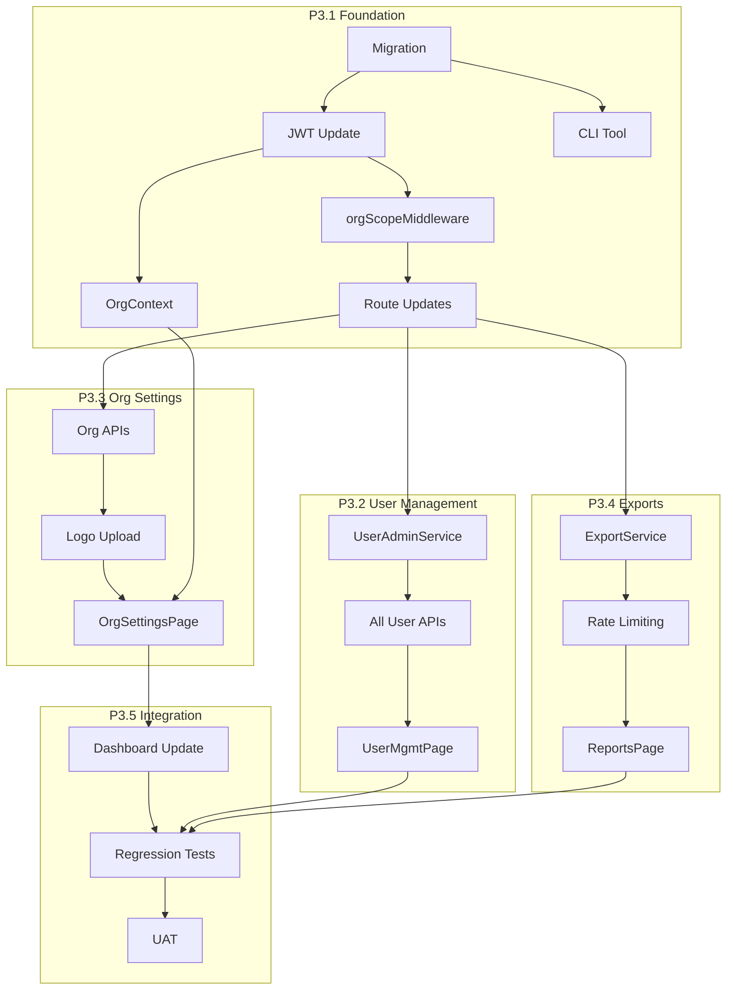

# Implementation Plan - EHS Portal Phase 3: Multi-Organisation & Enterprise Reporting

## 1. Overview

This document defines the implementation plan for Phase 3 of the EHS Portal. Phase 3 introduces multi-organisation support, user management, and data export capabilities.

**Estimated Effort:** 3-4 sprints (depending on team size and velocity)

**Prerequisites:**
- Phase 1 and Phase 2 complete and deployed
- All Phase 2 tests passing
- Database migrated with `organisation_id` columns (nullable) from Phase 1/2

---

## 2. Implementation Phases

### 2.1 Phase Overview

| Phase | Name | Focus | Key Deliverables |
|-------|------|-------|------------------|
| P3.1 | Foundation | Multi-tenancy foundation | organisations table, org scoping, CLI tool |
| P3.2 | User Management | Org-level user admin | User CRUD, disable/enable, password reset |
| P3.3 | Organisation Settings | Org profile & branding | Settings UI, logo upload, thresholds |
| P3.4 | Exports | Data export capability | CSV exports, rate limiting, filters |
| P3.5 | Integration | Polish & integration | Dashboard updates, navigation, testing |

---

## 3. Phase P3.1: Foundation

**Goal:** Establish multi-tenant infrastructure and seed tooling.

### 3.1 Backend Tasks

| Task ID | Task | C-IDs | US-ID | Dependencies |
|---------|------|-------|-------|--------------|
| P3.1-BE-01 | Create organisations table migration (003_phase3_multitenant.sql) | C71 | - | None |
| P3.1-BE-02 | Add `is_active` column to users table | C80 | - | P3.1-BE-01 |
| P3.1-BE-03 | Add `organisation_id` to attachments and audit_log | C73 | - | P3.1-BE-01 |
| P3.1-BE-04 | Create OrganisationRepository | C71, C73 | - | P3.1-BE-01 |
| P3.1-BE-05 | Create OrganisationService (basic read) | C91 | US-P3-01 | P3.1-BE-04 |
| P3.1-BE-06 | Update JWT token to include organisationId | C72, C74 | - | P3.1-BE-01 |
| P3.1-BE-07 | Create orgScopeMiddleware | C74 | - | P3.1-BE-06 |
| P3.1-BE-08 | Update all existing routes to use orgScopeMiddleware | C73, C74 | - | P3.1-BE-07 |
| P3.1-BE-09 | Update all repositories to filter by organisation_id | C73 | - | P3.1-BE-07 |
| P3.1-BE-10 | Create seed-org CLI script for first org + admin | C71, C82 | - | P3.1-BE-01 |
| P3.1-BE-11 | Update login to check user.is_active | C80 | - | P3.1-BE-02 |
| P3.1-BE-12 | Update login response with org info | C72 | - | P3.1-BE-06 |

### 3.2 Frontend Tasks

| Task ID | Task | C-IDs | US-ID | Dependencies |
|---------|------|-------|-------|--------------|
| P3.1-FE-01 | Create OrgContext provider | C91 | US-P3-01 | P3.1-BE-05 |
| P3.1-FE-02 | Update AuthContext to store organisationId | C72 | - | P3.1-BE-06 |
| P3.1-FE-03 | Create OrgLogo component | C92 | - | P3.1-FE-01 |
| P3.1-FE-04 | Update Header to use OrgLogo | C92 | - | P3.1-FE-03 |

### 3.3 Tests

| Task ID | Task | Dependencies |
|---------|------|--------------|
| P3.1-TS-01 | Unit tests for orgScopeMiddleware | P3.1-BE-07 |
| P3.1-TS-02 | Integration tests for org-scoped queries | P3.1-BE-09 |
| P3.1-TS-03 | Test disabled user cannot login | P3.1-BE-11 |
| P3.1-TS-04 | Test CLI seed-org script | P3.1-BE-10 |

### 3.4 Deliverables

- [ ] Migration 003 creates organisations table
- [ ] All entities have organisation_id constraints
- [ ] JWT includes organisationId
- [ ] All routes enforce org scoping
- [ ] seed-org CLI creates first org and admin
- [ ] Disabled users cannot login
- [ ] OrgContext loads org data
- [ ] Header displays org name (logo placeholder)

---

## 4. Phase P3.2: User Management

**Goal:** Enable admins to manage users within their organisation.

### 4.1 Backend Tasks

| Task ID | Task | C-IDs | US-ID | Dependencies |
|---------|------|-------|-------|--------------|
| P3.2-BE-01 | Create UserAdminService | C77-C83 | US-P3-05 | P3.1-BE-09 |
| P3.2-BE-02 | Implement GET /api/org-users | C77 | US-P3-05 | P3.2-BE-01 |
| P3.2-BE-03 | Implement POST /api/org-users (create user) | C78, C81, C82 | US-P3-06 | P3.2-BE-01 |
| P3.2-BE-04 | Implement GET /api/org-users/:id | C77 | US-P3-05 | P3.2-BE-01 |
| P3.2-BE-05 | Implement PUT /api/org-users/:id (update) | C79, C81 | US-P3-07 | P3.2-BE-01 |
| P3.2-BE-06 | Implement POST /api/org-users/:id/disable | C80 | US-P3-08 | P3.2-BE-01 |
| P3.2-BE-07 | Implement POST /api/org-users/:id/enable | C80 | US-P3-08 | P3.2-BE-01 |
| P3.2-BE-08 | Implement POST /api/org-users/:id/reset-password | C83 | US-P3-09 | P3.2-BE-01 |
| P3.2-BE-09 | Add email uniqueness check within org | C72 | US-P3-06 | P3.2-BE-01 |
| P3.2-BE-10 | Add last-admin protection on disable | C80 | US-P3-08 | P3.2-BE-06 |
| P3.2-BE-11 | Add cannot-change-own-role validation | C81 | US-P3-07 | P3.2-BE-05 |
| P3.2-BE-12 | Audit log user management events | C77-C83 | - | P3.2-BE-01 |

### 4.2 Frontend Tasks

| Task ID | Task | C-IDs | US-ID | Dependencies |
|---------|------|-------|-------|--------------|
| P3.2-FE-01 | Create UserManagementPage | C77 | US-P3-05 | P3.2-BE-02 |
| P3.2-FE-02 | Create UserTable component | C77 | US-P3-05 | P3.2-FE-01 |
| P3.2-FE-03 | Create UserFormModal component | C78, C79 | US-P3-06, US-P3-07 | P3.2-BE-03 |
| P3.2-FE-04 | Create ResetPasswordModal component | C83 | US-P3-09 | P3.2-BE-08 |
| P3.2-FE-05 | Create DisableUserModal component | C80 | US-P3-08 | P3.2-BE-06 |
| P3.2-FE-06 | Add Users link to Admin sidebar | C77 | - | P3.2-FE-01 |
| P3.2-FE-07 | Implement role/status badges | C77 | US-P3-05 | P3.2-FE-02 |
| P3.2-FE-08 | Implement action menu (edit/disable/reset) | C77-C83 | - | P3.2-FE-02 |

### 4.3 Tests

| Task ID | Task | Dependencies |
|---------|------|--------------|
| P3.2-TS-01 | Unit tests for UserAdminService | P3.2-BE-01 |
| P3.2-TS-02 | API tests for all user management endpoints | P3.2-BE-08 |
| P3.2-TS-03 | Test email uniqueness within org | P3.2-BE-09 |
| P3.2-TS-04 | Test last-admin protection | P3.2-BE-10 |
| P3.2-TS-05 | Test cannot-change-own-role | P3.2-BE-11 |
| P3.2-TS-06 | Frontend component tests for UserTable | P3.2-FE-02 |
| P3.2-TS-07 | Frontend tests for UserFormModal | P3.2-FE-03 |

### 4.4 Deliverables

- [ ] Admin can list all users in org
- [ ] Admin can create new user
- [ ] Admin can update user name/email/role
- [ ] Admin can disable user
- [ ] Admin can enable user
- [ ] Admin can reset user password
- [ ] Email is unique per org
- [ ] Cannot disable last admin
- [ ] Cannot change own role
- [ ] User management page complete

---

## 5. Phase P3.3: Organisation Settings

**Goal:** Enable admins to manage organisation profile, logo, and dashboard settings.

### 5.1 Backend Tasks

| Task ID | Task | C-IDs | US-ID | Dependencies |
|---------|------|-------|-------|--------------|
| P3.3-BE-01 | Implement GET /api/organisation | C91, C93 | US-P3-01 | P3.1-BE-05 |
| P3.3-BE-02 | Implement PUT /api/organisation | C91, C93, C95 | US-P3-02 | P3.3-BE-01 |
| P3.3-BE-03 | Implement POST /api/organisation/logo | C92, C95 | US-P3-03 | P3.3-BE-01 |
| P3.3-BE-04 | Implement DELETE /api/organisation/logo | C92, C95 | US-P3-03 | P3.3-BE-03 |
| P3.3-BE-05 | Implement PUT /api/organisation/dashboard-settings | C94, C95 | US-P3-04 | P3.3-BE-01 |
| P3.3-BE-06 | Logo file validation (type, size) | C92 | US-P3-03 | P3.3-BE-03 |
| P3.3-BE-07 | Logo storage in /uploads/logos/{orgId}/ | C92 | US-P3-03 | P3.3-BE-03 |
| P3.3-BE-08 | Timezone validation (IANA format) | C93 | US-P3-02 | P3.3-BE-02 |
| P3.3-BE-09 | Threshold validation (critical >= warning) | C94 | US-P3-04 | P3.3-BE-05 |
| P3.3-BE-10 | Audit log org settings changes | C91-C95 | - | P3.3-BE-02 |

### 5.2 Frontend Tasks

| Task ID | Task | C-IDs | US-ID | Dependencies |
|---------|------|-------|-------|--------------|
| P3.3-FE-01 | Create OrgSettingsPage | C91-C95 | US-P3-01 | P3.3-BE-01 |
| P3.3-FE-02 | Create OrgProfileForm component | C91, C93 | US-P3-02 | P3.3-BE-02 |
| P3.3-FE-03 | Create LogoUploader component | C92 | US-P3-03 | P3.3-BE-03 |
| P3.3-FE-04 | Create TimezoneSelector component | C93 | US-P3-02 | P3.3-FE-02 |
| P3.3-FE-05 | Create ThresholdSettings component | C94 | US-P3-04 | P3.3-BE-05 |
| P3.3-FE-06 | Add Organisation link to Admin sidebar | C91 | - | P3.3-FE-01 |
| P3.3-FE-07 | Update OrgContext to refetch on settings change | C91-C95 | - | P3.3-FE-01 |
| P3.3-FE-08 | Update OrgLogo to show uploaded logo | C92 | - | P3.3-BE-03 |

### 5.3 Tests

| Task ID | Task | Dependencies |
|---------|------|--------------|
| P3.3-TS-01 | API tests for organisation endpoints | P3.3-BE-05 |
| P3.3-TS-02 | Test logo upload/delete | P3.3-BE-04 |
| P3.3-TS-03 | Test invalid file type rejection | P3.3-BE-06 |
| P3.3-TS-04 | Test file size limit | P3.3-BE-06 |
| P3.3-TS-05 | Test timezone validation | P3.3-BE-08 |
| P3.3-TS-06 | Test threshold validation | P3.3-BE-09 |
| P3.3-TS-07 | Frontend tests for LogoUploader | P3.3-FE-03 |

### 5.4 Deliverables

- [ ] Admin can view organisation settings
- [ ] Admin can update org name and timezone
- [ ] Admin can upload logo (PNG/JPEG/SVG, max 2MB)
- [ ] Admin can remove logo
- [ ] Admin can configure dashboard thresholds
- [ ] Logo displays in header
- [ ] Organisation settings page complete

---

## 6. Phase P3.4: Exports

**Goal:** Enable managers and admins to export data to CSV.

### 6.1 Backend Tasks

| Task ID | Task | C-IDs | US-ID | Dependencies |
|---------|------|-------|-------|--------------|
| P3.4-BE-01 | Create ExportService | C84-C90 | US-P3-10 | P3.1-BE-09 |
| P3.4-BE-02 | Implement GET /api/exports/incidents | C84, C87, C88 | US-P3-10 | P3.4-BE-01 |
| P3.4-BE-03 | Implement GET /api/exports/inspections | C85, C87, C88 | US-P3-11 | P3.4-BE-01 |
| P3.4-BE-04 | Implement GET /api/exports/actions | C86, C87, C88 | US-P3-12 | P3.4-BE-01 |
| P3.4-BE-05 | Implement CSV streaming (fast-csv) | C84-C86 | - | P3.4-BE-01 |
| P3.4-BE-06 | Implement date range filter | C87 | US-P3-10 | P3.4-BE-02 |
| P3.4-BE-07 | Implement site filter | C87 | US-P3-10 | P3.4-BE-02 |
| P3.4-BE-08 | Implement status/severity filters | C87 | US-P3-10 | P3.4-BE-02 |
| P3.4-BE-09 | Implement row limit (10K) with error | C90 | US-P3-10 | P3.4-BE-01 |
| P3.4-BE-10 | Implement rate limiting (1/30s per user) | C90 | US-P3-10 | P3.4-BE-01 |
| P3.4-BE-11 | Set filename with org-slug and date | C89 | US-P3-10 | P3.4-BE-02 |
| P3.4-BE-12 | Add rate limit headers to responses | - | - | P3.4-BE-10 |

### 6.2 Frontend Tasks

| Task ID | Task | C-IDs | US-ID | Dependencies |
|---------|------|-------|-------|--------------|
| P3.4-FE-01 | Create ReportsPage | C84-C90 | US-P3-10 | P3.4-BE-04 |
| P3.4-FE-02 | Create ExportPanel component | C84-C87 | US-P3-10 | P3.4-FE-01 |
| P3.4-FE-03 | Create ExportButton component | C84-C90 | - | P3.4-FE-02 |
| P3.4-FE-04 | Create filter inputs (date, site, status) | C87 | US-P3-10 | P3.4-FE-02 |
| P3.4-FE-05 | Implement rate limit countdown | C90 | - | P3.4-BE-10 |
| P3.4-FE-06 | Implement row limit error modal | C90 | - | P3.4-BE-09 |
| P3.4-FE-07 | Add Reports link to sidebar | C84-C86 | - | P3.4-FE-01 |
| P3.4-FE-08 | Handle 429 response with toast | - | - | P3.4-BE-10 |

### 6.3 Tests

| Task ID | Task | Dependencies |
|---------|------|--------------|
| P3.4-TS-01 | Unit tests for ExportService | P3.4-BE-01 |
| P3.4-TS-02 | API tests for export endpoints | P3.4-BE-04 |
| P3.4-TS-03 | Test CSV format correctness | P3.4-BE-05 |
| P3.4-TS-04 | Test filter combinations | P3.4-BE-08 |
| P3.4-TS-05 | Test row limit error | P3.4-BE-09 |
| P3.4-TS-06 | Test rate limiting | P3.4-BE-10 |
| P3.4-TS-07 | Test org scoping in exports | P3.4-BE-02 |
| P3.4-TS-08 | Frontend tests for ExportButton states | P3.4-FE-03 |

### 6.4 Deliverables

- [ ] Manager/Admin can export incidents to CSV
- [ ] Manager/Admin can export inspections to CSV
- [ ] Manager/Admin can export actions to CSV
- [ ] Exports support date range filter
- [ ] Exports support site filter
- [ ] Exports support status/severity filters
- [ ] Exports limited to 10K rows
- [ ] Rate limiting: 1 export per 30s
- [ ] Filename includes org-slug and date
- [ ] Reports page complete

---

## 7. Phase P3.5: Integration & Polish

**Goal:** Complete integration, update dashboard, and final testing.

### 7.1 Backend Tasks

| Task ID | Task | C-IDs | US-ID | Dependencies |
|---------|------|-------|-------|--------------|
| P3.5-BE-01 | Update dashboard endpoint to use org thresholds | C94 | - | P3.3-BE-05 |
| P3.5-BE-02 | Ensure all audit logs include organisation_id | C73 | - | P3.1-BE-03 |
| P3.5-BE-03 | Final review of org scoping on all routes | C73, C74 | - | P3.1-BE-08 |
| P3.5-BE-04 | Update seed data to include default org | C71 | - | P3.1-BE-10 |

### 7.2 Frontend Tasks

| Task ID | Task | C-IDs | US-ID | Dependencies |
|---------|------|-------|-------|--------------|
| P3.5-FE-01 | Update Dashboard KPI cards with threshold colors | C94 | - | P3.5-BE-01 |
| P3.5-FE-02 | Final navigation/sidebar updates | - | - | All FE tasks |
| P3.5-FE-03 | Add export buttons to list pages (optional) | C84-C86 | - | P3.4-FE-03 |
| P3.5-FE-04 | Responsive design testing and fixes | - | - | All FE tasks |
| P3.5-FE-05 | Accessibility audit and fixes | - | - | All FE tasks |

### 7.3 Tests

| Task ID | Task | Dependencies |
|---------|------|--------------|
| P3.5-TS-01 | Full regression test of Phase 1 & 2 features | All BE tasks |
| P3.5-TS-02 | End-to-end tests for Phase 3 flows | All tasks |
| P3.5-TS-03 | Cross-tenant access attempt tests | P3.1-BE-07 |
| P3.5-TS-04 | UAT test execution | All tasks |

### 7.4 Deliverables

- [ ] Dashboard KPI colors reflect org thresholds
- [ ] All routes properly org-scoped
- [ ] Navigation complete and consistent
- [ ] Phase 1 & 2 regression passing
- [ ] All Phase 3 tests passing
- [ ] UAT complete

---

## 8. Dependency Graph



---

## 9. Risk Mitigation

| Risk | Mitigation |
|------|------------|
| Org scoping bugs expose cross-tenant data | Extensive testing, code review focus on org filtering |
| Migration breaks existing data | Backup before migration, test on staging first |
| Export timeout on large datasets | Streaming, row limit, index optimization |
| Rate limiting too aggressive | Environment-configurable rate limit values |
| Logo upload security | File type validation, size limits, virus scanning (future) |

---

## 10. Environment Configuration

### 10.1 New Environment Variables

```env
# Phase 3 Configuration
EXPORT_ROW_LIMIT=10000
EXPORT_RATE_LIMIT_SECONDS=30
LOGO_MAX_SIZE_BYTES=2097152
LOGO_ALLOWED_TYPES=image/png,image/jpeg,image/svg+xml
```

### 10.2 CLI Commands

```bash
# Create first organisation and admin
npm run seed-org -- --name "Acme Corp" --slug "acme-corp" --admin-email "admin@acme.com" --admin-password "SecurePass123!"

# Run Phase 3 migration
npm run migrate
```

---

## 11. Checklist Reference

See [phase3_impl_checklist.md](./phase3_impl_checklist.md) for detailed implementation tracking.

---

## 12. Related Documents

- [BRD_EHS_PORTAL_PHASE3.md](./BRD_EHS_PORTAL_PHASE3.md) - Requirements
- [DATA_MODEL_PHASE3.md](./DATA_MODEL_PHASE3.md) - Data model
- [ARCHITECTURE_PHASE3.md](./ARCHITECTURE_PHASE3.md) - Architecture
- [API_SPEC_PHASE3.md](./API_SPEC_PHASE3.md) - API specification
- [FRONTEND_UX_PHASE3.md](./FRONTEND_UX_PHASE3.md) - UI specification
- [TEST_STRATEGY_PHASE3.md](./TEST_STRATEGY_PHASE3.md) - Test strategy

---

*End of Document*
