# User Workflows Document
# EHS Portal - Phase 1: Core Operational MVP

---

> **How to Use Diagrams in This Document**
>
> This document contains Mermaid diagram definitions enclosed in triple backticks with `mermaid` syntax.
> To convert these to images for Microsoft Word:
> 1. Copy the Mermaid code block (without the backticks)
> 2. Paste into [Mermaid Live Editor](https://mermaid.live/) or [draw.io](https://app.diagrams.net/)
> 3. Export as PNG or SVG
> 4. Insert the image into your Word document
>
> Alternatively, use VS Code with a Mermaid preview extension, or Markdown editors that support Mermaid rendering.

---

## Document Control

| Item | Details |
|------|---------|
| **Document Title** | User Workflows Document - EHS Portal Phase 1 |
| **Version** | 1.0 |
| **Status** | Draft |
| **Author** | Claude (Senior Architect) |
| **Date** | January 2025 |
| **Related Documents** | BRD_EHS_PORTAL_PHASE1.md, USER_STORIES.md, USER_JOURNEYS.md |

---

## 1. Overview

This document describes the key user workflows for Phase 1 of the EHS Portal. Each workflow includes:
- Actor(s) involved
- Preconditions and postconditions
- Step-by-step flow diagram
- Exception handling

---

## 2. Authentication Workflows

### 2.1 User Login Flow

**Actor:** All Users (Worker, Manager, Admin)

**Preconditions:**
- User has valid account
- User is not already logged in

**Postconditions:**
- User is authenticated
- JWT token stored in browser
- User redirected to Dashboard

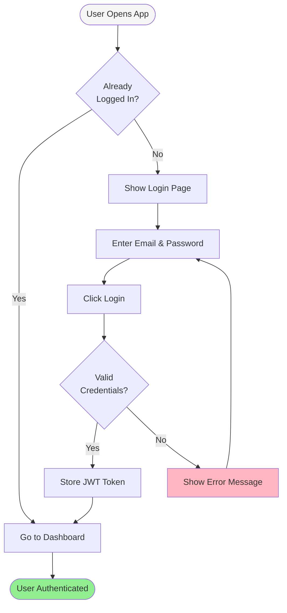

### 2.2 Session Expiry Flow

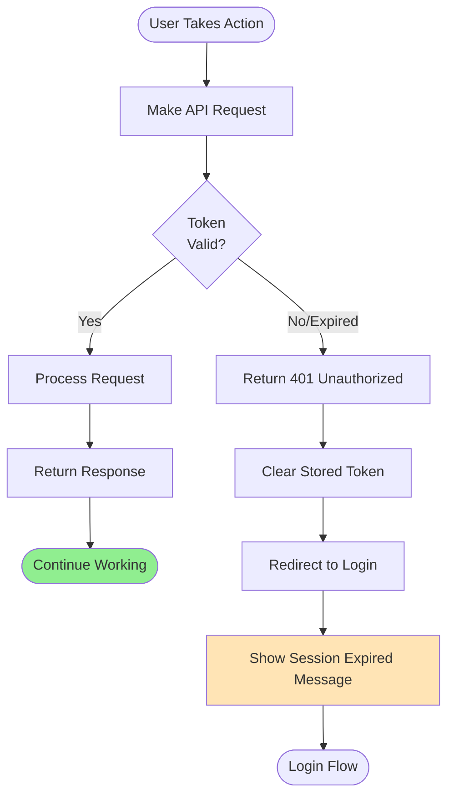

---

## 3. Incident Management Workflows

### 3.1 Create Incident Flow

**Actor:** Worker, Manager, Admin

**Preconditions:**
- User is logged in
- At least one site exists
- At least one incident type exists

**Postconditions:**
- New incident created with status "Open"
- Incident visible in incident list
- Dashboard metrics updated

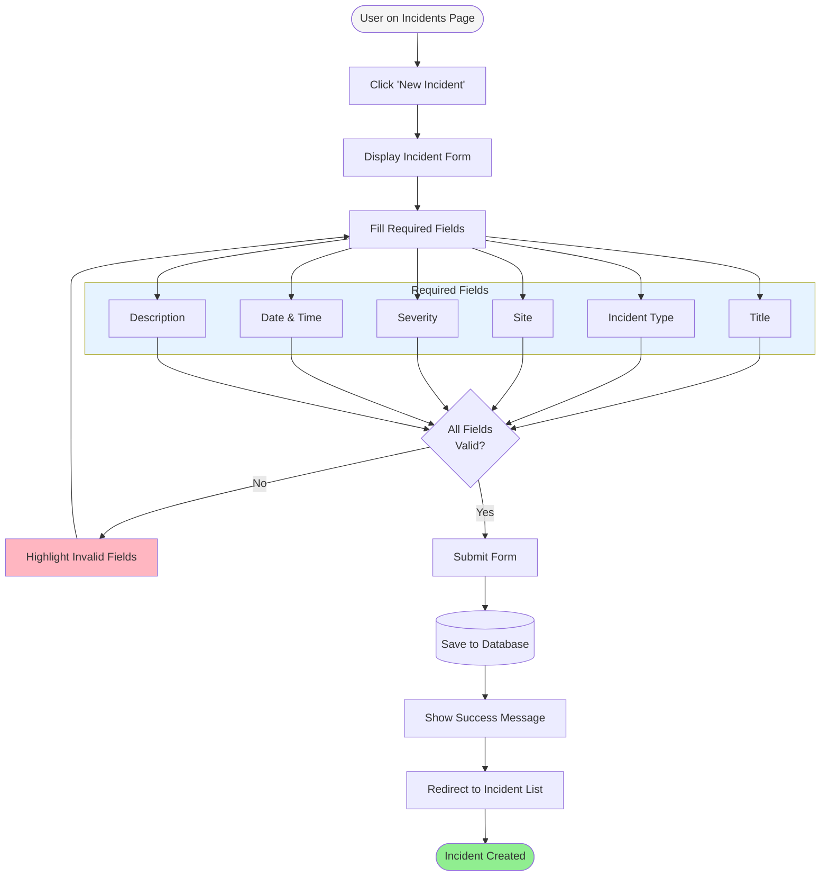

### 3.2 Incident Status Workflow

**Actor:** Manager, Admin

**Preconditions:**
- Incident exists
- User has manager or admin role

**Business Rules:**
- Status can only progress forward: Open ' Under Investigation ' Closed
- Workers cannot change status

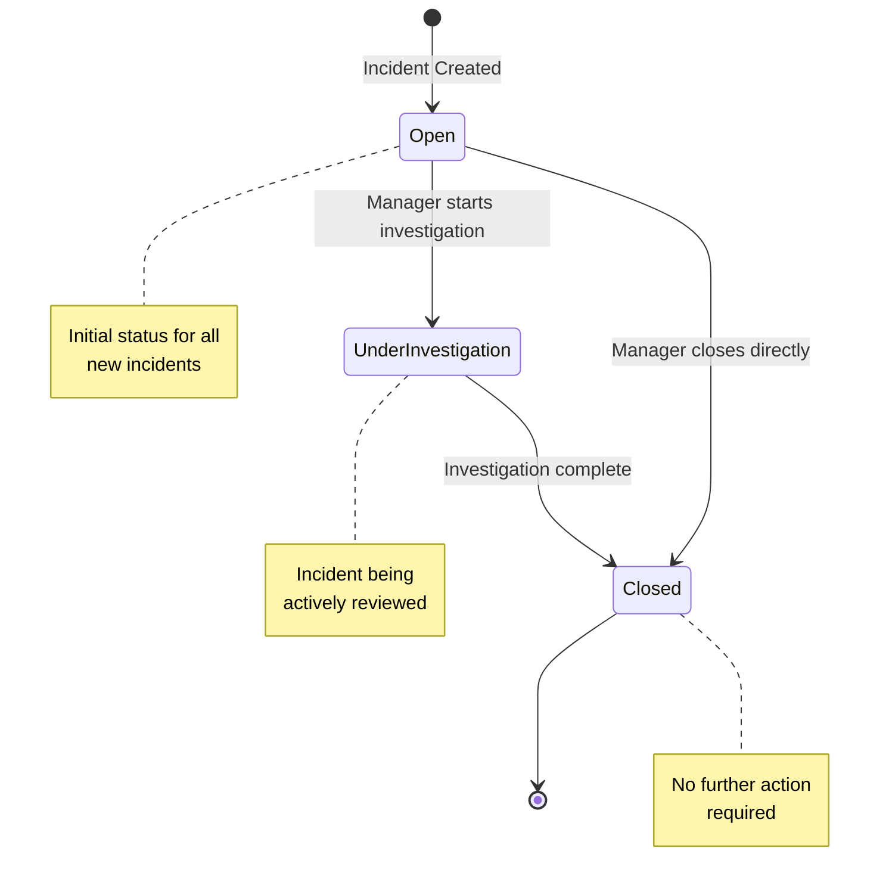

### 3.3 View Incidents Flow (Role-Based)

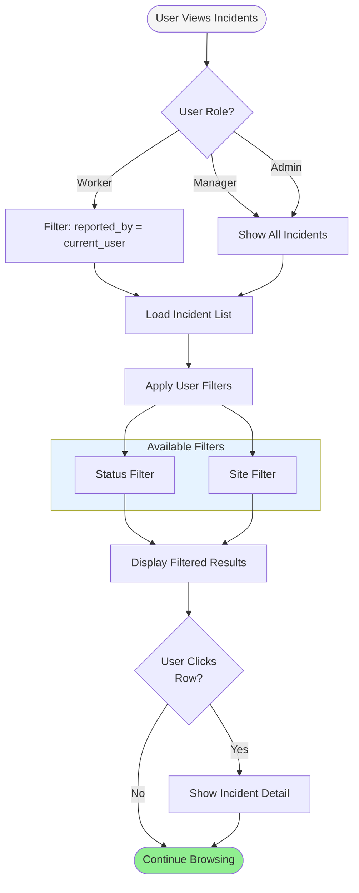

---

## 4. Inspection Management Workflows

### 4.1 Create Inspection Template Flow

**Actor:** Admin only

**Preconditions:**
- User is logged in as Admin

**Postconditions:**
- New template available for inspections
- Template items created in order

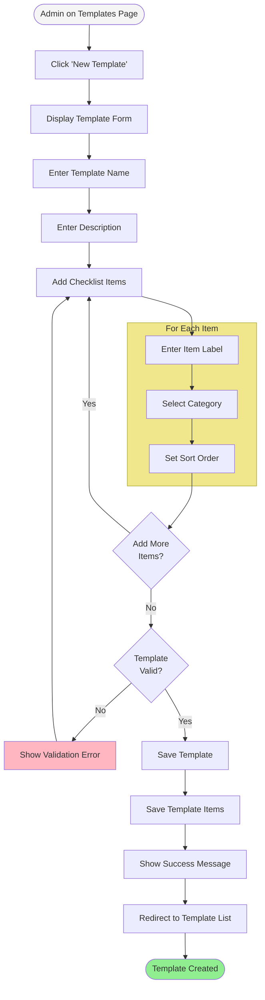

### 4.2 Perform Inspection Flow

**Actor:** Manager, Admin

**Preconditions:**
- User has manager or admin role
- At least one template exists
- At least one site exists

**Postconditions:**
- Inspection record created
- All item responses recorded
- Overall result calculated (Pass/Fail)

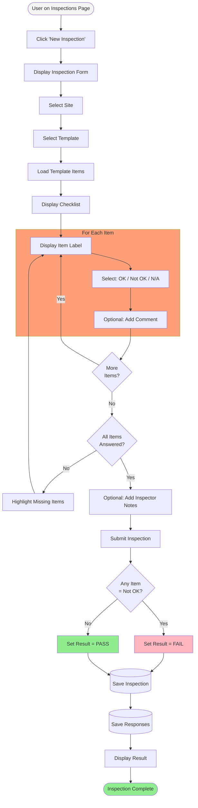

### 4.3 View Inspection History Flow

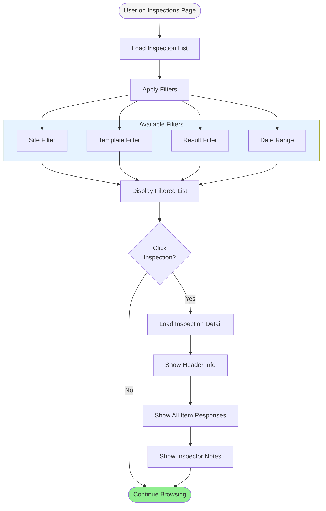

---

## 5. Site Management Workflows

### 5.1 Manage Sites Flow

**Actor:** Admin only

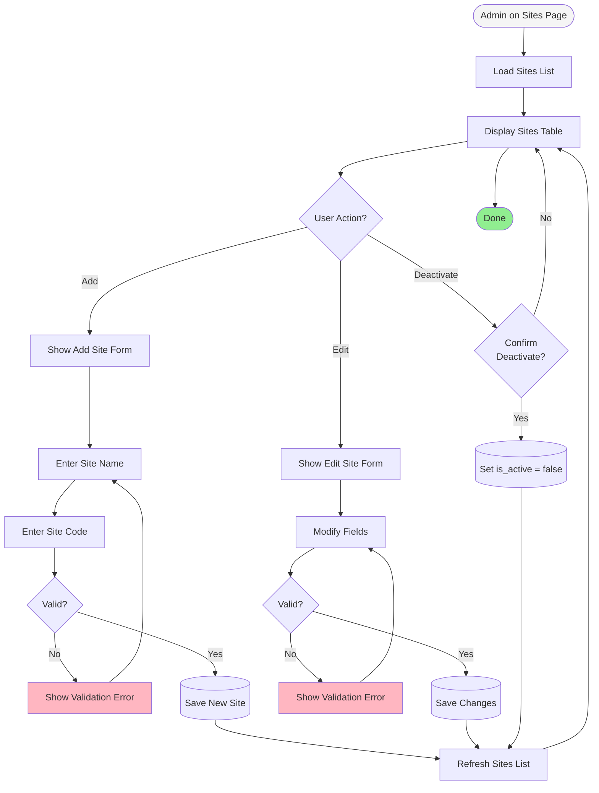

---

## 6. Dashboard Workflows

### 6.1 View Dashboard Flow

**Actor:** All Users

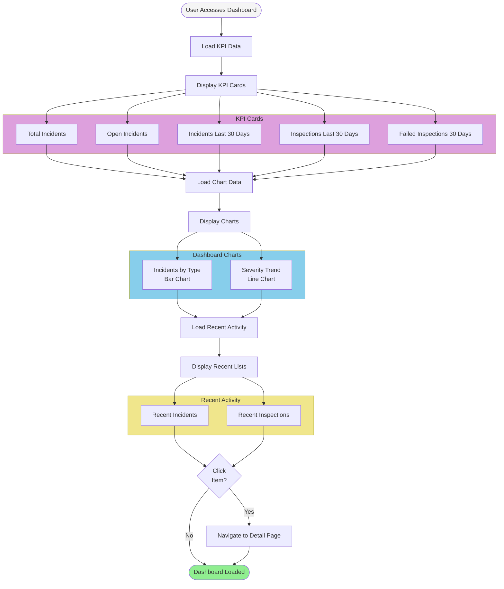

### 6.2 Dashboard Data Refresh

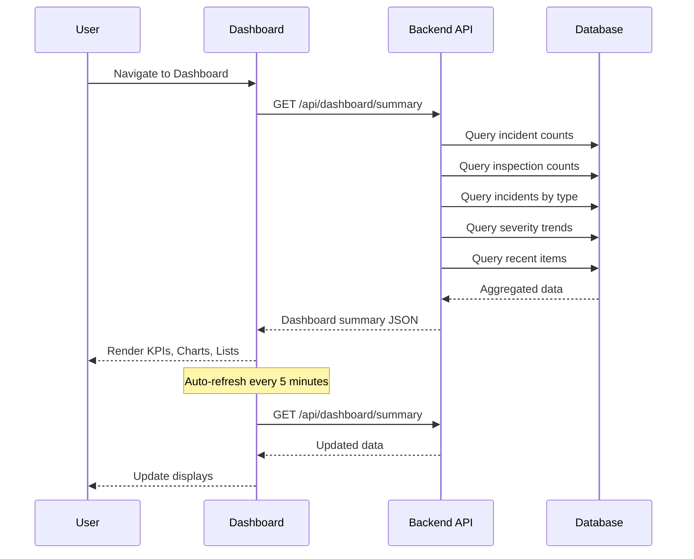

---

## 7. Complete User Journey Overview

### 7.1 Worker Journey

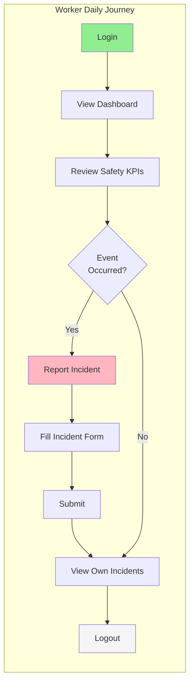

### 7.2 Manager Journey

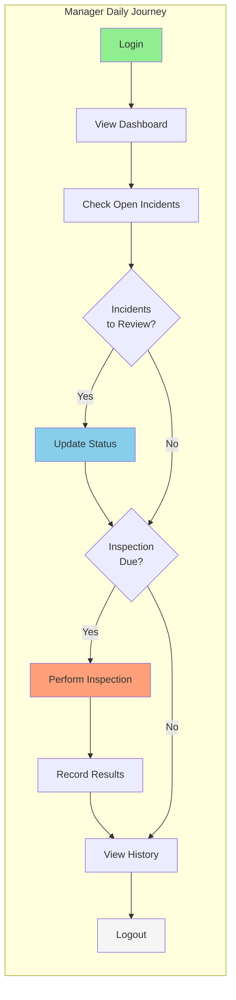

### 7.3 Admin Journey

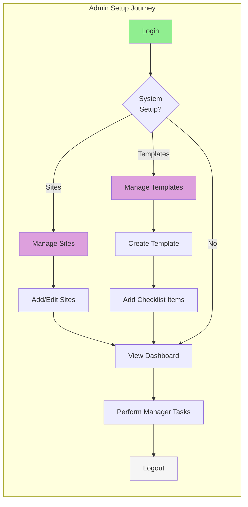

---

## 8. Exception Handling

### 8.1 Common Error Scenarios

| Workflow | Error Scenario | System Response |
|----------|----------------|-----------------|
| Login | Invalid credentials | Show error, allow retry |
| Login | Account locked | Show contact admin message |
| Create Incident | Required field missing | Highlight field, show message |
| Create Incident | Server error | Show error, preserve form data |
| Perform Inspection | Connection lost mid-inspection | Save draft locally (future) |
| Dashboard Load | API timeout | Show cached data with warning |
| Any Action | Session expired | Redirect to login with message |

### 8.2 Error Flow Diagram

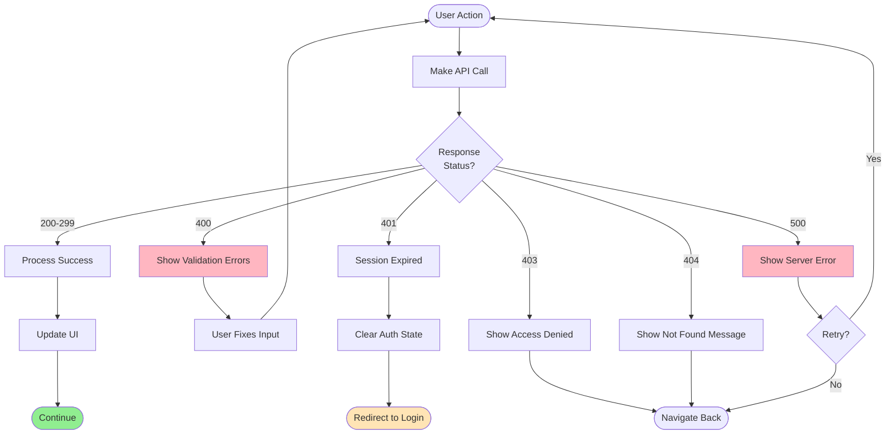

---

## 9. Appendices

### Appendix A: Workflow to User Story Mapping

| Workflow | User Stories | Test Cases |
|----------|--------------|------------|
| User Login | US-AUTH-01, US-AUTH-02 | TC-AUTH-01 to TC-AUTH-06 |
| Create Incident | US-INC-01 | TC-INC-01, TC-INC-02 |
| View Incidents | US-INC-02, US-INC-03 | TC-INC-03, TC-INC-04 |
| Update Incident Status | US-INC-04 | TC-INC-05, TC-INC-06 |
| Create Template | US-INSP-01, US-INSP-02 | TC-INSP-01, TC-INSP-02 |
| Perform Inspection | US-INSP-03 | TC-INSP-03, TC-INSP-04 |
| View Inspection History | US-INSP-04 | TC-INSP-05, TC-INSP-06 |
| Manage Sites | US-SITE-01, US-SITE-02 | TC-SITE-01, TC-SITE-02 |
| View Dashboard | US-DASH-01 to US-DASH-04 | TC-DASH-01 to TC-DASH-04 |

### Appendix B: Role Permissions Summary

| Workflow | Worker | Manager | Admin |
|----------|--------|---------|---------------|
| Login | - | - | - |
| View Dashboard | - | - | - |
| Create Incident | - | - | - |
| View Own Incidents | - | - | - |
| View All Incidents | - | - | - |
| Update Incident Status | - | - | - |
| Perform Inspection | - | - | - |
| View Inspection History | Read-only | - | - |
| Manage Sites | - | - | - |
| Manage Templates | - | - | - |

