# Workflows – EHS Portal Phase 10
## Integrations, SSO & External Connectivity

| Item | Detail |
|------|--------|
| Document Version | 1.0 |
| Author | Solution Architect |
| Date | 2026-02-05 |
| Status | Draft |
| Phase | 10 – Integrations, SSO & External Connectivity |

---

## 1. SSO Login Flow

### 1.1 OIDC Authorization Code Flow

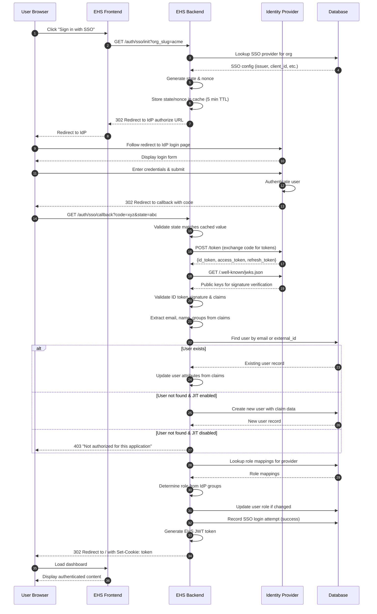

### 1.2 SSO Login State Diagram

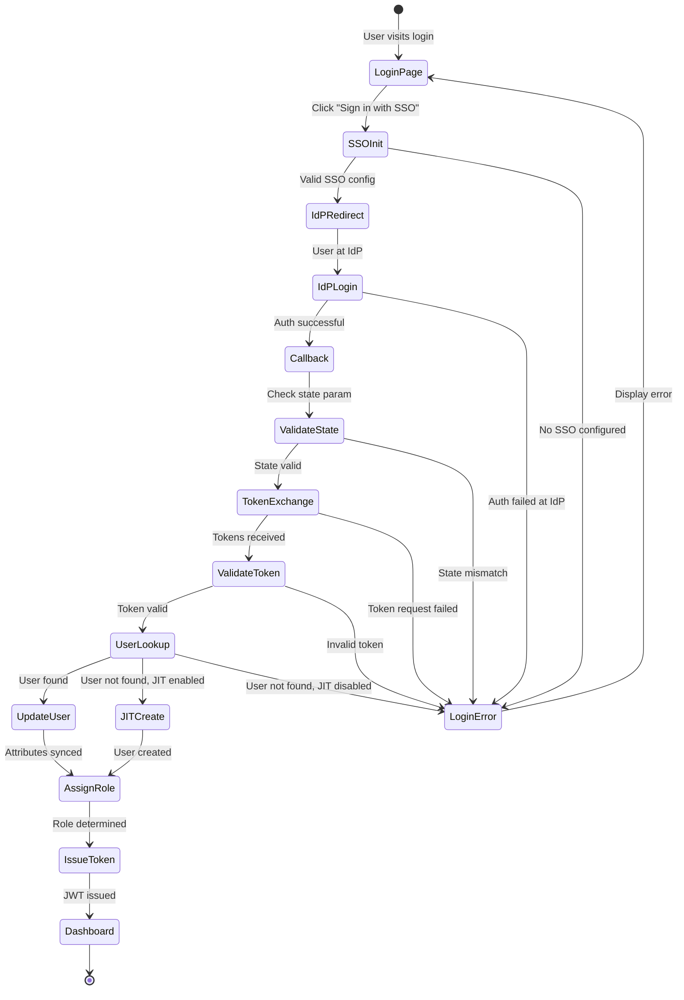

---

## 2. API Client Lifecycle

### 2.1 API Client Creation Flow

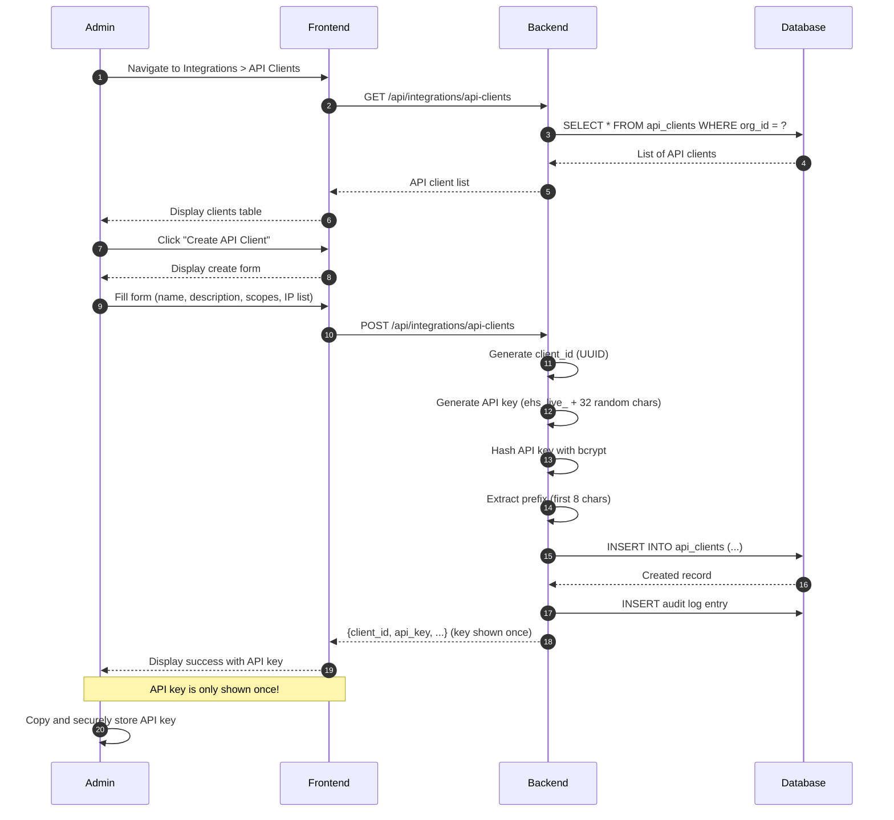

### 2.2 API Key Validation Flow

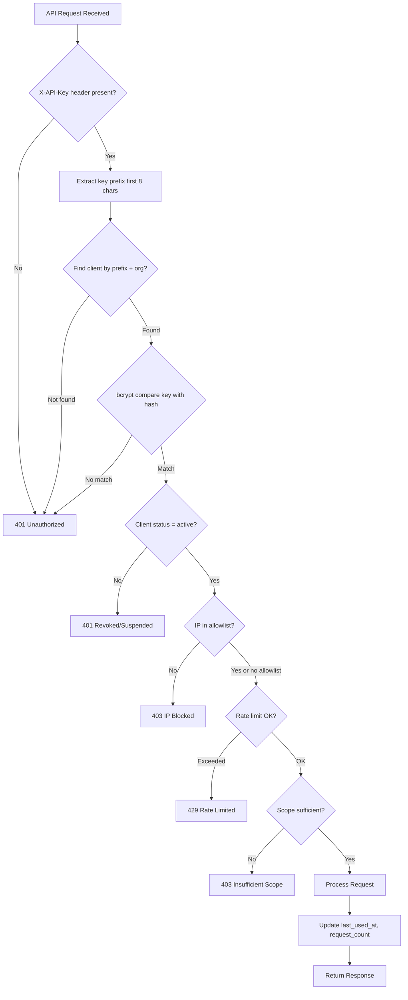

### 2.3 API Key Regeneration Flow

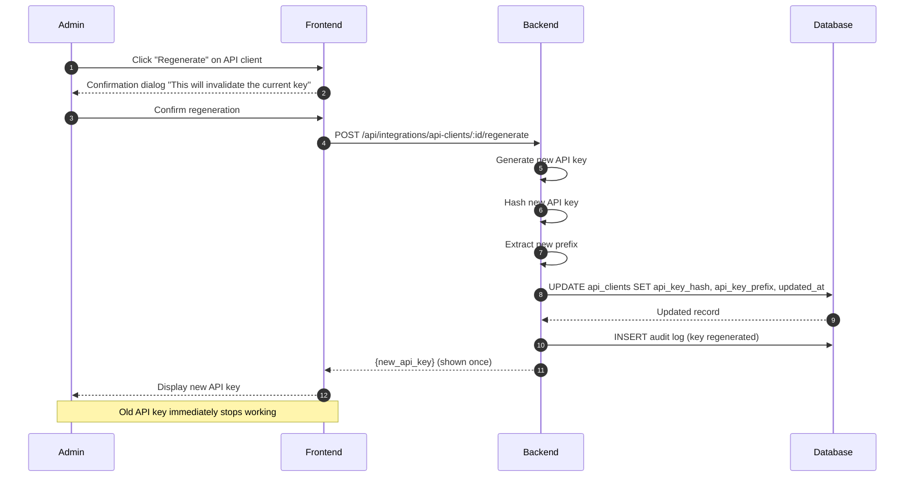

---

## 3. Webhook Delivery Flow

### 3.1 Event to Webhook Delivery

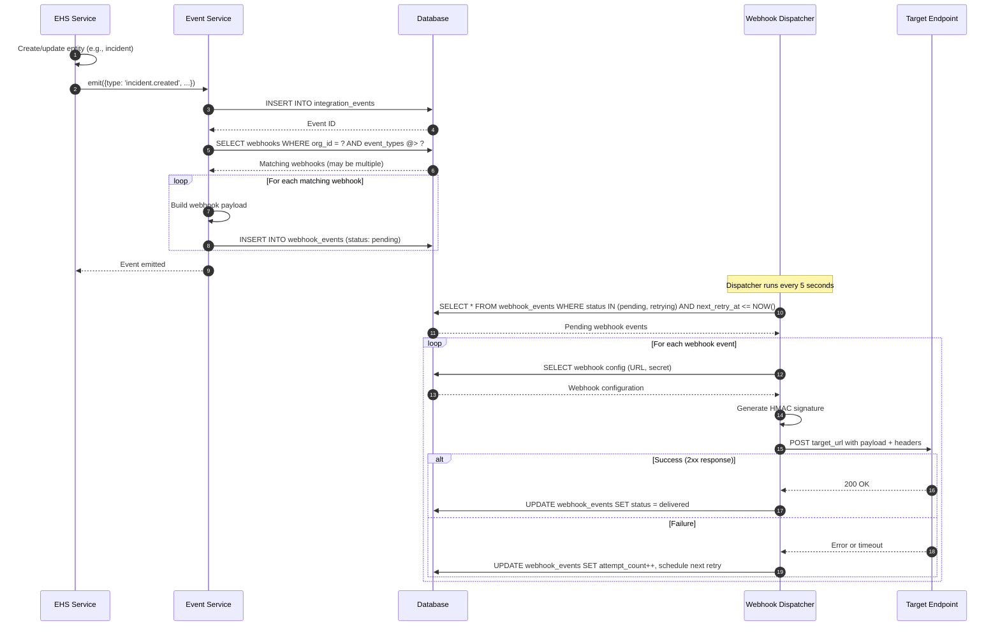

### 3.2 Webhook Retry Logic

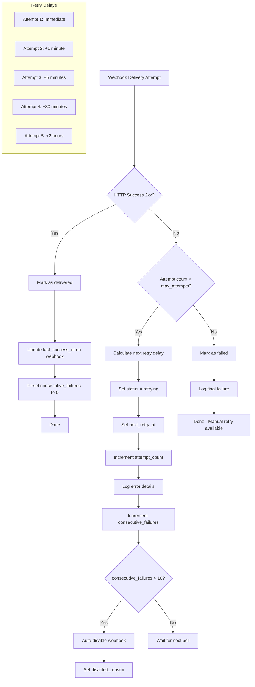

### 3.3 Teams Notification Flow

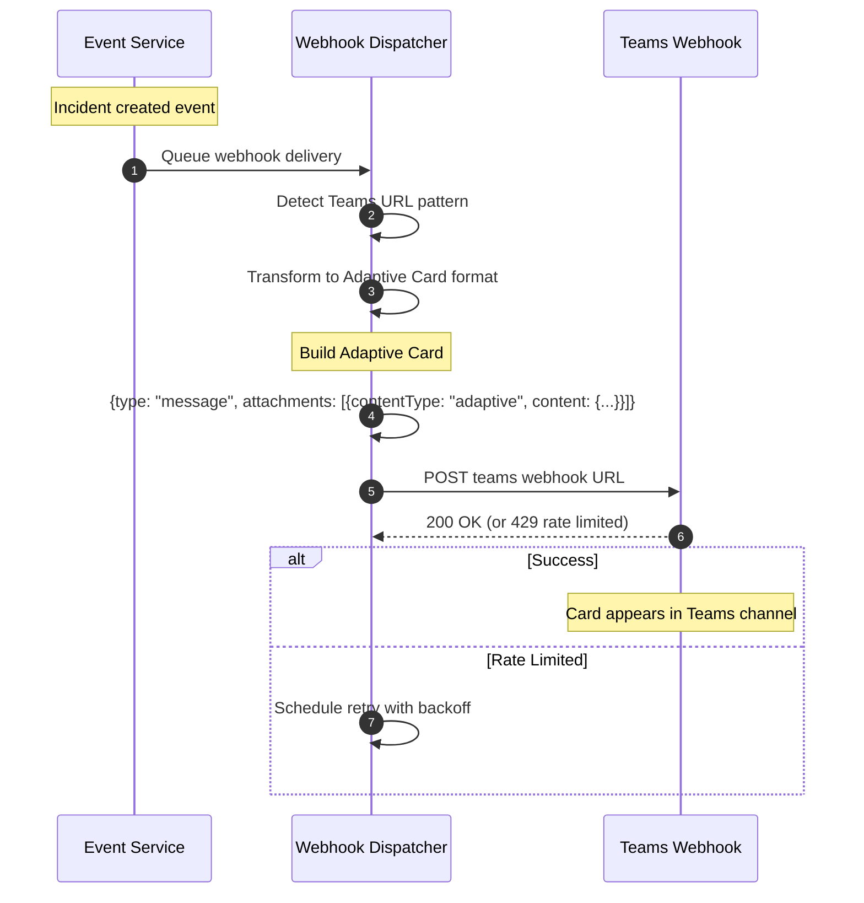

---

## 4. JIT User Provisioning

### 4.1 Just-In-Time User Creation

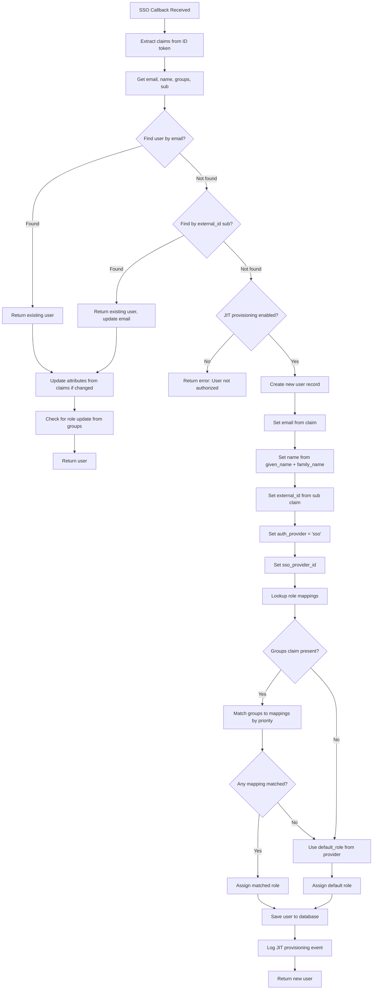

### 4.2 User Attribute Sync on Login

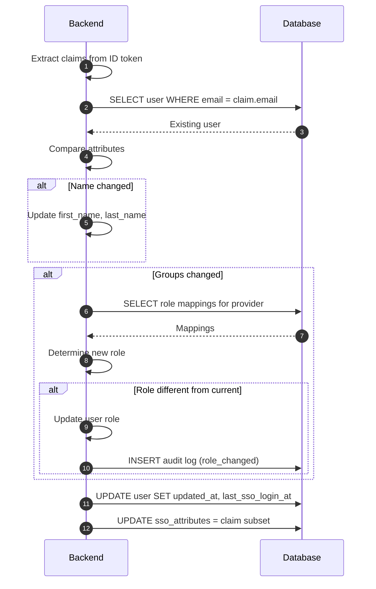

---

## 5. SSO Configuration Flow

### 5.1 Admin Configures SSO

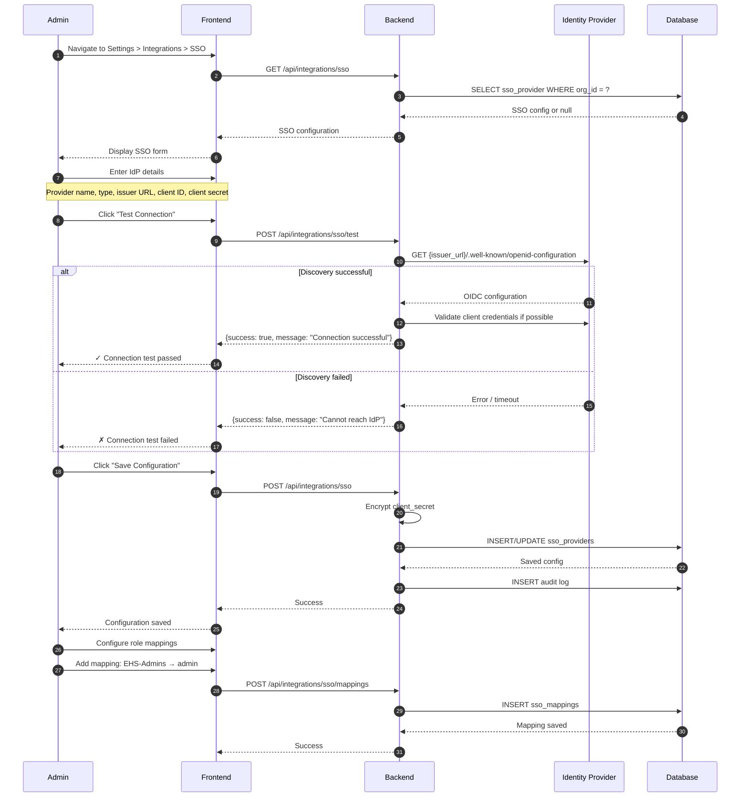

### 5.2 SSO Provider Validation

```mermaid
flowchart TD
    A[Save SSO Configuration] --> B[Validate required fields]
    B --> C{All required present?}
    C -->|No| D[Return validation error]
    C -->|Yes| E[Validate issuer URL format]
    E --> F{HTTPS URL?}
    F -->|No| D
    F -->|Yes| G[Fetch OIDC discovery document]
    G --> H{Discovery successful?}
    H -->|No| I[Return error: Cannot reach IdP]
    H -->|Yes| J[Validate required endpoints present]
    J --> K{Authorization & token endpoints?}
    K -->|No| L[Return error: Invalid OIDC config]
    K -->|Yes| M[Encrypt client secret]
    M --> N[Generate redirect URI]
    N --> O[Save to database]
    O --> P[Return success with redirect URI]
    
    Note over P: Admin must configure redirect URI in IdP
```

---

## 6. Integration Audit Flow

### 6.1 Audit Event Capture

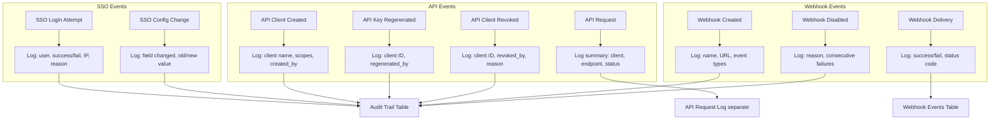

---

## 7. Public API Request Flow

### 7.1 Complete API Request Processing

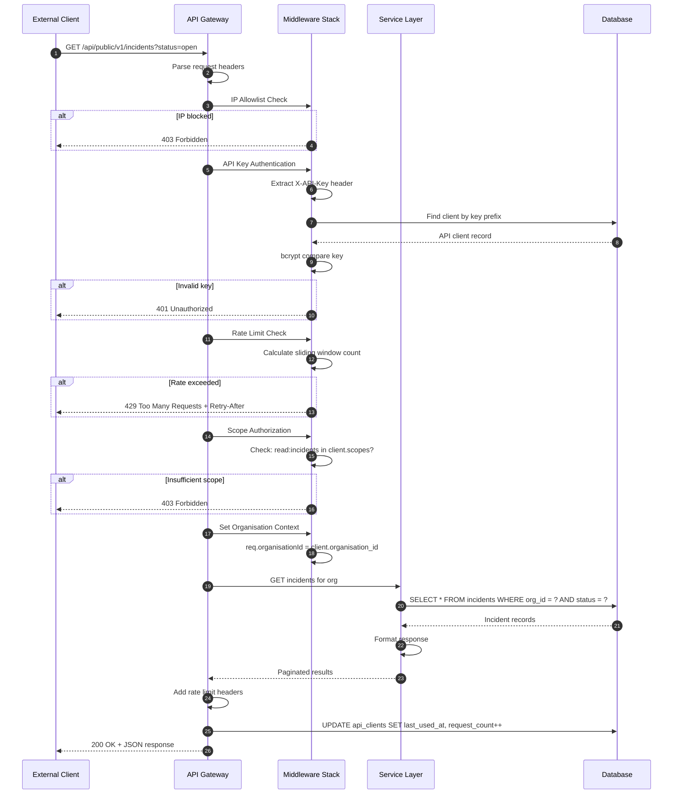

---

## 8. Error Recovery Flows

### 8.1 IdP Unavailability

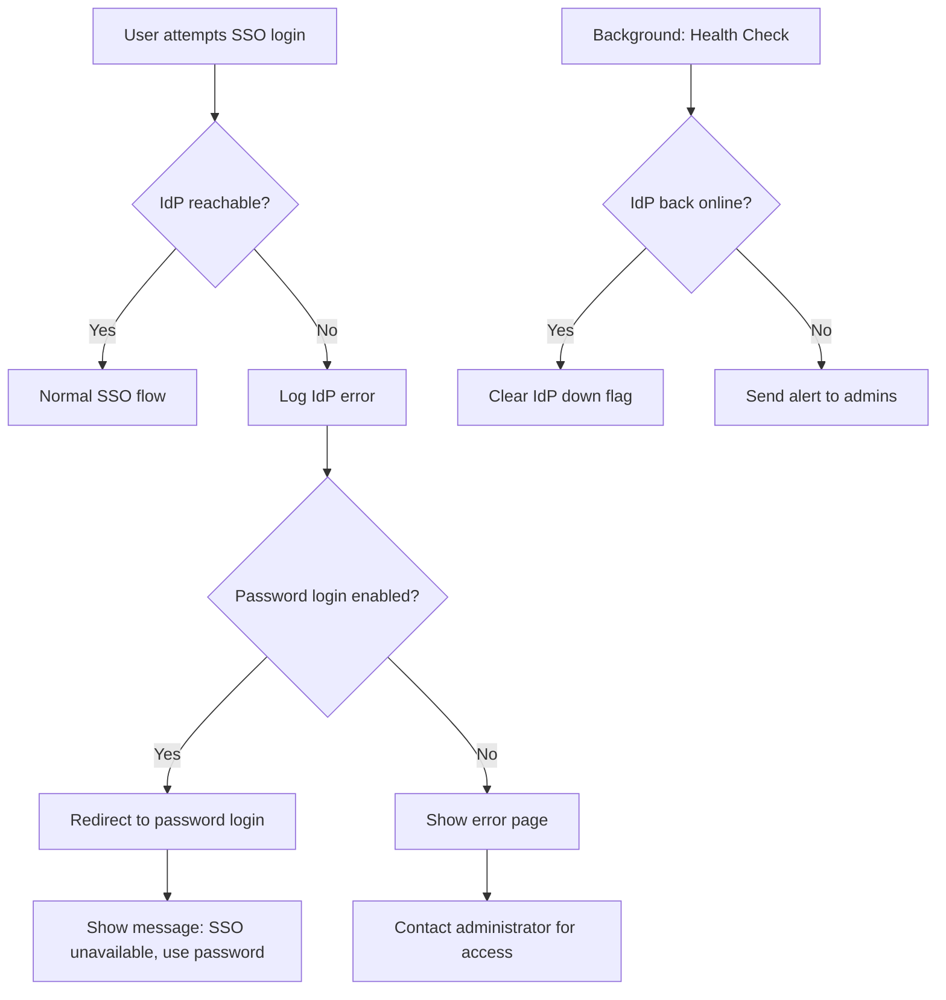

### 8.2 Webhook Target Unavailable

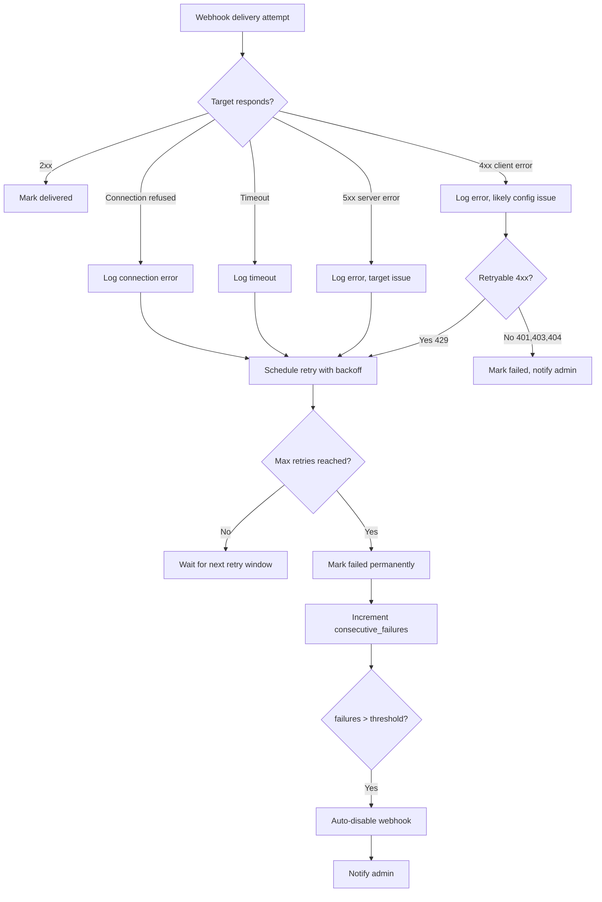

---

## 9. Integration Dashboard Flows

### 9.1 Admin Views Integration Status

```mermaid
flowchart TD
    A[Admin opens Integrations page] --> B[Load SSO status]
    B --> C{SSO configured?}
    C -->|Yes| D[Show provider name, status]
    D --> E[Show recent login count]
    C -->|No| F[Show "Configure SSO" prompt]

    A --> G[Load API clients]
    G --> H[List clients with usage stats]
    H --> I[Show: name, status, last_used, request_count]

    A --> J[Load webhooks]
    J --> K[List webhooks with delivery status]
    K --> L[Show: name, events, success rate, last delivery]
    L --> M{Any failures?}
    M -->|Yes| N[Highlight failed webhooks]
    M -->|No| O[All healthy indicator]

    A --> P[Load recent activity]
    P --> Q[Show integration events timeline]
```

---

*End of Document*
