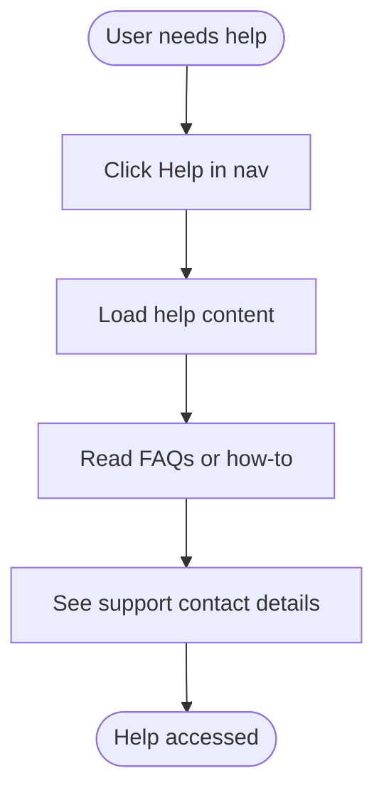

# User Workflows Document
# EHS Portal - Phase 2: Operational Excellence

---

> **How to Use Diagrams in This Document**
>
> This document contains Mermaid diagram definitions enclosed in triple backticks with `mermaid` syntax.
> To convert these to images for Microsoft Word:
> 1. Copy the Mermaid code block (without the backticks)
> 2. Paste into [Mermaid Live Editor](https://mermaid.live/) or [draw.io](https://app.diagrams.net/)
> 3. Export as PNG or SVG
> 4. Insert the image into your Word document
>
> Alternatively, use VS Code with a Mermaid preview extension, or Markdown editors that support Mermaid rendering.

---

## Document Control

| Item | Details |
|------|---------|
| **Document Title** | User Workflows Document - EHS Portal Phase 2 |
| **Version** | 1.0 |
| **Status** | Draft |
| **Author** | Codex (Solution Architect) |
| **Date** | January 2025 |
| **Related Documents** | BRD_EHS_PORTAL_PHASE2.md, DATA_MODEL_PHASE2.md, ARCHITECTURE_PHASE2.md, USER_JOURNEYS.md |

---

## 1. Overview

This document describes Phase 2 user workflows that extend Phase 1 screens and routes. Phase 2 adds:

- Actions/CAPA management
- Attachments/evidence handling
- Audit history visibility
- In-app help access

Each workflow includes:
- Actor and intent
- Success criteria
- Mermaid diagrams
- Related US-IDs and C-IDs

---

## 2. Actions/CAPA Workflows

### 2.1 Create Action from Incident Detail

**Actor:** Manager or Admin  
**Why:** Assign follow-up tasks for incidents  
**Success Criteria:** Action is created, visible in All Actions and My Actions, and audit log entry is recorded  
**References:** US-ACT-01, C20, C22, C23, C25, C26, C43

```mermaid
flowchart TD
    Start([Open Incident Detail]) --> ClickAdd[Click "Add Action"]
    ClickAdd --> Form[Show Action Form]
    Form --> Fill[Enter title, description, assignee, due date]
    Fill --> Validate{Valid?}
    Validate -->|No| Errors[Show validation errors]
    Errors --> Fill
    Validate -->|Yes| Submit[Submit Action]
    Submit --> Save[(Create action record)]
    Save --> Audit[(Write audit_log entry)]
    Audit --> UpdateUI[Refresh actions list]
    UpdateUI --> End([Action created])
```

### 2.2 Create Action from Failed Inspection Item

**Actor:** Manager or Admin  
**Why:** Track remediation from failed inspection items  
**Success Criteria:** Action linked to inspection and (optional) response item  
**References:** US-ACT-02, C21, C22, C23, C25, C26, C43


### 2.3 Manage "My Actions" (Assignee)

**Actor:** Worker / Manager / Admin (assignee)  
**Why:** Track and complete assigned actions  
**Success Criteria:** Action status updates and no longer appears in open filters  
**References:** US-ACT-03, C23, C25, C24 (overdue), C43


### 2.4 View "All Actions" (Manager/Admin)

**Actor:** Manager / Admin  
**Why:** Track all actions across sites  
**Success Criteria:** List view supports filters and role-based access  
**References:** US-ACT-04, C26, C27


---

## 3. Attachments/Evidence Workflows

### 3.1 Upload Attachment on Incident Detail

**Actor:** Worker (own incident), Manager, Admin  
**Why:** Store evidence for incident investigations  
**Success Criteria:** Attachment stored, listed, and downloadable  
**References:** US-ATT-01, C28, C31, C32, C33

```mermaid
flowchart TD
    Start([Open Incident Detail]) --> ClickAdd[Click "Add Attachment"]
    ClickAdd --> Pick[Select file]
    Pick --> Validate{Type/size valid?}
    Validate -->|No| Error[Show error]
    Validate -->|Yes| Upload[Upload file]
    Upload --> Store[(Store file + metadata)]
    Store --> Audit[(Write audit_log entry)]
    Audit --> List[Show attachment in list]
    List --> End([Attachment added])
```

### 3.2 Upload Attachment on Inspection Detail

**Actor:** Manager or Admin  
**Why:** Capture evidence from inspections  
**Success Criteria:** Attachment stored and visible on inspection detail  
**References:** US-ATT-02, C29, C31, C32, C33


### 3.3 Upload Attachment on Action Detail

**Actor:** Assignee / Manager / Admin  
**Why:** Attach completion evidence for actions  
**Success Criteria:** Attachment linked to action and accessible from action detail  
**References:** US-ATT-03, C30, C31, C32, C33


---

## 4. Audit History Workflows

### 4.1 View Activity Log on Incident or Inspection

**Actor:** Worker / Manager / Admin (per RBAC)  
**Why:** See who changed what and when  
**Success Criteria:** Chronological log is visible and read-only  
**References:** US-AUD-01, US-AUD-02, C40, C41, C42, C44, C45, C46


### 4.2 View Activity Log on Action Detail

**Actor:** Assignee / Manager / Admin  
**Why:** Track action status changes and attachment events  
**Success Criteria:** Action changes are visible and immutable  
**References:** US-AUD-03, C43, C46


---

## 5. Help & Support Workflow

### 5.1 Access In-App Help

**Actor:** Any user  
**Why:** Get guidance on incidents, inspections, actions  
**Success Criteria:** Help content opens and includes support contact  
**References:** US-HELP-01, C68, C69, C70



---

## 6. Phase 2 Journey Summary

| Journey | Key C-IDs |
|---------|-----------|
| Create action from incident | C20, C22, C23, C25, C26 |
| Create action from inspection | C21, C22, C23, C25, C26 |
| My Actions management | C23, C24, C25 |
| All Actions view | C26, C27 |
| Attachments on incident | C28, C31, C32, C33 |
| Attachments on inspection | C29, C31, C32, C33 |
| Attachments on action | C30, C31, C32, C33 |
| Activity log (incident/inspection) | C40, C41, C42, C44, C45, C46 |
| Activity log (action) | C43, C46 |
| In-app help | C68, C69, C70 |

---

## 7. Related Documents

- BRD_EHS_PORTAL_PHASE2.md
- DATA_MODEL_PHASE2.md
- ARCHITECTURE_PHASE2.md
- USER_JOURNEYS.md
