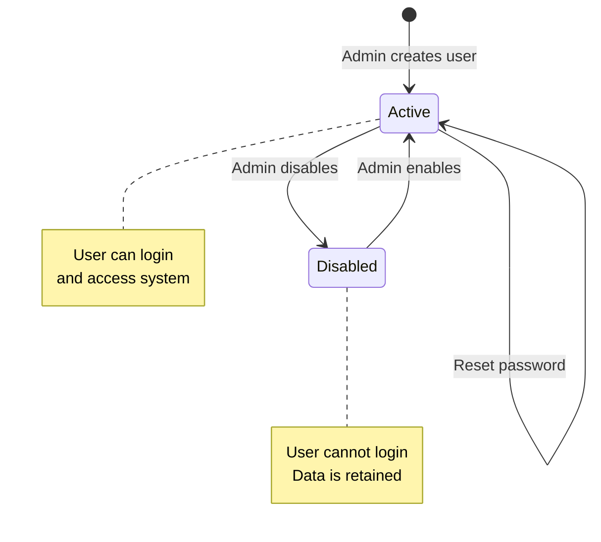
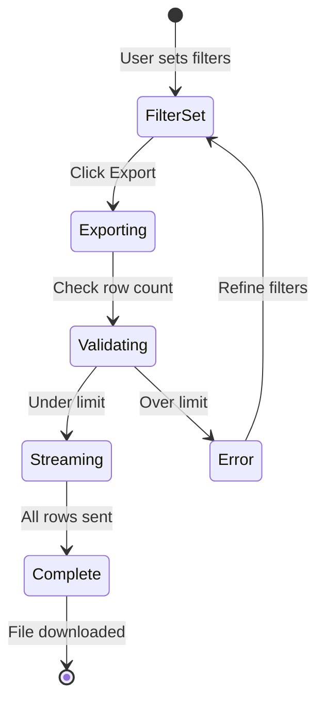

# Workflows - EHS Portal Phase 3: Multi-Organisation & Enterprise Reporting

## 1. Overview

This document defines the detailed workflows for Phase 3 features. Each workflow includes narrative steps, roles involved, and references to BRD and data model documents.

**Phase 3 Workflow Categories:**
- Organisation Administration (settings, branding)
- User Management (CRUD, enable/disable)
- Data Exports (CSV for incidents, inspections, actions)

---

## 2. Organisation Administration Workflows

### 2.1 WF-P3-01: View Organisation Settings

**ID:** WF-P3-01
**Name:** View Organisation Settings
**Roles:** Worker, Manager, Admin
**C-IDs:** C91, C93
**US-ID:** US-P3-01

#### Narrative

Any authenticated user can view their organisation's basic settings (name, timezone). This information is used to display the organisation name in the header and format dates appropriately.

#### Steps

| Step | Actor | Action | System Response |
|------|-------|--------|-----------------|
| 1 | User | Logs in to the system | System validates credentials, returns JWT with organisationId |
| 2 | Frontend | Loads OrgContext on app mount | Fetches GET /api/organisations/{orgId} |
| 3 | Backend | Receives request | Validates JWT, extracts orgId |
| 4 | OrganisationService | getById(orgId) | Queries organisations table |
| 5 | Backend | Returns organisation | 200 OK with org name, timezone, logo_url, settings |
| 6 | Frontend | Stores in OrgContext | Renders org name/logo in header |

#### Preconditions
- User is authenticated
- Organisation exists and is active

#### Postconditions
- Organisation data displayed in UI
- Dates formatted according to org timezone

#### References
- [BRD_EHS_PORTAL_PHASE3.md](./BRD_EHS_PORTAL_PHASE3.md) - BR-SET-01, BR-SET-03
- [DATA_MODEL_PHASE3.md](./DATA_MODEL_PHASE3.md) - organisations table

---

### 2.2 WF-P3-02: Edit Organisation Profile

**ID:** WF-P3-02
**Name:** Edit Organisation Profile
**Roles:** Admin only
**C-IDs:** C91, C93, C95
**US-ID:** US-P3-02

#### Narrative

Organisation admins can update the organisation's display name and timezone. Changes take effect immediately and are reflected across all users' sessions on their next API call or page refresh.

#### Steps

| Step | Actor | Action | System Response |
|------|-------|--------|-----------------|
| 1 | Admin | Navigates to Admin > Organisation Settings | Frontend loads current settings from OrgContext |
| 2 | Admin | Views current organisation profile | Displays form with name, timezone fields |
| 3 | Admin | Modifies name and/or timezone | Form captures changes |
| 4 | Admin | Clicks "Save Changes" | Frontend validates input |
| 5 | Frontend | Sends PUT /api/organisations/{orgId} | Request with { name, timezone } |
| 6 | Backend | Validates admin role | Checks req.user.role === 'admin' |
| 7 | Backend | Validates org ownership | Confirms req.user.organisationId === orgId |
| 8 | OrganisationService | update(orgId, data) | Validates timezone format (IANA) |
| 9 | OrganisationService | Updates database | UPDATE organisations SET name=$2, timezone=$3 |
| 10 | AuditLogService | Logs change | INSERT audit_log with old/new values |
| 11 | Backend | Returns updated org | 200 OK with updated organisation |
| 12 | Frontend | Updates OrgContext | Refreshes header display |
| 13 | Admin | Sees success message | "Organisation settings updated" |

#### Preconditions
- User has Admin role
- Organisation exists and is active

#### Postconditions
- Organisation record updated
- Audit log entry created
- UI reflects new settings

#### Validation Rules
- Name: 1-200 characters, required
- Timezone: Valid IANA timezone (e.g., "America/New_York", "Europe/London")

#### References
- [BRD_EHS_PORTAL_PHASE3.md](./BRD_EHS_PORTAL_PHASE3.md) - BR-SET-01, BR-SET-03, BR-SET-05
- [ARCHITECTURE_PHASE3.md](./ARCHITECTURE_PHASE3.md) - OrganisationService

---

### 2.3 WF-P3-03: Upload Organisation Logo

**ID:** WF-P3-03
**Name:** Upload Organisation Logo
**Roles:** Admin only
**C-IDs:** C92, C95
**US-ID:** US-P3-03

#### Narrative

Organisation admins can upload a logo image that appears in the application header. The logo replaces any existing logo and is immediately visible to all users in the organisation.

#### Steps

| Step | Actor | Action | System Response |
|------|-------|--------|-----------------|
| 1 | Admin | Navigates to Admin > Organisation Settings | Displays current logo (or placeholder) |
| 2 | Admin | Clicks "Upload Logo" | File picker dialog opens |
| 3 | Admin | Selects image file | Frontend validates file type and size |
| 4 | | | Allowed: PNG, JPEG, SVG |
| 4 | | | Max size: 2 MB |
| 5 | Admin | Confirms upload | Frontend sends multipart POST |
| 6 | Frontend | POST /api/organisations/{orgId}/logo | multipart/form-data with file |
| 7 | Backend | Validates admin role and org | Checks permissions |
| 8 | OrganisationService | uploadLogo(orgId, file) | Validates file server-side |
| 9 | FileStorageAdapter | Saves file | Path: /uploads/logos/{orgId}/logo.{ext} |
| 10 | OrganisationService | Updates logo_url | UPDATE organisations SET logo_url = $2 |
| 11 | AuditLogService | Logs upload | Event: organisation_logo_updated |
| 12 | Backend | Returns updated org | 200 OK with new logo_url |
| 13 | Frontend | Updates header | Displays new logo immediately |

#### Preconditions
- User has Admin role
- File is valid image (PNG, JPEG, SVG)
- File size <= 2 MB

#### Postconditions
- Logo file stored in file system
- Organisation record updated with logo_url
- Logo visible in header for all org users

#### Error Handling
| Error | Response |
|-------|----------|
| Invalid file type | 400 "Only PNG, JPEG, SVG files allowed" |
| File too large | 400 "Logo must be under 2 MB" |
| Storage failure | 500 "Failed to save logo" |

#### References
- [BRD_EHS_PORTAL_PHASE3.md](./BRD_EHS_PORTAL_PHASE3.md) - BR-SET-02
- [ARCHITECTURE_PHASE3.md](./ARCHITECTURE_PHASE3.md) - File Storage section

---

### 2.4 WF-P3-04: Configure Dashboard Thresholds

**ID:** WF-P3-04
**Name:** Configure Dashboard Thresholds
**Roles:** Admin only
**C-IDs:** C94, C95
**US-ID:** US-P3-04

#### Narrative

Organisation admins can configure warning and critical thresholds for dashboard KPIs. When KPI values exceed these thresholds, the dashboard displays appropriate color coding (yellow for warning, red for critical).

#### Steps

| Step | Actor | Action | System Response |
|------|-------|--------|-----------------|
| 1 | Admin | Navigates to Admin > Organisation Settings | Loads settings form |
| 2 | Admin | Expands "Dashboard Thresholds" section | Shows current threshold values |
| 3 | Admin | Configures thresholds: | |
| | | - Open Incidents Warning (default: 5) | |
| | | - Open Incidents Critical (default: 10) | |
| | | - Overdue Actions Warning (default: 3) | |
| | | - Overdue Actions Critical (default: 5) | |
| 4 | Admin | Clicks "Save Settings" | Frontend validates values |
| 5 | Frontend | PUT /api/organisations/{orgId} | { settings: { dashboard: {...} } } |
| 6 | OrganisationService | updateSettings(orgId, settings) | Merges with existing settings |
| 7 | Backend | Updates database | UPDATE organisations SET settings = $2 |
| 8 | Backend | Returns updated org | 200 OK |
| 9 | Frontend | Refreshes dashboard | KPI cards show updated coloring |

#### Preconditions
- User has Admin role
- Threshold values are positive integers

#### Postconditions
- Settings JSONB updated in organisations table
- Dashboard reflects new thresholds

#### Settings Schema
```json
{
  "dashboard": {
    "openIncidentsWarning": 5,
    "openIncidentsCritical": 10,
    "overdueActionsWarning": 3,
    "overdueActionsCritical": 5,
    "failedInspectionsWarning": 2,
    "failedInspectionsCritical": 5
  }
}
```

#### References
- [BRD_EHS_PORTAL_PHASE3.md](./BRD_EHS_PORTAL_PHASE3.md) - BR-SET-04
- [DATA_MODEL_PHASE3.md](./DATA_MODEL_PHASE3.md) - organisations.settings

---

## 3. User Management Workflows

### 3.1 WF-P3-05: View Organisation Users

**ID:** WF-P3-05
**Name:** View Organisation Users
**Roles:** Admin only
**C-IDs:** C77
**US-ID:** US-P3-05

#### Narrative

Organisation admins can view a list of all users in their organisation, including their name, email, role, and active status.

#### Steps

| Step | Actor | Action | System Response |
|------|-------|--------|-----------------|
| 1 | Admin | Navigates to Admin > Users | Frontend checks admin role |
| 2 | Frontend | GET /api/organisations/{orgId}/users | Request with auth token |
| 3 | Backend | Validates admin role | Checks req.user.role === 'admin' |
| 4 | UserAdminService | listByOrganisation(orgId) | Queries users table |
| 5 | Backend | Returns user list | 200 OK with array of users |
| 6 | Frontend | Renders user table | Columns: Name, Email, Role, Status, Actions |
| 7 | Admin | Views user list | Can sort/filter by role, status |

#### User List Response
```json
{
  "users": [
    {
      "id": "uuid",
      "name": "John Doe",
      "email": "john@example.com",
      "role": "manager",
      "isActive": true,
      "createdAt": "2025-01-01T00:00:00Z",
      "updatedAt": "2025-01-15T00:00:00Z"
    }
  ]
}
```

#### References
- [BRD_EHS_PORTAL_PHASE3.md](./BRD_EHS_PORTAL_PHASE3.md) - BR-USR-01

---

### 3.2 WF-P3-06: Create New User

**ID:** WF-P3-06
**Name:** Create New User
**Roles:** Admin only
**C-IDs:** C78, C81, C82
**US-ID:** US-P3-06

#### Narrative

Organisation admins can create new user accounts within their organisation. Users are created with a specified role and initial password. There is no self-registration; all accounts are admin-created.

#### Steps

| Step | Actor | Action | System Response |
|------|-------|--------|-----------------|
| 1 | Admin | Clicks "Add User" button | Modal form opens |
| 2 | Admin | Fills form: | |
| | | - Name (required) | |
| | | - Email (required) | |
| | | - Role (Worker/Manager/Admin) | |
| | | - Initial Password (required) | |
| 3 | Admin | Clicks "Create User" | Frontend validates form |
| 4 | Frontend | POST /api/organisations/{orgId}/users | Request with user data |
| 5 | Backend | Validates admin role | Checks permissions |
| 6 | UserAdminService | create(orgId, userData) | Begins user creation |
| 7 | UserAdminService | Checks email uniqueness | SELECT * FROM users WHERE org_id=$1 AND email=$2 |
| 8 | | If email exists | Return 409 "Email already in use" |
| 9 | AuthService | hashPassword(password) | bcrypt with cost factor 10 |
| 10 | UserAdminService | Inserts user | INSERT INTO users (organisation_id, name, email, password_hash, role, is_active) |
| 11 | AuditLogService | Logs creation | Event: user_created |
| 12 | Backend | Returns new user | 201 Created with user (no password) |
| 13 | Frontend | Closes modal, refreshes list | Shows success message |
| 14 | Admin | Communicates credentials | Sends email/password to new user (out of band) |

#### Validation Rules
- Name: 1-200 characters, required
- Email: Valid email format, unique within organisation
- Password: Minimum 8 characters (additional rules optional)
- Role: Must be 'worker', 'manager', or 'admin'

#### Error Handling
| Error | Response |
|-------|----------|
| Email already exists | 409 "A user with this email already exists in your organisation" |
| Invalid role | 400 "Role must be worker, manager, or admin" |
| Weak password | 400 "Password must be at least 8 characters" |

#### References
- [BRD_EHS_PORTAL_PHASE3.md](./BRD_EHS_PORTAL_PHASE3.md) - BR-USR-02, BR-USR-05, BR-USR-06
- [ARCHITECTURE_PHASE3.md](./ARCHITECTURE_PHASE3.md) - UserAdminService

---

### 3.3 WF-P3-07: Update User Details

**ID:** WF-P3-07
**Name:** Update User Details
**Roles:** Admin only
**C-IDs:** C79, C81
**US-ID:** US-P3-07

#### Narrative

Organisation admins can update a user's name, email, or role. Email changes must maintain uniqueness within the organisation. Role changes take effect on the user's next login.

#### Steps

| Step | Actor | Action | System Response |
|------|-------|--------|-----------------|
| 1 | Admin | Clicks "Edit" on user row | Modal opens with current values |
| 2 | Admin | Modifies fields (name, email, role) | Form captures changes |
| 3 | Admin | Clicks "Save Changes" | Frontend validates |
| 4 | Frontend | PUT /api/organisations/{orgId}/users/{userId} | Request with updated data |
| 5 | Backend | Validates admin role | Checks permissions |
| 6 | Backend | Validates org ownership | Confirms user belongs to admin's org |
| 7 | UserAdminService | update(orgId, userId, data) | Begins update |
| 8 | | If email changed | Checks uniqueness in org |
| 9 | | If admin changing own role | Blocks with 400 "Cannot change your own role" |
| 10 | UserAdminService | Updates database | UPDATE users SET name=$3, email=$4, role=$5 |
| 11 | AuditLogService | Logs change | Event: user_updated with changes |
| 12 | Backend | Returns updated user | 200 OK |
| 13 | Frontend | Closes modal, refreshes list | Shows success message |

#### Business Rules
- Admin cannot change their own role (prevents lockout)
- Email must remain unique within organisation
- Role change takes effect on user's next login

#### References
- [BRD_EHS_PORTAL_PHASE3.md](./BRD_EHS_PORTAL_PHASE3.md) - BR-USR-03, BR-USR-05

---

### 3.4 WF-P3-08: Disable/Enable User Account

**ID:** WF-P3-08
**Name:** Disable/Enable User Account
**Roles:** Admin only
**C-IDs:** C80
**US-ID:** US-P3-08

#### Narrative

Organisation admins can disable user accounts to block login without deleting the user or their historical data. Disabled users cannot authenticate. Admins can re-enable accounts at any time.

#### Steps

| Step | Actor | Action | System Response |
|------|-------|--------|-----------------|
| 1 | Admin | Clicks "Disable" on active user | Confirmation dialog appears |
| 2 | Admin | Confirms action | Frontend sends request |
| 3 | Frontend | PUT /api/organisations/{orgId}/users/{userId} | { isActive: false } |
| 4 | Backend | Validates admin role | Checks permissions |
| 5 | Backend | Checks not last admin | Counts active admins in org |
| 6 | | If last admin | Return 400 "Cannot disable the only admin" |
| 7 | UserAdminService | setActive(orgId, userId, false) | Updates is_active flag |
| 8 | AuditLogService | Logs action | Event: user_disabled |
| 9 | Backend | Returns updated user | 200 OK with isActive: false |
| 10 | Frontend | Updates user status in list | Shows "Disabled" badge |

#### Re-enable Steps

| Step | Actor | Action | System Response |
|------|-------|--------|-----------------|
| 1 | Admin | Clicks "Enable" on disabled user | No confirmation needed |
| 2 | Frontend | PUT /api/organisations/{orgId}/users/{userId} | { isActive: true } |
| 3 | UserAdminService | setActive(orgId, userId, true) | Updates is_active flag |
| 4 | AuditLogService | Logs action | Event: user_enabled |
| 5 | Backend | Returns updated user | 200 OK with isActive: true |
| 6 | Frontend | Updates status | User can now login |

#### Business Rules
- Cannot disable the last active admin in an organisation
- Disabling blocks login immediately (existing sessions may continue until token expires)
- User's historical data (incidents, inspections, etc.) is retained
- Admin cannot disable themselves

#### References
- [BRD_EHS_PORTAL_PHASE3.md](./BRD_EHS_PORTAL_PHASE3.md) - BR-USR-04
- [DATA_MODEL_PHASE3.md](./DATA_MODEL_PHASE3.md) - users.is_active

---

### 3.5 WF-P3-09: Reset User Password

**ID:** WF-P3-09
**Name:** Reset User Password
**Roles:** Admin only
**C-IDs:** C83
**US-ID:** US-P3-09

#### Narrative

Organisation admins can reset a user's password when they forget it or need a credential refresh. The new password is set directly (no email link in Phase 3).

#### Steps

| Step | Actor | Action | System Response |
|------|-------|--------|-----------------|
| 1 | Admin | Clicks "Reset Password" on user | Modal opens |
| 2 | Admin | Enters new password | Form captures input |
| 3 | Admin | Confirms password | Must match |
| 4 | Admin | Clicks "Reset" | Frontend validates |
| 5 | Frontend | POST /api/organisations/{orgId}/users/{userId}/reset-password | { newPassword } |
| 6 | Backend | Validates admin role | Checks permissions |
| 7 | UserAdminService | resetPassword(orgId, userId, newPassword) | Validates password strength |
| 8 | AuthService | hashPassword(newPassword) | bcrypt hash |
| 9 | UserAdminService | Updates password | UPDATE users SET password_hash = $3 |
| 10 | AuditLogService | Logs reset | Event: password_reset (no password in log) |
| 11 | Backend | Returns success | 200 OK |
| 12 | Frontend | Shows confirmation | "Password reset successfully" |
| 13 | Admin | Communicates new password | Sends to user (out of band) |

#### Business Rules
- Password must meet minimum requirements (8+ characters)
- Existing sessions are not invalidated (consider for future)
- Password is never logged

#### References
- [BRD_EHS_PORTAL_PHASE3.md](./BRD_EHS_PORTAL_PHASE3.md) - BR-USR-07

---

## 4. Export Workflows

### 4.1 WF-P3-10: Export Incidents to CSV

**ID:** WF-P3-10
**Name:** Export Incidents to CSV
**Roles:** Manager, Admin
**C-IDs:** C84, C87, C88, C89, C90
**US-ID:** US-P3-10

#### Narrative

Managers and admins can export incident data to CSV format for reporting, compliance, or analysis. Exports are filtered by date range, site, status, and severity, and are automatically scoped to the user's organisation.

#### Steps

| Step | Actor | Action | System Response |
|------|-------|--------|-----------------|
| 1 | Manager | Navigates to Incidents page | Incident list loads |
| 2 | Manager | Sets filters (optional): | |
| | | - Date range (start/end) | |
| | | - Site | |
| | | - Status (open/under_investigation/closed) | |
| | | - Severity (low/medium/high/critical) | |
| 3 | Manager | Clicks "Export to CSV" | Export dialog may show |
| 4 | Frontend | Constructs query params | startDate, endDate, siteId, status, severity |
| 5 | Frontend | GET /api/exports/incidents?format=csv&... | Request with filters |
| 6 | Backend | Validates role | Manager or Admin required |
| 7 | Backend | Injects organisation_id | From JWT token |
| 8 | ExportService | exportIncidents(orgId, filters, res) | Begins export |
| 9 | ExportService | Validates row limit | Count query, max 10,000 |
| 10 | | If over limit | Return 400 "Too many records, refine filters" |
| 11 | ExportService | Sets response headers | Content-Type: text/csv |
| 12 | | | Content-Disposition: attachment; filename="..." |
| 13 | ExportService | Streams CSV | Query with cursor, pipe to response |
| 14 | Browser | Downloads file | incidents_{org-slug}_{date}.csv |

#### CSV Columns
```
ID,Title,Description,Type,Site,Site Code,Severity,Status,Occurred At,Reported By,Reporter Email,Created At,Updated At
```

#### Filename Format
```
incidents_{org-slug}_{YYYY-MM-DD}.csv
```
Example: `incidents_acme-corp_2025-01-25.csv`

#### Filter Parameters
| Parameter | Type | Description |
|-----------|------|-------------|
| startDate | ISO 8601 | Filter by occurred_at >= |
| endDate | ISO 8601 | Filter by occurred_at <= |
| siteId | UUID | Filter by site |
| status | string | Filter by status |
| severity | string | Filter by severity |

#### References
- [BRD_EHS_PORTAL_PHASE3.md](./BRD_EHS_PORTAL_PHASE3.md) - BR-EXP-01, BR-EXP-04, BR-EXP-05

---

### 4.2 WF-P3-11: Export Inspections to CSV

**ID:** WF-P3-11
**Name:** Export Inspections to CSV
**Roles:** Manager, Admin
**C-IDs:** C85, C87, C88, C89, C90
**US-ID:** US-P3-11

#### Narrative

Managers and admins can export inspection data to CSV format. Exports include inspection metadata and overall result, filtered by date range, site, and result status.

#### Steps

| Step | Actor | Action | System Response |
|------|-------|--------|-----------------|
| 1 | Manager | Navigates to Inspections page | Inspection list loads |
| 2 | Manager | Sets filters (optional): | |
| | | - Date range (performed_at) | |
| | | - Site | |
| | | - Result (pass/fail) | |
| 3 | Manager | Clicks "Export to CSV" | |
| 4 | Frontend | GET /api/exports/inspections?format=csv&... | |
| 5 | Backend | Validates role, injects org_id | |
| 6 | ExportService | exportInspections(orgId, filters, res) | |
| 7 | ExportService | Validates row limit | Max 10,000 |
| 8 | ExportService | Streams CSV | |
| 9 | Browser | Downloads file | inspections_{org-slug}_{date}.csv |

#### CSV Columns
```
ID,Template Name,Site,Site Code,Performed At,Performed By,Performer Email,Overall Result,Notes,Created At
```

#### References
- [BRD_EHS_PORTAL_PHASE3.md](./BRD_EHS_PORTAL_PHASE3.md) - BR-EXP-02

---

### 4.3 WF-P3-12: Export Actions to CSV

**ID:** WF-P3-12
**Name:** Export Actions to CSV
**Roles:** Manager, Admin
**C-IDs:** C86, C87, C88, C89, C90
**US-ID:** US-P3-12

#### Narrative

Managers and admins can export action/CAPA data to CSV format for tracking corrective measures. Exports are filtered by date range, status, and due date.

#### Steps

| Step | Actor | Action | System Response |
|------|-------|--------|-----------------|
| 1 | Manager | Navigates to Actions page | Action list loads |
| 2 | Manager | Sets filters (optional): | |
| | | - Date range (created_at) | |
| | | - Status (open/in_progress/done/overdue) | |
| | | - Due date (before) | |
| 3 | Manager | Clicks "Export to CSV" | |
| 4 | Frontend | GET /api/exports/actions?format=csv&... | |
| 5 | Backend | Validates role, injects org_id | |
| 6 | ExportService | exportActions(orgId, filters, res) | |
| 7 | ExportService | Validates row limit | Max 10,000 |
| 8 | ExportService | Streams CSV | |
| 9 | Browser | Downloads file | actions_{org-slug}_{date}.csv |

#### CSV Columns
```
ID,Title,Description,Source Type,Source Name,Assigned To,Assignee Email,Created By,Due Date,Status,Completed At,Created At,Updated At
```

#### References
- [BRD_EHS_PORTAL_PHASE3.md](./BRD_EHS_PORTAL_PHASE3.md) - BR-EXP-03

---

## 5. Workflow Summary

| ID | Name | Roles | C-IDs |
|----|------|-------|-------|
| WF-P3-01 | View Organisation Settings | All | C91, C93 |
| WF-P3-02 | Edit Organisation Profile | Admin | C91, C93, C95 |
| WF-P3-03 | Upload Organisation Logo | Admin | C92, C95 |
| WF-P3-04 | Configure Dashboard Thresholds | Admin | C94, C95 |
| WF-P3-05 | View Organisation Users | Admin | C77 |
| WF-P3-06 | Create New User | Admin | C78, C81, C82 |
| WF-P3-07 | Update User Details | Admin | C79, C81 |
| WF-P3-08 | Disable/Enable User Account | Admin | C80 |
| WF-P3-09 | Reset User Password | Admin | C83 |
| WF-P3-10 | Export Incidents to CSV | Manager, Admin | C84, C87-C90 |
| WF-P3-11 | Export Inspections to CSV | Manager, Admin | C85, C87-C90 |
| WF-P3-12 | Export Actions to CSV | Manager, Admin | C86, C87-C90 |

---

## 6. State Diagrams

### 6.1 User Account States



### 6.2 Export Flow



---

## 7. Related Documents

- [BRD_EHS_PORTAL_PHASE3.md](./BRD_EHS_PORTAL_PHASE3.md) - Phase 3 business requirements
- [DATA_MODEL_PHASE3.md](./DATA_MODEL_PHASE3.md) - Phase 3 data model
- [ARCHITECTURE_PHASE3.md](./ARCHITECTURE_PHASE3.md) - Phase 3 architecture
- [API_SPEC_PHASE3.md](./API_SPEC_PHASE3.md) - Phase 3 API specification (to be created)

---

*End of Document*
