# Workflows – EHS Portal Phase 9
## Risk Register & Enterprise Risk Management

| Item | Detail |
|------|--------|
| Document Version | 1.0 |
| Author | Solution Architect |
| Date | 2026-02-05 |
| Status | Draft |
| Phase | 9 – Risk Register & Enterprise Risk Management |

---

## 1. Risk Lifecycle Workflow

```mermaid
stateDiagram-v2
    [*] --> Draft: Create Risk
    Draft --> Open: Submit for Assessment
    Draft --> Draft: Edit
    
    Open --> Open: Update Scoring
    Open --> Under_Review: Initiate Review
    Open --> Treating: Assign Controls
    Open --> Closed: Close (Low Risk)
    
    Treating --> Treating: Add Controls
    Treating --> Under_Review: Submit for Review
    Treating --> Open: Controls Complete
    
    Under_Review --> Open: Review Accepted
    Under_Review --> Treating: Improvements Needed
    Under_Review --> Closed: Close Risk
    
    Closed --> Open: Reopen
    Closed --> [*]
```



---

## 2. Risk Creation Workflow

```
┌───────────────────────────────────────────────────────────────────────────┐
│                         RISK CREATION WORKFLOW                             │
└───────────────────────────────────────────────────────────────────────────┘

User (Manager/Admin)                  System                      Notifications
       │                                │                              │
       │  1. Click "Add Risk"           │                              │
       ├───────────────────────────────►│                              │
       │                                │                              │
       │  2. Display form with:         │                              │
       │     - Title, Description       │                              │
       │     - Category dropdown        │                              │
       │     - Source dropdown          │                              │
       │     - Site(s) selection        │                              │
       │     - Owner selection          │                              │
       │◄───────────────────────────────┤                              │
       │                                │                              │
       │  3. Complete hazard section:   │                              │
       │     - Hazard description       │                              │
       │     - Potential causes         │                              │
       │     - Potential consequences   │                              │
       ├───────────────────────────────►│                              │
       │                                │                              │
       │  4. Complete inherent scoring: │                              │
       │     - Likelihood (1-5)         │                              │
       │     - Impact (1-5)             │                              │
       ├───────────────────────────────►│                              │
       │                                │  5. Calculate inherent       │
       │                                │     score & level            │
       │                                ├─────────────────────────────►│
       │                                │                              │
       │  6. Display score with         │                              │
       │     colour-coded level         │                              │
       │◄───────────────────────────────┤                              │
       │                                │                              │
       │  7. Set review frequency       │                              │
       │     (Monthly/Quarterly/etc.)   │                              │
       ├───────────────────────────────►│                              │
       │                                │  8. Calculate next           │
       │                                │     review date              │
       │                                ├─────────────────────────────►│
       │                                │                              │
       │  9. Submit (Save as Draft      │                              │
       │     or Open)                   │                              │
       ├───────────────────────────────►│                              │
       │                                │ 10. Generate risk reference  │
       │                                │     (RISK-2026-0001)         │
       │                                ├─────────────────────────────►│
       │                                │                              │
       │                                │ 11. Create risk record       │
       │                                ├─────────────────────────────►│
       │                                │                              │
       │                                │ 12. Create audit log entry   │
       │                                ├─────────────────────────────►│
       │                                │                              │
       │                                │ 13. If Extreme/High:         │
       │                                │     Queue notification       │
       │                                ├─────────────────────────────►│ Notify admins
       │                                │                              │
       │ 14. Success - redirect to      │                              │
       │     risk detail page           │                              │
       │◄───────────────────────────────┤                              │
       │                                │                              │
```

---

## 3. Risk Scoring Workflow

```
┌───────────────────────────────────────────────────────────────────────────┐
│                         RISK SCORING WORKFLOW                              │
└───────────────────────────────────────────────────────────────────────────┘

                    ┌──────────────────────────────────────────┐
                    │         INHERENT RISK SCORING            │
                    │    (Before controls are applied)         │
                    └──────────────────────────────────────────┘
                                       │
        ┌──────────────────────────────┼──────────────────────────────┐
        │                              │                              │
        ▼                              ▼                              ▼
┌───────────────┐            ┌───────────────┐             ┌──────────────┐
│  LIKELIHOOD   │            │    IMPACT     │             │   SCORING    │
│   (1-5)       │      ×     │    (1-5)      │      =      │   MATRIX     │
└───────────────┘            └───────────────┘             └──────────────┘
        │                              │                              │
        ▼                              ▼                              ▼
┌───────────────┐            ┌───────────────┐             ┌──────────────┐
│ 1 = Rare      │            │ 1 = Negligible│             │  1-4: LOW    │
│ 2 = Unlikely  │            │ 2 = Minor     │             │  5-9: MEDIUM │
│ 3 = Possible  │            │ 3 = Moderate  │             │ 10-16: HIGH  │
│ 4 = Likely    │            │ 4 = Major     │             │ 17-25:EXTREME│
│ 5 = Almost    │            │ 5 = Catastrophic            └──────────────┘
│     Certain   │            └───────────────┘
└───────────────┘
                                       │
                                       ▼
                    ┌──────────────────────────────────────────┐
                    │         ADD CONTROLS                      │
                    │   - Administrative                        │
                    │   - Engineering                           │
                    │   - PPE                                   │
                    │   - Substitution                          │
                    │   - Elimination                           │
                    └──────────────────────────────────────────┘
                                       │
                                       ▼
                    ┌──────────────────────────────────────────┐
                    │         RESIDUAL RISK SCORING            │
                    │    (After controls are applied)          │
                    └──────────────────────────────────────────┘
                                       │
        ┌──────────────────────────────┼──────────────────────────────┐
        │                              │                              │
        ▼                              ▼                              ▼
┌───────────────┐            ┌───────────────┐             ┌──────────────┐
│  RESIDUAL     │            │   RESIDUAL    │             │   RESIDUAL   │
│  LIKELIHOOD   │      ×     │    IMPACT     │      =      │    SCORE     │
└───────────────┘            └───────────────┘             └──────────────┘
                                       │
                                       ▼
                    ┌──────────────────────────────────────────┐
                    │         TOLERANCE CHECK                   │
                    │   Compare residual level vs org tolerance│
                    └──────────────────────────────────────────┘
                                       │
              ┌────────────────────────┼─────────────────────────┐
              │                        │                         │
              ▼                        ▼                         ▼
       ┌────────────┐          ┌────────────┐           ┌────────────┐
       │  WITHIN    │          │ APPROACHING │           │  EXCEEDS   │
       │ TOLERANCE  │          │  TOLERANCE  │           │ TOLERANCE  │
       │   (OK)     │          │  (WARNING)  │           │  (ACTION)  │
       └────────────┘          └────────────┘           └────────────┘
```

---

## 4. Risk Control Management Workflow

```
┌───────────────────────────────────────────────────────────────────────────┐
│                    CONTROL MANAGEMENT WORKFLOW                             │
└───────────────────────────────────────────────────────────────────────────┘

User                          System                        Linked Entity
  │                             │                               │
  │  1. View risk detail        │                               │
  │     Controls tab            │                               │
  ├────────────────────────────►│                               │
  │                             │                               │
  │  2. Display existing        │                               │
  │     controls (if any)       │                               │
  │◄────────────────────────────┤                               │
  │                             │                               │
  │  3. Click "Add Control"     │                               │
  ├────────────────────────────►│                               │
  │                             │                               │
  │  4. Display control form:   │                               │
  │     - Description           │                               │
  │     - Type (preventive/     │                               │
  │       detective/corrective) │                               │
  │     - Hierarchy level       │                               │
  │     - Owner                 │                               │
  │     - Verification freq.    │                               │
  │◄────────────────────────────┤                               │
  │                             │                               │
  │  5. Complete form &         │                               │
  │     set effectiveness       │                               │
  │     (effective/partial/     │                               │
  │      ineffective/untested)  │                               │
  ├────────────────────────────►│                               │
  │                             │                               │
  │  6. Optionally link to:     │                               │
  │     - Existing action       │                               │
  │     - Training course       │                               │
  │     - Permit                 │                               │
  ├────────────────────────────►│                               │
  │                             │  7. Validate entity exists    │
  │                             ├──────────────────────────────►│
  │                             │                               │
  │                             │  8. Confirm entity valid      │
  │                             │◄──────────────────────────────┤
  │                             │                               │
  │                             │  9. Create control record     │
  │                             │     with link                 │
  │                             ├─────────────────────────────► │
  │                             │                               │
  │ 10. Control saved           │                               │
  │     Show updated list       │                               │
  │◄────────────────────────────┤                               │
  │                             │                               │
  │ 11. Update residual score   │                               │
  │     (manual re-assessment)  │                               │
  ├────────────────────────────►│                               │
  │                             │ 12. Recalculate residual      │
  │                             │     level                     │
  │                             ├─────────────────────────────► │
  │ 13. Show new residual       │                               │
  │     score badge             │                               │
  │◄────────────────────────────┤                               │
```

---

## 5. Risk Review Workflow

```
┌───────────────────────────────────────────────────────────────────────────┐
│                         RISK REVIEW WORKFLOW                               │
└───────────────────────────────────────────────────────────────────────────┘

Scheduler                  Owner                    System              Mgmt
    │                        │                        │                  │
    │  1. Review due         │                        │                  │
    │     reminder           │                        │                  │
    ├───────────────────────►│                        │                  │
    │                        │                        │                  │
    │                        │  2. Open risk          │                  │
    │                        │     detail page        │                  │
    │                        ├───────────────────────►│                  │
    │                        │                        │                  │
    │                        │  3. Click "Record      │                  │
    │                        │     Review"            │                  │
    │                        ├───────────────────────►│                  │
    │                        │                        │                  │
    │                        │  4. Show review form:  │                  │
    │                        │     - Previous scores  │                  │
    │                        │     - Current status   │                  │
    │                        │     - Controls summary │                  │
    │                        │◄───────────────────────┤                  │
    │                        │                        │                  │
    │                        │  5. Review controls:   │                  │
    │                        │     - Verify each      │                  │
    │                        │     - Update status    │                  │
    │                        ├───────────────────────►│                  │
    │                        │                        │                  │
    │                        │  6. Re-assess scores:  │                  │
    │                        │     - New likelihood   │                  │
    │                        │     - New impact       │                  │
    │                        ├───────────────────────►│                  │
    │                        │                        │                  │
    │                        │  7. Select outcome:    │                  │
    │                        │     - No change        │                  │
    │                        │     - Improved         │                  │
    │                        │     - Deteriorated     │                  │
    │                        │     - Recommend close  │                  │
    │                        ├───────────────────────►│                  │
    │                        │                        │                  │
    │                        │                        │  8. Snapshot     │
    │                        │                        │     current      │
    │                        │                        │     scores       │
    │                        │                        ├─────────────────►│
    │                        │                        │                  │
    │                        │                        │  9. Update risk  │
    │                        │                        │     with new     │
    │                        │                        │     scores       │
    │                        │                        ├─────────────────►│
    │                        │                        │                  │
    │                        │                        │ 10. Calculate    │
    │                        │                        │     next review  │
    │                        │                        │     date         │
    │                        │                        ├─────────────────►│
    │                        │                        │                  │
    │                        │                        │ 11. If recommend │
    │                        │                        │     close:       │
    │                        │                        │     notify mgmt  │
    │                        │                        ├─────────────────►│
    │                        │                        │                  │
    │                        │ 12. Review recorded    │                  │
    │                        │     confirmation       │                  │
    │                        │◄───────────────────────┤                  │
```

---

## 6. Risk Linking Workflow

```
┌───────────────────────────────────────────────────────────────────────────┐
│                         RISK LINKING WORKFLOW                              │
└───────────────────────────────────────────────────────────────────────────┘

                         ┌─────────────────┐
                         │      RISK       │
                         │   RISK-2026-001 │
                         └────────┬────────┘
                                  │
        ┌─────────────────────────┼─────────────────────────┐
        │         │               │              │          │
        ▼         ▼               ▼              ▼          ▼
   ┌─────────┐ ┌─────────┐ ┌─────────┐ ┌─────────┐ ┌─────────┐
   │INCIDENT │ │ ACTION  │ │INSPECTION│ │TRAINING │ │CHEMICAL │
   │         │ │         │ │         │ │         │ │         │
   │INC-001  │ │ACT-045  │ │INSP-078 │ │TC-012   │ │CHEM-034 │
   │INC-002  │ │ACT-046  │ │         │ │TC-015   │ │         │
   └─────────┘ └─────────┘ └─────────┘ └─────────┘ └─────────┘

LINK CREATION FLOW:
═══════════════════

User                          System                    Target Module
  │                             │                            │
  │  1. Risk detail page        │                            │
  │     Links tab               │                            │
  ├────────────────────────────►│                            │
  │                             │                            │
  │  2. Show current links      │                            │
  │     grouped by type         │                            │
  │◄────────────────────────────┤                            │
  │                             │                            │
  │  3. Click "Link Entity"     │                            │
  ├────────────────────────────►│                            │
  │                             │                            │
  │  4. Select entity type:     │                            │
  │     - Incident              │                            │
  │     - Action                │                            │
  │     - Inspection            │                            │
  │     - Training Course       │                            │
  │     - Chemical              │                            │
  │     - Permit                │                            │
  ├────────────────────────────►│                            │
  │                             │                            │
  │  5. Search/browse entities  │                            │
  │     of selected type        │                            │
  ├────────────────────────────►│                            │
  │                             │  6. Query entities         │
  │                             ├───────────────────────────►│
  │                             │                            │
  │                             │  7. Return list            │
  │                             │◄───────────────────────────┤
  │                             │                            │
  │  8. Display searchable      │                            │
  │     list                    │                            │
  │◄────────────────────────────┤                            │
  │                             │                            │
  │  9. Select entity(ies)      │                            │
  │     Add link reason         │                            │
  ├────────────────────────────►│                            │
  │                             │                            │
  │                             │ 10. Validate each entity   │
  │                             ├───────────────────────────►│
  │                             │                            │
  │                             │ 11. Create link records    │
  │                             ├───────────────────────────►│
  │                             │                            │
  │ 12. Links created           │                            │
  │     Show updated list       │                            │
  │◄────────────────────────────┤                            │
```

---

## 7. Risk Heatmap Generation Workflow

```
┌───────────────────────────────────────────────────────────────────────────┐
│                       HEATMAP GENERATION WORKFLOW                          │
└───────────────────────────────────────────────────────────────────────────┘

User                          System                        Database
  │                             │                              │
  │  1. Navigate to Risk        │                              │
  │     Heatmap page            │                              │
  ├────────────────────────────►│                              │
  │                             │                              │
  │                             │  2. Query risks with         │
  │                             │     residual scores          │
  │                             ├─────────────────────────────►│
  │                             │                              │
  │                             │  3. Return risks with        │
  │                             │     L × I coordinates        │
  │                             │◄─────────────────────────────┤
  │                             │                              │
  │                             │  4. Aggregate into 5×5       │
  │                             │     matrix cells             │
  │                             ├─────────────────────────────►│
  │                             │                              │
  │  5. Render heatmap:         │                              │
  │                             │                              │
  │     ┌───┬───┬───┬───┬───┐   │                              │
  │  5  │   │   │ H │ E │ E │   │                              │
  │     ├───┼───┼───┼───┼───┤   │  Legend:                     │
  │  4  │   │ M │ H │ H │ E │   │  L = Low (Green)             │
  │     ├───┼───┼───┼───┼───┤   │  M = Medium (Yellow)         │
  │  3  │ L │ M │ M │ H │ H │   │  H = High (Orange)           │
  │     ├───┼───┼───┼───┼───┤   │  E = Extreme (Red)           │
  │  2  │ L │ L │ M │ M │ H │   │                              │
  │     ├───┼───┼───┼───┼───┤   │                              │
  │  1  │ L │ L │ L │ M │ M │   │                              │
  │     └───┴───┴───┴───┴───┘   │                              │
  │       1   2   3   4   5     │                              │
  │          IMPACT             │                              │
  │◄────────────────────────────┤                              │
  │                             │                              │
  │  6. Click cell to drill     │                              │
  │     down to risk list       │                              │
  ├────────────────────────────►│                              │
  │                             │                              │
  │                             │  7. Filter risks by          │
  │                             │     selected L × I           │
  │                             ├─────────────────────────────►│
  │                             │                              │
  │  8. Show filtered risk      │                              │
  │     list in modal/panel     │                              │
  │◄────────────────────────────┤                              │
```

---

## 8. Risk Export Workflow

```
┌───────────────────────────────────────────────────────────────────────────┐
│                         RISK EXPORT WORKFLOW                               │
└───────────────────────────────────────────────────────────────────────────┘

User                          System                       Export Service
  │                             │                               │
  │  1. Click "Export" button   │                               │
  │     on Risk Register        │                               │
  ├────────────────────────────►│                               │
  │                             │                               │
  │  2. Show export options:    │                               │
  │     - Format (Excel/PDF)    │                               │
  │     - Current filters       │                               │
  │     - Include controls      │                               │
  │     - Include reviews       │                               │
  │     - Include links         │                               │
  │◄────────────────────────────┤                               │
  │                             │                               │
  │  3. Select options &        │                               │
  │     click Export            │                               │
  ├────────────────────────────►│                               │
  │                             │                               │
  │                             │  4. Query risks with          │
  │                             │     applied filters           │
  │                             ├──────────────────────────────►│
  │                             │                               │
  │                             │  5. Generate document         │
  │                             │     (Excel or PDF)            │
  │                             │◄──────────────────────────────┤
  │                             │                               │
  │  6. Download starts         │                               │
  │     (browser save dialog)   │                               │
  │◄────────────────────────────┤                               │
  │                             │                               │
  │                             │  7. Log export in audit       │
  │                             │     (who, when, filters)      │
  │                             ├──────────────────────────────►│


EXPORT FORMATS:
═══════════════

┌─────────────────────────────────────────────────────────────────────────┐
│                     EXCEL EXPORT (Risk_Register.xlsx)                   │
├─────────────────────────────────────────────────────────────────────────┤
│ Sheet 1: Risks                                                          │
│ ┌────────┬─────────┬──────────┬────────┬────────┬────────┬──────────┐  │
│ │Ref     │Title    │Category  │Status  │Inherent│Residual│Owner     │  │
│ ├────────┼─────────┼──────────┼────────┼────────┼────────┼──────────┤  │
│ │RISK-001│Slip/Fall│Physical  │Open    │16 HIGH │8 MEDIUM│J. Smith  │  │
│ │RISK-002│Chemical │Chemical  │Treating│20 EXTRM│12 HIGH │M. Jones  │  │
│ └────────┴─────────┴──────────┴────────┴────────┴────────┴──────────┘  │
│                                                                         │
│ Sheet 2: Controls                                                       │
│ ┌────────┬────────────────────┬───────────┬──────────────┬───────────┐ │
│ │Risk Ref│Control Description │Type       │Effectiveness │Verified   │ │
│ ├────────┼────────────────────┼───────────┼──────────────┼───────────┤ │
│ │RISK-001│Floor mats installed│Engineering│Effective     │2026-01-15 │ │
│ │RISK-001│Warning signs       │Admin      │Partial       │2026-01-10 │ │
│ └────────┴────────────────────┴───────────┴──────────────┴───────────┘ │
│                                                                         │
│ Sheet 3: Heatmap Summary                                                │
│ ┌───────────────────────────────────────────────────────────────────┐  │
│ │ 5×5 matrix with risk counts per cell                              │  │
│ └───────────────────────────────────────────────────────────────────┘  │
└─────────────────────────────────────────────────────────────────────────┘

┌─────────────────────────────────────────────────────────────────────────┐
│                     PDF EXPORT (Risk_Register.pdf)                      │
├─────────────────────────────────────────────────────────────────────────┤
│ Page 1: Cover & Summary                                                 │
│ ┌───────────────────────────────────────────────────────────────────┐  │
│ │  RISK REGISTER REPORT                                             │  │
│ │  Organisation: Acme Corp                                          │  │
│ │  Generated: 2026-02-05                                            │  │
│ │                                                                   │  │
│ │  Summary:                                                         │  │
│ │  - Total Risks: 45                                                │  │
│ │  - Extreme: 3  High: 12  Medium: 18  Low: 12                      │  │
│ │  - Overdue Reviews: 4                                             │  │
│ └───────────────────────────────────────────────────────────────────┘  │
│                                                                         │
│ Page 2+: Risk Details                                                   │
│ ┌───────────────────────────────────────────────────────────────────┐  │
│ │ RISK-001: Slip and Fall Hazard                                    │  │
│ │ Category: Physical | Status: Open | Owner: J. Smith               │  │
│ │ ─────────────────────────────────────────────────────────         │  │
│ │ Description: ...                                                  │  │
│ │ Inherent: 16 (HIGH) | Residual: 8 (MEDIUM)                        │  │
│ │ Controls: 2 | Last Review: 2026-01-15 | Next: 2026-04-15          │  │
│ └───────────────────────────────────────────────────────────────────┘  │
└─────────────────────────────────────────────────────────────────────────┘
```

---

## 9. Review Reminder Notification Workflow

```
┌───────────────────────────────────────────────────────────────────────────┐
│                    REVIEW REMINDER WORKFLOW (Background)                   │
└───────────────────────────────────────────────────────────────────────────┘

Scheduler (Daily 08:00)       RiskReviewService        NotificationService
         │                          │                          │
         │  1. Trigger review       │                          │
         │     reminder job         │                          │
         ├─────────────────────────►│                          │
         │                          │                          │
         │                          │  2. Query risks with     │
         │                          │     next_review_date     │
         │                          │     in 7, 3, 1 days      │
         │                          ├─────────────────────────►│
         │                          │                          │
         │                          │  3. For each risk:       │
         │                          │     Queue reminder       │
         │                          ├─────────────────────────►│
         │                          │                          │
         │                          │                          │ 4. Send email
         │                          │                          │    to owner
         │                          │                          ├────────────►
         │                          │                          │
         │                          │                          │ 5. Create in-app
         │                          │                          │    notification
         │                          │                          ├────────────►
         │                          │                          │
         │                          │  6. Query overdue        │
         │                          │     reviews              │
         │                          ├─────────────────────────►│
         │                          │                          │
         │                          │  7. For each overdue:    │
         │                          │     - Notify owner       │
         │                          │     - Escalate to mgr    │
         │                          ├─────────────────────────►│
         │                          │                          │
         │  8. Job complete         │                          │
         │◄─────────────────────────┤                          │
```

---

## 10. Tolerance Breach Escalation Workflow

```
┌───────────────────────────────────────────────────────────────────────────┐
│                    TOLERANCE BREACH ESCALATION                             │
└───────────────────────────────────────────────────────────────────────────┘

Risk Update                  RiskService              NotificationService
     │                          │                            │
     │  1. Risk score updated   │                            │
     │     (inherent or         │                            │
     │      residual)           │                            │
     ├─────────────────────────►│                            │
     │                          │                            │
     │                          │  2. Calculate new level    │
     │                          ├───────────────────────────►│
     │                          │                            │
     │                          │  3. Get org tolerance      │
     │                          │     settings               │
     │                          ├───────────────────────────►│
     │                          │                            │
     │                          │  4. Compare residual       │
     │                          │     vs tolerance           │
     │                          ├───────────────────────────►│
     │                          │                            │
     │                          │                            │
     │                 ┌────────┴────────┐                   │
     │                 │   Decision      │                   │
     │                 └────────┬────────┘                   │
     │                          │                            │
     │         ┌────────────────┼────────────────┐           │
     │         ▼                ▼                ▼           │
     │   ┌──────────┐    ┌──────────┐    ┌──────────┐       │
     │   │ WITHIN   │    │APPROACHING│    │ EXCEEDS  │       │
     │   │TOLERANCE │    │ TOLERANCE │    │TOLERANCE │       │
     │   └──────────┘    └──────────┘    └──────────┘       │
     │         │                │                │           │
     │         │                ▼                ▼           │
     │         │         Notify owner    Notify owner        │
     │         │         (warning)       + manager           │
     │         │                │        + admin             │
     │         │                │                │           │
     │         ▼                ▼                ▼           │
     │   No action        Send warning    Send escalation    │
     │                    notification   notification        │
     │                          │                │           │
     │                          ├────────────────┤           │
     │                          │                            │
     │                          │  5. Create notification    │
     │                          ├───────────────────────────►│
     │                          │                            │
     │                          │  6. Log escalation in      │
     │                          │     audit trail            │
     │                          ├───────────────────────────►│
```

---

## 11. Revision History

| Version | Date | Author | Changes |
|---------|------|--------|---------|
| 1.0 | 2026-02-05 | Solution Architect | Initial Phase 9 workflows |
